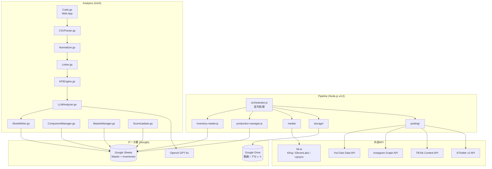
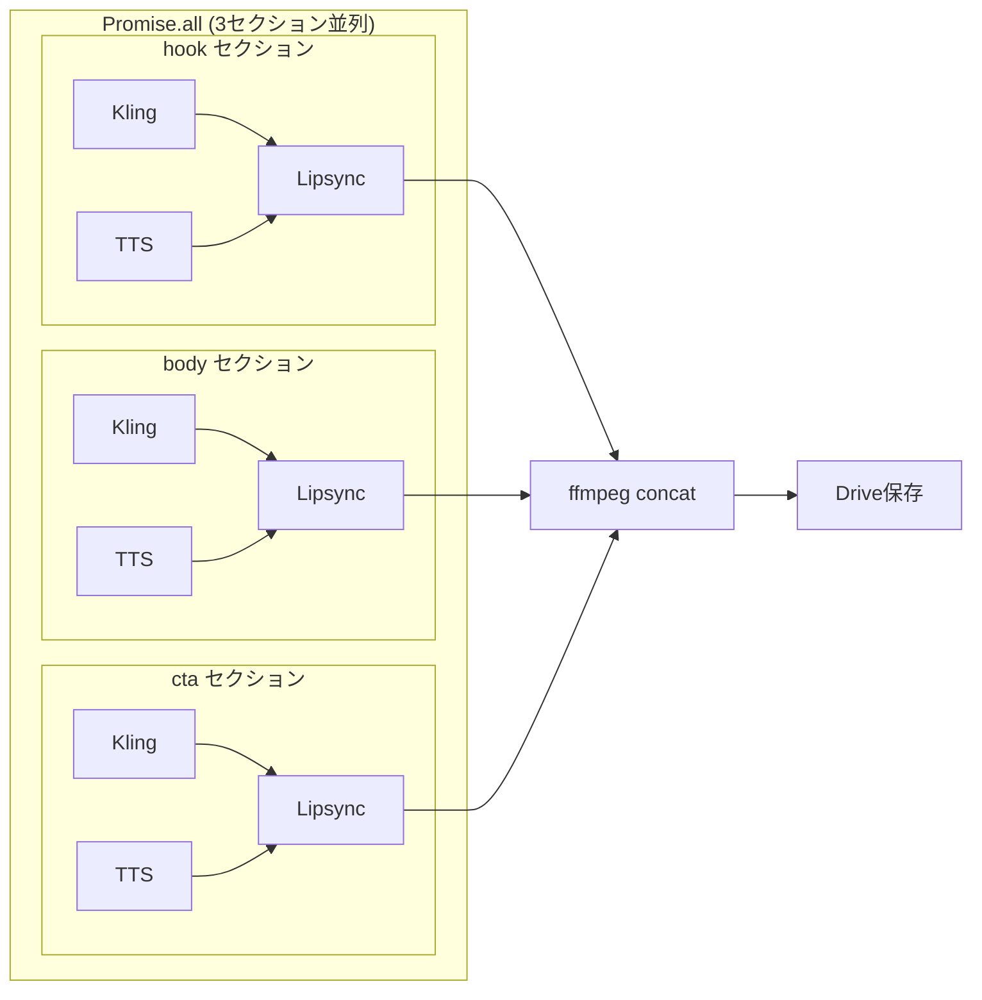

# AI-Influencer 技術アーキテクチャ

> **バージョン**: 4.0
> **最終更新**: 2026-02-10

---

## システム全体図



### テキスト版

```
┌──────────────────────────────────────────────────────────────────┐
│                    Pipeline (Node.js v4.0)                        │
│                                                                  │
│  orchestrator.js ──► media/ ──► fal.ai (Kling/ElevenLabs/Sync)  │
│       │              │         (3セクション並列処理)              │
│       │              └──► ffmpeg (3セクション結合)                │
│       │                                                          │
│       ├──► inventory-reader.js ──► Inventory Sheets (4つ)        │
│       ├──► production-manager.js ──► production タブ (32カラム)  │
│       ├──► storage/ ──► Google Drive                             │
│       │                                                          │
│       └──► posting/ ──► YouTube / Instagram / TikTok / X        │
│                                                                  │
│  sheets/ ◄──► Google Sheets (accounts, production, inventories)  │
└──────────────────────────────────────────────────────────────────┘
                              │
                              ▼
┌──────────────────────────────────────────────────────────────────┐
│                  Analytics (GAS v2.0) ※変更なし                  │
│                                                                  │
│  Code.gs ──► CSVParser ──► Normalizer ──► Linker                │
│                                              │                   │
│                                              ▼                   │
│  SheetWriter ◄── LLMAnalyzer ◄── KPIEngine                      │
│       │              │                                           │
│       ▼              ▼                                           │
│  ComponentManager  ScoreUpdater  MasterManager                   │
│       │              │              │                             │
│       ▼              ▼              ▼                             │
│              Google Sheets (Master + Inventories)                 │
└──────────────────────────────────────────────────────────────────┘
```

---

## データフロー

### 動画制作フロー（Pipeline v4.0）

```
1. インベントリ読み取り
   inventory-reader.js: Scenarios/Motions/Characters/Audio Inventory → 素材ID解決

2. キャラクター画像取得
   Google Drive (Characters/) → fal.storage アップロード → 一時公開URL

3. 3セクション(hook/body/cta) 並列処理 (Promise.all)
   各セクションで（セクション間は並列、セクション内も一部並列）:
   ┌─ fal.ai Kling motion-control (画像 + モーション参照動画 → 動画) ─┐ 並列
   └─ fal.ai ElevenLabs eleven-v3 (スクリプト → 音声)               ─┘
   → fal.ai Sync Lipsync v2/pro (動画 + 音声 → 口同期動画)

4. 結合
   ffmpeg concat demuxer (3本のセクション動画 → final.mp4)

5. 保存
   4ファイル(01_hook.mp4, 02_body.mp4, 03_cta.mp4, final.mp4)
   → Google Drive (Productions/YYYY-MM-DD/VID_YYYYMM_XXXX/)

6. 記録
   production-manager.js: production タブにURL・ステータスを自動記録（32カラム）
```

### 並列処理フロー図



### 分析フロー（GAS）※既存

```
1. CSV取込
   プラットフォームCSV → CSVParser → Normalizer → 統一スキーマ

2. リンク
   Linker: プラットフォームID ↔ video_uid マッチング

3. 分析
   KPIEngine: 目標値との比較・スコア算出
   LLMAnalyzer: OpenAI GPT-4o でコンポーネント別分析

4. 更新
   ScoreUpdater: コンポーネントスコア更新
   MasterManager: マスターシートの分析結果更新
   SheetWriter: 分析レポート・推奨事項を書き込み
```

---

## API統合

### fal.ai（メディア生成ハブ）

全メディア生成は fal.ai 経由で呼び出す。各サービスの役割：

| サービス | 用途 | 何をするか | 単価 | 10秒あたり |
|---|---|---|---|---|
| Kling 2.6 motion-control | AI動画生成 | image_url + video_url → 動画を生成 | $0.07/秒 | $0.70 |
| ElevenLabs eleven-v3 | テキスト音声合成 (TTS) | スクリプトテキスト → 音声を生成 (voice: "Aria") | ~$0.05/1K文字 | ~$0.04 |
| Sync Lipsync v2/pro | リップシンク | 動画+音声 → 口の動きを同期させた動画を生成 (sync_mode: "bounce") | $3.00/分 | $0.50 |

**セクション単価: ~$1.24（10秒）/ 1本あたり(3セクション): ~$3.72**

### Google APIs

| API | 用途 |
|---|---|
| Google Sheets API v4 | データ読み書き（パイプライン側） |
| Google Drive API v3 | 動画・アセット保存 |
| YouTube Data API v3 | 動画アップロード |

### プラットフォーム投稿API

| プラットフォーム | API | 制限 |
|---|---|---|
| YouTube | Data API v3 | 最も安定 |
| Instagram | Graph API (Business) | URL-basedのみ |
| TikTok | Content Posting API | 15投稿/日、審査必要 |
| X/Twitter | v2 API | レート制限厳しい |

### OpenAI（分析）

| 用途 | モデル |
|---|---|
| コンポーネント別パフォーマンス分析 | GPT-4o |
| 改善提案・次回コンポーネント推奨 | GPT-4o |

---

## データ管理方針

### 設計原則

**Google Drive（ファイル実体）+ Google Sheets（メタデータ・ID管理）** の二層構造で全データを管理する。

| レイヤー | 役割 | 具体例 |
|---|---|---|
| Drive | ファイル実体の保存 | 動画、画像、音声、プロンプト |
| Sheets | メタデータ・ID・プロパティの紐付け管理 | インベントリ、content_pipeline、accounts |

### なぜこの構造か

1. **構造化データ**: Sheets上でID/プロパティ/ファイルリンクが紐付いているため、APIで一括読み取り可能
2. **AI連携**: パイプラインやLLMに読み込ませる際、シートからメタデータを取得→Drive URLでファイルアクセスという一貫したパターンで処理できる
3. **非エンジニアも操作可能**: Sheets/Driveはブラウザで誰でも確認・編集できる
4. **スケーラビリティ**: アカウント・コンテンツが増えてもシートの行追加とDriveフォルダで対応可能
5. **外部DB不要**: Google Workspace内で完結し、追加インフラ不要

### Drive フォルダ構造

起点: **Shared Drives > Product > AI-Influencer** (`1KRQuZ4W7u5CXRamjvN4xmavfu-7TPb0X`)

```
AI-Influencer/
├── Characters/         # 入力: キャラクター画像
│   └── Images/         # 画像ファイル
├── Productions/        # 出力: 生成動画
│   └── YYYY-MM-DD/     # 日付別
│       └── VID_YYYYMM_XXXX/   # コンテンツID別
│           ├── 01_hook.mp4
│           ├── 02_body.mp4
│           ├── 03_cta.mp4
│           └── final.mp4
├── Scenarios/          # シナリオ関連アセット
├── Motions/            # モーション関連アセット
├── Audio/              # 音声ファイル
├── Analytics/          # 分析関連
└── (その他)
```

> **NOTE**: Productions/ フォルダは日付→コンテンツID の2階層。アカウント別サブフォルダ等の設計は Phase 1（量産体制）で決定する。

### Sheets ↔ Drive の紐付け

- インベントリシートの `file_link` カラム → Drive内ファイルへのリンク
- content_pipeline シートの `drive_folder_id` カラム → 出力フォルダのDrive ID
- 全てのアセットはDriveに実体を保存し、Sheetsでメタデータを管理する（Sheets内にファイル実体を置かない）

---

## Google Sheetsスキーマ

### 既存タブ（GAS管理、変更なし）

| タブ名 | 用途 | 管理 |
|---|---|---|
| master | 動画制作マスター (1行=1動画) | GAS |
| metrics_youtube | YouTube メトリクス | GAS |
| metrics_tiktok | TikTok メトリクス | GAS |
| metrics_instagram | Instagram メトリクス | GAS |
| kpi_targets | KPI目標値 | GAS |
| analysis_reports | 分析レポート | GAS |
| recommendations | AI推奨事項 | GAS |
| video_analysis | 動画分析結果 | GAS |
| unlinked_imports | 未リンクインポート | GAS |
| _config | 設定値 (APIキー等) | GAS |

### 新規タブ（Pipeline管理）

#### accounts

アカウント管理。1行=1プラットフォームアカウント。

| カラム | 型 | 説明 |
|---|---|---|
| account_id | String | 一意ID (ACC_XXXX) |
| persona_name | String | AIキャラクター名 |
| platform | String | youtube / tiktok / instagram / twitter |
| account_handle | String | @ユーザー名 |
| character_id | String | Characters InventoryへのFK |
| target_region | String | JP / US / SEA |
| timezone | String | Asia/Tokyo 等 |
| posting_window | String | 18:00-22:00 等 |
| content_niche | String | beauty / lifestyle 等 |
| voice_id | String | TTS音声ID |
| status | String | setup / active / paused |
| api_credential_key | String | OAuthトークンのScript Propertiesキー |
| last_posted_at | DateTime | 最終投稿日時 |

#### production（v4.0 新規 — 32カラム）

本番動画制作の管理タブ。content_pipelineの後継として、新規実行はこちらに記録。

| カラム | 型 | 入力 | 説明 |
|---|---|---|---|
| video_id | String | 手動 | 一意ID（VID_YYYYMM_XXXX） |
| account_id | String | 手動 | 投稿先アカウント |
| title | String | 手動 | 動画タイトル |
| edit_status | String | 手動 | 編集ステータス（draft/ready/done） |
| character_id | String | 手動 | キャラクターID |
| hook_scenario_id | String | 手動 | hookシナリオID |
| body_scenario_id | String | 手動 | bodyシナリオID |
| cta_scenario_id | String | 手動 | ctaシナリオID |
| hook_motion_id | String | 手動 | hookモーションID |
| body_motion_id | String | 手動 | bodyモーションID |
| cta_motion_id | String | 手動 | ctaモーションID |
| voice_id | String | 手動 | TTS音声ID（例: Aria） |
| pipeline_status | String | 自動 | パイプライン処理ステータス |
| current_phase | String | 自動 | 現在の処理フェーズ |
| hook_video_url | String | 自動 | hook動画のDrive URL |
| body_video_url | String | 自動 | body動画のDrive URL |
| cta_video_url | String | 自動 | cta動画のDrive URL |
| final_video_url | String | 自動 | 結合版動画のDrive URL |
| drive_folder_id | String | 自動 | 出力フォルダのDrive ID |
| error_message | String | 自動 | エラーメッセージ |
| processing_time_sec | Number | 自動 | 処理時間（秒） |
| created_at | DateTime | 自動 | 作成日時 |
| updated_at | DateTime | 自動 | 更新日時 |
| platform_post_ids | String | 手動 | プラットフォーム側投稿ID |
| yt_views | Number | 分析 | YouTube視聴数 |
| yt_engagement | Number | 分析 | YouTubeエンゲージメント |
| tt_views | Number | 分析 | TikTok視聴数 |
| tt_engagement | Number | 分析 | TikTokエンゲージメント |
| ig_views | Number | 分析 | Instagram視聴数 |
| ig_engagement | Number | 分析 | Instagramエンゲージメント |
| overall_score | Number | 分析 | 総合スコア |
| analysis_date | DateTime | 分析 | 分析実行日 |

#### content_pipeline（レガシー — v3.1以前の実行ログ）

v3.1以前のパイプライン実行ログ。新規実行はproductionタブを使用。

| カラム | 型 | 説明 |
|---|---|---|
| content_id | String | 一意ID (CNT_YYYYMM_XXXX) |
| account_id | String | 投稿先アカウント |
| status | String | queued→processing→...→completed |
| character_folder_id | String | Google Drive キャラクターフォルダID |
| section_count | Number | セクション数(通常3) |
| hook_video_url | String | hook動画のDrive URL |
| body_video_url | String | body動画のDrive URL |
| cta_video_url | String | cta動画のDrive URL |
| final_video_url | String | 結合版動画のDrive URL |
| drive_folder_id | String | 出力フォルダのDrive ID |
| platform_post_id | String | プラットフォーム側の投稿ID |
| views_48h | Number | 48時間後の視聴数 |
| error_message | String | エラーメッセージ |
| created_at | DateTime | 作成日時 |
| updated_at | DateTime | 更新日時 |

### インベントリスプレッドシート（5つ）

各コンポーネントタイプに1つずつ独立したスプレッドシート:

- **Scenarios Inventory** (`13Meu7cniKUr1JiEyKla0qhfiV9Az1IFuzIedzDxjpiY`)
- **Motions Inventory** (`1ycnmfpL8OgAI7WvlPTr3Z9p1H8UTmCNMV7ahunMlsEw`)
- **Characters Inventory** (`1-m4f5LgNmArtpECZqqxFL-6P4eabBmPkOYX2VkFHCHA`)
- **Audio Inventory** (`1Dw_atybwdGpi1Q0jh6CsuUSwzqVw1ZXB6jQT_-VDVak`)
- **Accounts Inventory** (`1CmT6C3qCW3md6lJ9Rvc2WNQkWa5zcvlq6Zp_enJHoUE`) — v4.0新規

共通カラム: component_id, type, name, description, file_link, tags, times_used, avg_performance_score, created_date, status

---

## GASモジュール一覧（変更なし）

| モジュール | 行数 | 役割 |
|---|---|---|
| Code.gs | 1157 | Web App エンドポイント + UIメニュー |
| Config.gs | 389 | 設定値、スキーマ、定数 |
| Setup.gs | 762 | ワンクリックセットアップ |
| Migration.gs | 224 | v1→v2 マイグレーション |
| CSVParser.gs | 190 | プラットフォーム別CSVパーサー |
| Normalizer.gs | 208 | 統一スキーマ変換 |
| Linker.gs | 238 | video_uid マッチング |
| KPIEngine.gs | 249 | KPI比較・スコア算出 |
| LLMAnalyzer.gs | 665 | OpenAI連携分析 |
| SheetWriter.gs | 275 | シート書き込み |
| ComponentManager.gs | 283 | コンポーネントCRUD |
| MasterManager.gs | 255 | マスターシート操作 |
| ScoreUpdater.gs | 212 | コンポーネントスコア |
| Utils.gs | 544 | ユーティリティ・ID生成 |

GAS API エンドポイント詳細は [MANUAL.md](MANUAL.md) を参照。

---

## n8n → Node.js コードマッピング

| n8n ノード | Node.js モジュール | 説明 |
|---|---|---|
| Google Sheets Read (Inventories) | pipeline/sheets/inventory-reader.js | インベントリ読み取り + ID解決（v4.0新規） |
| Google Sheets Write (Production) | pipeline/sheets/production-manager.js | productionタブ管理（v4.0新規） |
| Google Sheets Read (Scenarios) | pipeline/sheets/content-manager.js | シナリオ読み込み（レガシー） |
| fal.storage upload | pipeline/media/fal-client.js | キャラクター画像の一時URL生成 |
| fal-ai/kling-video motion-control | pipeline/media/video-generator.js | 画像+モーション参照動画→動画生成 |
| fal-ai/elevenlabs eleven-v3 | pipeline/media/tts-generator.js | テキスト→音声生成 |
| fal-ai/sync-lipsync v2/pro | pipeline/media/lipsync.js | 動画+音声→口同期 |
| ffmpeg concat | pipeline/media/concat.js | 3セクション動画の結合 |
| Google Drive Upload | pipeline/storage/drive-storage.js | 完成動画のDrive保存 |
| YouTube Upload | pipeline/posting/adapters/youtube.js | YouTube Shorts投稿 |
| Instagram Publish | pipeline/posting/adapters/instagram.js | Instagram Reels投稿 |
| TikTok Publish | pipeline/posting/adapters/tiktok.js | TikTok投稿 |
| X Post | pipeline/posting/adapters/twitter.js | X投稿 |
| Google Sheets Write | pipeline/sheets/content-manager.js | パイプライン結果のシート書き込み（レガシー） |
| Schedule Trigger | scripts/run-daily.js | 日次バッチ (cron) |

---

## コスト見積もり

### 動画生成コスト（1セクションあたり、~5-10秒）

| サービス | 役割 | コスト(10秒) |
|---|---|---|
| Kling 2.6 motion-control (fal.ai) | 画像+モーション→動画 | $0.70 |
| ElevenLabs eleven-v3 (fal.ai) | テキスト→音声 | ~$0.04 |
| Sync Lipsync v2/pro (fal.ai) | 動画+音声→口同期 | $0.50 |
| **セクション単価** | | **$1.24** |

### 1本あたりコスト（3セクション）: ~$3.72

### 月次コスト見積もり

| 月 | アカウント数 | 月間本数 | 月間コスト |
|---|---|---|---|
| 2月 | 50 | 1,500 | $5,580 |
| 3月 | 160 | 4,800 | $17,856 |
| 6月 | 700 | 21,000 | $78,120 |
