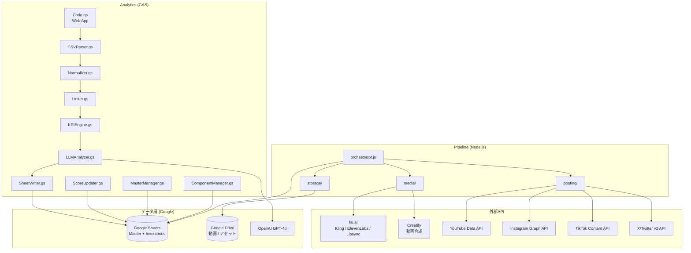

# AI-Influencer 技術アーキテクチャ

> **バージョン**: 3.0
> **最終更新**: 2026-02-09

---

## システム全体図



### テキスト版

```
┌──────────────────────────────────────────────────────────────────┐
│                    Pipeline (Node.js)                             │
│                                                                  │
│  orchestrator.js ──► media/ ──► fal.ai (Kling/ElevenLabs/Sync)  │
│       │              │                                           │
│       │              └──► Creatify (合成)                        │
│       │                                                          │
│       ├──► storage/ ──► Google Drive                             │
│       │                                                          │
│       └──► posting/ ──► YouTube / Instagram / TikTok / X        │
│                                                                  │
│  sheets/ ◄──► Google Sheets (accounts, content_pipeline)         │
└──────────────────────────────────────────────────────────────────┘
                              │
                              ▼
┌──────────────────────────────────────────────────────────────────┐
│                  Analytics (GAS v2.0) ※変更なし                  │
│                                                                  │
│  Code.gs ──► CSVParser ──► Normalizer ──► Linker                │
│                                              │                   │
│                                              ▼                   │
│  SheetWriter ◄── LLMAnalyzer ◄── KPIEngine                      │
│       │              │                                           │
│       ▼              ▼                                           │
│  ComponentManager  ScoreUpdater  MasterManager                   │
│       │              │              │                             │
│       ▼              ▼              ▼                             │
│              Google Sheets (Master + Inventories)                 │
└──────────────────────────────────────────────────────────────────┘
```

---

## データフロー

### 動画制作フロー（Pipeline）

```
1. シナリオ選択
   Google Sheets (scenarios) → orchestrator.js

2. メディア生成
   画像アップロード → fal.ai Kling (動画生成)
   → fal.ai ElevenLabs (TTS) → fal.ai Lipsync
   → Creatify (最終合成)

3. 保存
   完成動画 → Google Drive (アカウント別フォルダ)

4. 投稿
   Google Drive → YouTube / Instagram / TikTok / X
   プラットフォームID → Google Sheets (master) に記録
```

### 分析フロー（GAS）※既存

```
1. CSV取込
   プラットフォームCSV → CSVParser → Normalizer → 統一スキーマ

2. リンク
   Linker: プラットフォームID ↔ video_uid マッチング

3. 分析
   KPIEngine: 目標値との比較・スコア算出
   LLMAnalyzer: OpenAI GPT-4o でコンポーネント別分析

4. 更新
   ScoreUpdater: コンポーネントスコア更新
   MasterManager: マスターシートの分析結果更新
   SheetWriter: 分析レポート・推奨事項を書き込み
```

---

## API統合

### fal.ai（メディア生成ハブ）

全メディア生成は fal.ai 経由で呼び出す。各サービスの役割：

| サービス | 用途 | 何をするか | 単価 | 10秒あたり |
|---|---|---|---|---|
| Kling 2.6 | AI動画生成 | キャラクター画像 → 動画を生成 | $0.07/秒 | $0.70 |
| ElevenLabs v3 | テキスト音声合成 (TTS) | スクリプトテキスト → 音声を生成 | ~$0.05/1K文字 | ~$0.04 |
| Sync Lipsync v2 | リップシンク | 動画+音声 → 口の動きを同期させた動画を生成 | $3.00/分 | $0.50 |

### Creatify Aurora

| 用途 | 何をするか | 単価 | 10秒あたり |
|---|---|---|---|
| 最終動画合成 | リップシンク済み動画を最終仕上げ・合成 | $0.14/秒 (720p) | $1.40 |

**合計: ~$2.64/本（10秒、720p）**

### Google APIs

| API | 用途 |
|---|---|
| Google Sheets API v4 | データ読み書き（パイプライン側） |
| Google Drive API v3 | 動画・アセット保存 |
| YouTube Data API v3 | 動画アップロード |

### プラットフォーム投稿API

| プラットフォーム | API | 制限 |
|---|---|---|
| YouTube | Data API v3 | 最も安定 |
| Instagram | Graph API (Business) | URL-basedのみ |
| TikTok | Content Posting API | 15投稿/日、審査必要 |
| X/Twitter | v2 API | レート制限厳しい |

### OpenAI（分析）

| 用途 | モデル |
|---|---|
| コンポーネント別パフォーマンス分析 | GPT-4o |
| 改善提案・次回コンポーネント推奨 | GPT-4o |

---

## Google Sheetsスキーマ

### 既存タブ（GAS管理、変更なし）

| タブ名 | 用途 | 管理 |
|---|---|---|
| master | 動画制作マスター (1行=1動画) | GAS |
| metrics_youtube | YouTube メトリクス | GAS |
| metrics_tiktok | TikTok メトリクス | GAS |
| metrics_instagram | Instagram メトリクス | GAS |
| kpi_targets | KPI目標値 | GAS |
| analysis_reports | 分析レポート | GAS |
| recommendations | AI推奨事項 | GAS |
| video_analysis | 動画分析結果 | GAS |
| unlinked_imports | 未リンクインポート | GAS |
| _config | 設定値 (APIキー等) | GAS |

### 新規タブ（Pipeline管理）

#### accounts

アカウント管理。1行=1プラットフォームアカウント。

| カラム | 型 | 説明 |
|---|---|---|
| account_id | String | 一意ID (ACC_XXXX) |
| persona_name | String | AIキャラクター名 |
| platform | String | youtube / tiktok / instagram / twitter |
| account_handle | String | @ユーザー名 |
| character_id | String | Characters InventoryへのFK |
| target_region | String | JP / US / SEA |
| timezone | String | Asia/Tokyo 等 |
| posting_window | String | 18:00-22:00 等 |
| content_niche | String | beauty / lifestyle 等 |
| voice_id | String | TTS音声ID |
| status | String | setup / active / paused |
| api_credential_key | String | OAuthトークンのScript Propertiesキー |
| last_posted_at | DateTime | 最終投稿日時 |

#### content_pipeline

パイプライン実行ログ。1行=1動画生成タスク。

| カラム | 型 | 説明 |
|---|---|---|
| content_id | String | 一意ID (CNT_YYYYMM_XXXX) |
| account_id | String | 投稿先アカウント |
| status | String | queued→generating_video→generating_tts→syncing_lips→compositing→uploading→ready→posting→posted→collected |
| character_image_url | String | Cloudinary URL |
| script_text | String | TTSテキスト |
| kling_video_url | String | 生成された動画URL |
| tts_audio_url | String | 生成された音声URL |
| lipsync_video_url | String | リップシンク済み動画URL |
| final_video_url | String | 最終動画URL |
| drive_file_id | String | Google Drive ファイルID |
| platform_post_id | String | プラットフォーム側の投稿ID |
| views_48h | Number | 48時間後の視聴数 |
| error_message | String | エラーメッセージ |
| created_at | DateTime | 作成日時 |
| updated_at | DateTime | 更新日時 |

### インベントリスプレッドシート（4つ、既存）

各コンポーネントタイプに1つずつ独立したスプレッドシート:

- **Scenarios Inventory** (`13Meu7cniKUr1JiEyKla0qhfiV9Az1IFuzIedzDxjpiY`)
- **Motions Inventory** (`1ycnmfpL8OgAI7WvlPTr3Z9p1H8UTmCNMV7ahunMlsEw`)
- **Characters Inventory** (`1-m4f5LgNmArtpECZqqxFL-6P4eabBmPkOYX2VkFHCHA`)
- **Audio Inventory** (`1Dw_atybwdGpi1Q0jh6CsuUSwzqVw1ZXB6jQT_-VDVak`)

共通カラム: component_id, type, name, description, file_link, tags, times_used, avg_performance_score, created_date, status

---

## GASモジュール一覧（変更なし）

| モジュール | 行数 | 役割 |
|---|---|---|
| Code.gs | 1157 | Web App エンドポイント + UIメニュー |
| Config.gs | 389 | 設定値、スキーマ、定数 |
| Setup.gs | 762 | ワンクリックセットアップ |
| Migration.gs | 224 | v1→v2 マイグレーション |
| CSVParser.gs | 190 | プラットフォーム別CSVパーサー |
| Normalizer.gs | 208 | 統一スキーマ変換 |
| Linker.gs | 238 | video_uid マッチング |
| KPIEngine.gs | 249 | KPI比較・スコア算出 |
| LLMAnalyzer.gs | 665 | OpenAI連携分析 |
| SheetWriter.gs | 275 | シート書き込み |
| ComponentManager.gs | 283 | コンポーネントCRUD |
| MasterManager.gs | 255 | マスターシート操作 |
| ScoreUpdater.gs | 212 | コンポーネントスコア |
| Utils.gs | 544 | ユーティリティ・ID生成 |

GAS API エンドポイント詳細は [MANUAL.md](MANUAL.md) を参照。

---

## n8n → Node.js コードマッピング

| n8n ノード | Node.js モジュール | 説明 |
|---|---|---|
| Google Sheets Read | pipeline/sheets/scenario-reader.js | シナリオ・アカウント情報の読み込み |
| HTTP Request (fal.ai Kling) | pipeline/media/video-generator.js | キャラクター画像→動画生成 |
| HTTP Request (ElevenLabs) | pipeline/media/tts-generator.js | テキスト→音声生成 |
| HTTP Request (Lipsync) | pipeline/media/lipsync.js | 動画+音声→口同期 |
| HTTP Request (Creatify) | pipeline/media/compositor.js | 最終動画合成 |
| Cloudinary Upload | pipeline/media/cloudinary.js | 画像アップロード |
| Google Drive Upload | pipeline/storage/drive-storage.js | 完成動画のDrive保存 |
| YouTube Upload | pipeline/posting/adapters/youtube.js | YouTube Shorts投稿 |
| Instagram Publish | pipeline/posting/adapters/instagram.js | Instagram Reels投稿 |
| TikTok Publish | pipeline/posting/adapters/tiktok.js | TikTok投稿 |
| X Post | pipeline/posting/adapters/twitter.js | X投稿 |
| Google Sheets Write | pipeline/sheets/content-manager.js | パイプライン結果のシート書き込み |
| Schedule Trigger | scripts/run-daily.js | 日次バッチ (cron) |

---

## コスト見積もり

### 動画生成コスト（1本あたり、10秒、720p）

| サービス | 役割 | コスト |
|---|---|---|
| Kling 2.6 (fal.ai) | キャラクター画像→動画 | $0.70 |
| ElevenLabs v3 (fal.ai) | テキスト→音声 | ~$0.04 |
| Sync Lipsync v2 (fal.ai) | 動画+音声→口同期 | $0.50 |
| Creatify Aurora (720p) | 最終合成 | $1.40 |
| **合計** | | **$2.64** |

### 月次コスト見積もり（動画生成のみ）

| 月 | アカウント数 | 推定動画本数/日 | 月間本数 | 月間コスト |
|---|---|---|---|---|
| 2月 | 50 | 50 | 1,500 | $3,960 |
| 3月 | 160 | 160 | 4,800 | $12,672 |
| 4月 | 340 | 340 | 10,200 | $26,928 |
| 5月 | 520 | 520 | 15,600 | $41,184 |
| 6月 | 700 | 700 | 21,000 | $55,440 |
