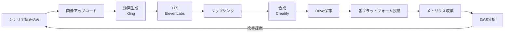

# AI-Influencer 戦略ドキュメント

> **最終更新**: 2026-02-09
> **ステータス**: Phase 1 準備中
> **関係者**: Shunsae, Badhan

---

## 目次

- [1. エグゼクティブサマリー](#1-エグゼクティブサマリー)
- [2. KPI計画](#2-kpi計画)
- [3. 収益モデル](#3-収益モデル)
- [4. 費用計画](#4-費用計画)
- [5. 動画制作コスト](#5-動画制作コスト)
- [6. マネタイズカテゴリ](#6-マネタイズカテゴリ)
- [7. 全体フロー](#7-全体フロー)
- [8. 自動化状況マップ](#8-自動化状況マップ)
- [9. プラットフォームAPI状況](#9-プラットフォームapi状況)
- [10. フェーズ計画](#10-フェーズ計画)
- [11. リスク一覧](#11-リスク一覧)
- [12. 中長期ロードマップ](#12-中長期ロードマップ)
- [13. 会議メモ](#13-会議メモ)
- [14. TODO・依頼事項](#14-todo依頼事項)
- [15. 意思決定ログ](#15-意思決定ログ)

---

## 1. エグゼクティブサマリー

AIインフルエンサーアカウントを大量運用し、ショート動画（YouTube Shorts / TikTok / Instagram Reels / X）を自動制作・投稿・分析するシステム。2月に50アカウントでMVP開始、6月までに700アカウントへスケール。

収益源はプラットフォーム広告収益＋アフィリエイト。自動化パイプライン（Node.js）で動画生成からプラットフォーム投稿まで完全自動化し、既存GASアナリティクスでパフォーマンス分析を行う。

---

## 2. KPI計画

### アカウント・再生数・収益目標

| 月 | アカウント数 | TT | IG | YT | X | 総再生数(千) | 総合収益(千) |
|---|---|---|---|---|---|---|---|
| 2月 | 50 | 12 | 12 | 12 | 14 | 17,600 | ¥5,386 |
| 3月 | 160 | 42 | 42 | 42 | 34 | 57,400 | ¥17,226 |
| 4月 | 340 | 92 | 92 | 92 | 64 | 122,800 | ¥36,598 |
| 5月 | 520 | 142 | 142 | 142 | 94 | 188,200 | ¥55,970 |
| 6月 | 700 | 192 | 192 | 192 | 124 | 253,600 | ¥75,342 |

---

## 3. 収益モデル

### マネタイズ① プラットフォーム収益

各プラットフォームのCPM（1,000再生あたり収益）:

| プラットフォーム | CPM |
|---|---|
| TikTok | ¥40 |
| YouTube | ¥10 |
| Twitter/X | ¥30 |
| Instagram | ¥0 |

月次推移:
- 2月: ¥386K
- 3月: ¥1,226K
- 4月: ¥2,598K
- 5月: ¥3,970K
- 6月: ¥5,342K
- **累計: ¥13.5M**

### マネタイズ② アフィリエイト

プラットフォーム別単価:

| プラットフォーム | 単価/件 |
|---|---|
| TikTok | ¥10万 |
| Instagram | ¥10万 |
| YouTube | ¥5万 |
| X/Twitter | ¥5万 |

月次推移:
- 2月: ¥5.0M
- 3月: ¥17.0M
- 4月: ¥34.0M
- 5月: ¥51.0M
- 6月: ¥70.0M
- **累計: ¥177M**

---

## 4. 費用計画

### 月次費用

| 項目 | 2月 | 3月 | 4月+ |
|---|---|---|---|
| インターン (人数) | 4人 | 8人 | 12人 |
| インターン費 (@¥120K/月) | ¥480K | ¥960K | ¥1,440K |
| 給与 | ¥500K | ¥500K | ¥500K |
| その他（アカウント購入、メアド、VPN等） | ¥5K | ¥8K | ¥18K |
| **合計** | **¥985K** | **¥1,468K** | **¥1,958K** |

---

## 5. 動画制作コスト

### 1本あたりコスト: ~$2.77

| サービス | コスト |
|---|---|
| Kling (動画生成) | $0.70 |
| TTS (ElevenLabs) | $0.04 |
| Lipsync | $0.83 |
| Creatify (合成) | $1.20 |
| **合計** | **$2.77** |

---

## 6. マネタイズカテゴリ

### TikTok
- スキンケア（CVR 1-2%）
- アパレル（CVR 1.5-2.5%）
- 日用品
- 食品
- 美容家電

### Instagram
- スキンケア
- サプリ
- ファッション
- キッチン用品
- 家電

### YouTube Shorts
- ガジェット（CVR 3-6%）
- サブスク無料体験（CVR 2-6%）
- コスメ
- 学び
- 旅行

### 横断（AI自動化向き）
- EC物販
- サブスク
- マッチングアプリ
- 美容
- 転職

---

## 7. 全体フロー



### テキスト版フロー

```
シナリオ読み込み
    → 画像アップロード
    → 動画生成 (Kling)
    → TTS (ElevenLabs)
    → リップシンク
    → 合成 (Creatify)
    → Google Drive 保存
    → 各プラットフォーム投稿 (YT/TT/IG/X)
    → メトリクス収集
    → GAS分析 (KPI + OpenAI)
    → 改善提案 → 次のシナリオへ (ループ)
```

---

## 8. 自動化状況マップ

| ステップ | 状況 | ツール |
|---|---|---|
| シナリオ選択 | 🟡 半自動（GAS推奨→人間承認） | GAS + Sheets |
| 画像アップロード | 🔴 未実装 | pipeline/ (予定) |
| 動画生成 | 🔴 未実装 | fal.ai / Kling API |
| TTS | 🔴 未実装 | fal.ai / ElevenLabs |
| リップシンク | 🔴 未実装 | fal.ai |
| 動画合成 | 🔴 未実装 | Creatify |
| Drive保存 | 🔴 未実装 | Google Drive API |
| プラットフォーム投稿 | 🔴 未実装 | YouTube/TikTok/IG/X API |
| メトリクス収集 | 🟡 手動CSV | GAS CSVParser |
| 分析・スコア更新 | 🟢 自動 | GAS KPIEngine + LLMAnalyzer |
| 改善提案 | 🟢 自動 | GAS + OpenAI |

🟢 自動　🟡 半自動/手動　🔴 未実装

---

## 9. プラットフォームAPI状況

| プラットフォーム | API状況 | 制限・注意事項 |
|---|---|---|
| YouTube | 標準API | 最も安定。Data API v3 + upload |
| Instagram | Business API必須 | URL-basedアップロードのみ。Business/Creator アカウント必須 |
| TikTok | API審査要 | 15投稿/日制限。Content Posting API は審査必要 |
| X/Twitter | v2 API | 不安定。レート制限が厳しい |

---

## 10. フェーズ計画

### Phase 1: MVP（2/10〜2/12）

**目標**: 1アカウントでYouTube自動投稿を実現

- [ ] fal.ai API連携（Kling動画生成）
- [ ] ElevenLabs TTS連携
- [ ] Lipsync連携
- [ ] Google Drive保存
- [ ] YouTube Data API投稿
- [ ] エンドツーエンドの1本自動生成

### Phase 2: マルチアカウント（2/13〜2/17）

**目標**: 12 YouTubeアカウント + 12 Instagramアカウント

- [ ] アカウント管理シート（accounts タブ）
- [ ] マルチアカウント対応のオーケストレーター
- [ ] Instagram Business APIアカウント投稿
- [ ] 日次バッチ実行スクリプト

### Phase 3: フルスケール（2/18〜2/28）

**目標**: 全50アカウント × 4プラットフォーム

- [ ] TikTok Content Posting API連携
- [ ] X/Twitter v2 API連携
- [ ] 50アカウント並列処理
- [ ] メトリクス自動収集
- [ ] エラーハンドリング・リトライ

---

## 11. リスク一覧

| リスク | 影響度 | 対策 |
|---|---|---|
| TikTok API審査却下 | 高 | 手動投稿フォールバック、他プラットフォーム優先 |
| アカウントBAN | 高 | 投稿頻度制限、コンテンツ多様化、IP分散(VPN) |
| fal.ai サービス障害 | 中 | 代替APIの調査、ローカルバッファ |
| API費用超過 | 中 | 1本$2.77を前提とした予算管理、日次コスト監視 |
| 品質低下によるエンゲージメント低下 | 中 | GASスコアリング→低スコアコンポーネント排除 |
| プラットフォーム規約変更 | 中 | 複数プラットフォーム分散運用 |
| CSV形式変更 | 低 | 列名エイリアス対応済み(GAS) |

---

## 12. 中長期ロードマップ

| 時期 | マイルストーン |
|---|---|
| 2月 | 50アカウント運用開始 |
| 3月 | 160アカウント、アフィリエイト本格化 |
| 4月 | 340アカウント、インターン12人体制 |
| 5月 | 520アカウント |
| 6月 | 700アカウント、月次収益¥75M目標 |
| Q3以降 | OpenClaw統合検討、さらなるスケール |

---

## 13. 会議メモ

### 2026-02-09: Shunsae × Badhan MTG

**議題**: n8nワークフローのコード化、技術スタック決定

**決定事項**:
- n8nワークフローをNode.jsコードに移行する
- fal.aiをメディア生成ハブとして使用する（Kling, ElevenLabs, Lipsync を統合）
- Google Sheetsをデータベースとして継続使用
- 既存GASアナリティクスはそのまま維持（変更なし）
- YouTube から投稿開始（API が最も安定）

**アクションアイテム**:
- Badhan: fal.ai APIキー共有
- Badhan: 各プラットフォームアカウント情報共有
- Badhan: n8nワークフロー詳細の共有
- Shunsae: Node.jsパイプライン実装開始

---

## 14. TODO・依頼事項

### バダンへの依頼（未完了）

- [ ] fal.ai APIキーの共有
- [ ] 各プラットフォームのアカウント情報（YouTube/IG/TikTok/X）
- [ ] n8nワークフローの詳細（ノード構成、パラメータ）
- [ ] Creatify APIキーまたはアカウント情報

### 技術タスク

- [ ] pipeline/ ディレクトリの実装
- [ ] fal.ai SDK統合
- [ ] YouTube Data API投稿テスト
- [ ] accountsシートのスキーマ設計
- [ ] content_pipelineシートのスキーマ設計

---

## 15. 意思決定ログ

| 日付 | 決定 | 理由 |
|---|---|---|
| 2026-02-09 | n8n → Node.jsに移行 | スケーラビリティ、バージョン管理、テスト容易性 |
| 2026-02-09 | fal.aiをメディアハブとして採用 | Kling/ElevenLabs/Lipsyncを統合的に利用可能 |
| 2026-02-09 | Google Sheetsを継続 | 既存GASアナリティクスとの統合、非エンジニアも閲覧可能 |
| 2026-02-09 | YouTube優先でMVP | API最安定、収益化最速 |
| 2026-02-06 | GASをアナリティクスに採用 | Sheets native統合、サーバーレス |
| 2026-02-06 | CSV-firstアプローチ | プラットフォームAPI制限が厳しいため |
