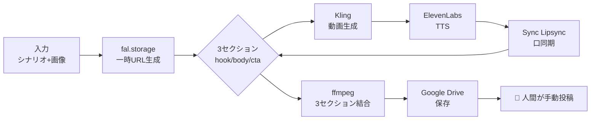
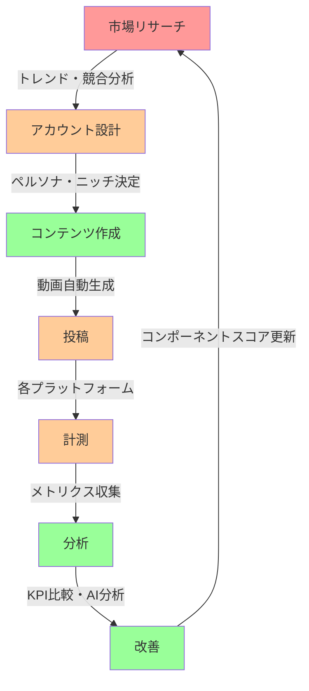
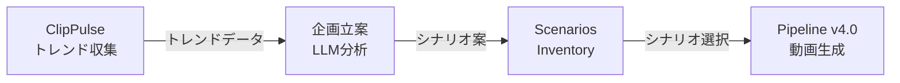

# AI-Influencer 戦略ドキュメント

> **最終更新**: 2026-02-10 (v4.0)
> **ステータス**: 量産準備完了 — パイプラインv4.0並列化済み、インベントリ実データ投入済み
> **関係者**: Shungo (技術実装), チームメイト (クオリティ・コンテンツ)

---

## 目次

- [1. エグゼクティブサマリー](#1-エグゼクティブサマリー)
- [2. KPI計画](#2-kpi計画)
- [3. 収益モデル](#3-収益モデル)
- [4. 費用計画](#4-費用計画)
- [5. 動画制作コスト](#5-動画制作コスト)
- [6. マネタイズカテゴリ](#6-マネタイズカテゴリ)
- [7. 全体フロー](#7-全体フロー)
- [8. 自動化状況マップ](#8-自動化状況マップ)
- [9. プラットフォームAPI状況](#9-プラットフォームapi状況)
- [10. フェーズ計画](#10-フェーズ計画)
- [11. リスク一覧](#11-リスク一覧)
- [12. 中長期ロードマップ](#12-中長期ロードマップ)
- [13. 会議メモ](#13-会議メモ)
- [14. TODO・依頼事項](#14-todo依頼事項)
- [15. 意思決定ログ](#15-意思決定ログ)
- [16. ワークフロー全体マップ（v4.0）](#16-ワークフロー全体マップv40)
- [17. 量産KPI分析（2/14会議用）](#17-量産kpi分析214会議用)
- [18. APIコスト分析](#18-apiコスト分析)
- [19. レート制限・スケーラビリティ](#19-レート制限スケーラビリティ)
- [20. ツールインベントリ](#20-ツールインベントリ)
- [21. ClipPulse連携分析](#21-clippulse連携分析)
- [22. OpenClaw検討](#22-openclaw検討)

---

## 1. エグゼクティブサマリー

AIインフルエンサーアカウントを大量運用し、ショート動画（YouTube Shorts / TikTok / Instagram Reels / X）を自動制作・投稿・分析するシステム。2月に50アカウントでMVP開始、6月までに700アカウントへスケール。

収益源はプラットフォーム広告収益＋アフィリエイト。最終的にはNode.jsパイプラインで動画生成→投稿→分析まで完全自動化し、既存GASアナリティクスでパフォーマンス分析を行う。

### 現状と緊急課題（2026-02-09時点）

**2月中旬に突入しているが、まだ1本も投稿できていない。** 2月KPI（50アカウント、17,600K再生）の達成が危機的状況。

投稿の自動化、分析ループ、クオリティ改善などの理想形は後回しにする。**今やるべきことは1つだけ**:

> **コンテンツ（動画）を自動生成し、Google Driveに溜める。人間がそこから手動で投稿する。**

- **Shungo**: チームメイトが作成したn8nワークフローを読み、使われている外部サービス/APIをNode.jsコードに落とし込む。入力を与えたら動画がDriveに保存される最低限のパイプラインを爆速で構築する。
- **チームメイト**: コンテンツのクオリティ担保。シナリオ・キャラクター・音声の品質チェック。
- **投稿**: 当面は人間が手動で各プラットフォームに投稿する。API自動投稿は後続タスク。

### 直近目標フロー

```
入力（キャラクター画像フォルダ@Drive）
  → [自動] fal.storage に画像アップロード（一時URL）
  → [自動] 3セクション(hook/body/cta)をループ処理:
    → Kling motion-control で動画生成
    → ElevenLabs eleven-v3 で音声生成
    → Sync Lipsync v2/pro で口同期
  → [自動] ffmpeg で3セクション結合
  → [自動] Google Drive に4ファイル保存
  → [手動] 人間が各プラットフォームに投稿
```

**自動投稿、メトリクス収集、GAS分析ループは全て後続フェーズ。まずはDriveにコンテンツが溜まる状態を作る。**

---

## 2. KPI計画

### アカウント・再生数・収益目標

| 月 | アカウント数 | TT | IG | YT | X | 総再生数(千) | 総合収益(千) |
|---|---|---|---|---|---|---|---|
| 2月 | 50 | 12 | 12 | 12 | 14 | 17,600 | ¥5,386 |
| 3月 | 160 | 42 | 42 | 42 | 34 | 57,400 | ¥17,226 |
| 4月 | 340 | 92 | 92 | 92 | 64 | 122,800 | ¥36,598 |
| 5月 | 520 | 142 | 142 | 142 | 94 | 188,200 | ¥55,970 |
| 6月 | 700 | 192 | 192 | 192 | 124 | 253,600 | ¥75,342 |

---

## 3. 収益モデル

### 各プラットフォームの収益化条件

#### YouTube

**収益化条件（数値）:**
- 登録者 1,000人
- 直近90日で有効な公開アップロード 3本
- さらに以下のどちらか:
  - 過去12か月の公開の有効な総再生時間 4,000時間
  - 直近90日の有効な公開Shorts視聴数 1,000万回

**その他の条件:**
- YPP（YouTubeパートナープログラム）加入
- 2段階認証（2-Step Verification）ON
- AdSense for YouTube アカウントをリンク

**収益度合い:**
- 長尺動画: 200〜500円/1,000再生
- ショート: 3〜30円/1,000再生
- ※広告費をかける時期によって大幅に変動（広告プールの一定%がクリエイター割り当てという方式のため）

**アフィリエイト案件単価:**
- 長尺動画: 20〜100万円
- Shorts: 5〜20万円

#### TikTok

**収益化条件（数値）:**
- フォロワー 1万人+
- 直近30日間の総動画視聴数 10万回以上
- 1,000以上の動画から収益化発生
- 5秒未満の視聴はカウント外
- おすすめFeed以外からの流入分の視聴はカウント外

**その他の条件:**
- 日本在住 & 18歳以上
- 動画の長さが1分以上であること
- 政府関連やビジネス等の非個人アカウントは不可

**収益度合い:**
- CPM: 40円〜100円
- ※RPMはアカウントごとに異なる（自分のダッシュボード参照）

**アフィリエイト案件単価:** 10〜30万円

#### Instagram

- **プラットフォームからの収益は基本的に存在しない**
- あるにはあるが、Metaからの招待制で招待が来た人のみ可能
- **基本的にアフィリエイトでの収益がメイン**

**アフィリエイト案件単価:** 10〜50万円

#### X / Twitter

**収益化条件（数値）:**
- X Premium（有料）への加入
- フォロワー 500人以上
- 直近3ヶ月の総合インプレッション 500万回以上

**収益度合い:**
- CPM: 30〜100円
- ※ただし100万Imp単位での課金の可能性あり

**アフィリエイト案件単価:** 5〜30万円

---

### マネタイズ① プラットフォーム収益

各プラットフォームのCPM（1,000再生あたり収益）:

| プラットフォーム | CPM |
|---|---|
| TikTok | ¥40 |
| YouTube | ¥10 |
| Twitter/X | ¥30 |
| Instagram | ¥0 |

月次推移:
- 2月: ¥386K
- 3月: ¥1,226K
- 4月: ¥2,598K
- 5月: ¥3,970K
- 6月: ¥5,342K
- **累計: ¥13.5M**

### マネタイズ② アフィリエイト

プラットフォーム別単価:

| プラットフォーム | 単価/件 |
|---|---|
| TikTok | ¥10万 |
| Instagram | ¥10万 |
| YouTube | ¥5万 |
| X/Twitter | ¥5万 |

月次推移:
- 2月: ¥5.0M
- 3月: ¥17.0M
- 4月: ¥34.0M
- 5月: ¥51.0M
- 6月: ¥70.0M
- **累計: ¥177M**

---

## 4. 費用計画

### 月次費用

| 項目 | 2月 | 3月 | 4月+ |
|---|---|---|---|
| インターン (人数) | 4人 | 8人 | 12人 |
| インターン費 (@¥120K/月) | ¥480K | ¥960K | ¥1,440K |
| 給与 | ¥500K | ¥500K | ¥500K |
| その他（アカウント購入、メアド、VPN等） | ¥5K | ¥8K | ¥18K |
| **合計** | **¥985K** | **¥1,468K** | **¥1,958K** |

---

## 5. 動画制作コスト

### 1本あたりコスト: ~$3.72（3セクション × ~10秒、720p）

| サービス | 単価 | セクションあたり | 出典 |
|---|---|---|---|
| Kling 2.6 motion-control | $0.07/秒 | $0.70 | fal.ai |
| TTS (ElevenLabs eleven-v3) | ~$0.05/1K文字 | ~$0.04 | fal.ai |
| Sync Lipsync v2/pro | $3.00/分 | $0.50 | fal.ai |
| **セクション単価** | | **$1.24** | |
| **合計（3セクション + ffmpeg結合）** | | **~$3.72** | |

---

## 6. マネタイズカテゴリ

### TikTok

| カテゴリ | 成果地点 | 商品単価 | コミッション率 | 客単価 | CVR | ショート向けの型 |
|---|---|---|---|---|---|---|
| スキンケア・コスメ | 購入 | ¥3,819 | 5% | ~¥191 | 1.0〜2.0% | 変化/使用感→比較→結論 |
| アパレル・ファッション | 購入 | ¥4,277 | 8% | ~¥342 | 1.5〜2.5% | 着用→全身→ディテール→サイズ感 |
| 日用消耗品 | 購入 | ¥1,717 | 4% | ~¥69 | 1.0〜2.0% | 時短/ストレス解消の課題解決 |
| 食品（お取り寄せ/ギフト） | 購入 | ¥3,670 | 8% | ~¥294 | 0.8〜1.5% | シズル（湯気/断面）＋一言レビュー |
| 美容・健康家電 | 購入 | ¥8,949 | 2% | ~¥179 | 1.0〜2.0% | デモ→ベネフィット→注意点（正直） |

### Instagram リール

| カテゴリ | 成果地点 | 商品単価 | コミッション率 | 客単価 | CVR | ショート向けの型 |
|---|---|---|---|---|---|---|
| スキンケア/コスメ | 購入 | ¥3,819 | 5% | ~¥191 | 1.0〜1.6% | ルーティン→成分→悩み→使い方 |
| サプリ/プロテイン | 購入（定期） | ¥3,342 | 6% | ~¥201 | 0.9〜1.5% | 目的直線訴求／3日・1週間レビュー |
| レディースファッション | 購入 | ¥4,545 | 8% | ~¥364 | 0.7〜1.3% | 着回し/骨格・身長別/サイズ比較 |
| キッチン用品/生活雑貨 | 購入 | ¥2,620 | 3% | ~¥79 | 0.6〜1.1% | Before→After（時短/収納/ストレス減） |
| キッチン家電（時短家電） | 購入 | ¥11,838 | 2% | ~¥237 | 0.4〜0.9% | 比較/検証（旧型vs新型、買う前の3点） |

### YouTube Shorts

| カテゴリ | 成果地点 | 客単価 | CVR | ショート向けの型 |
|---|---|---|---|---|
| 低〜中単価の物販（ガジェット等） | 購入 | ¥75〜200/件 | 3〜6% | 用途→結論の即断型（これ買い） |
| 無料体験系サブスク（VOD等） | 無料体験 | ¥250〜1,500/件 | 2〜6% | 低ハードルで「試す理由」→即CTA |
| コスメ/スキンケア（D2C初回） | 初回購入 | ¥1,500〜5,000/件 | 1〜3% | 不安解消（比較/レビュー）→購入 |
| 学び/自己投資 | 無料体験/資料請求 | ~¥3,000/件 | 1〜4% | 成果物（学習計画/質問集）提示→申込 |
| 旅行/体験予約 | 予約 | ¥200〜800/件 | 0.5〜2% | 比較・失敗回避→検討補助 |

### 横断（AI自動化との相性）

| カテゴリ | 客単価 | CVR | AI自動化相性 | 理由 |
|---|---|---|---|---|
| EC物販（セール/クーポン/ガジェット） | ¥75〜200/件 | 0.8〜2.0% | **高** | 価格/在庫/順位の検知→差分を短文化→自動投稿しやすい |
| サブスク無料体験（VOD/音楽/電子書籍） | ¥250〜1,500/件 | 1.5〜4.0% | 中 | 用途別おすすめ自動生成→CTAテンプレ化 |
| マッチングアプリ/恋愛サービス | ¥2,000〜5,000/件 | 0.8〜2.5% | 中 | 悩み別セグメント→訴求軸テンプレ化 |
| 美容・健康（トライアル等） | ¥1,000〜5,000/件 | 0.4〜1.5% | 低 | 表現NGリスク（薬機法）→人手監修が前提 |
| 転職・求人/リスキリング | ¥5,000〜20,000/件 | 0.3〜1.0% | 中 | 職種別ロードマップ等の定型コンテンツ |

---

## 7. フロー

### 直近フロー（最優先 — コンテンツ生成→Drive保存）

今すぐ構築すべき範囲。入力を与えたらDriveにコンテンツが溜まる状態を作る。



```
入力（シナリオ + キャラクター画像）
    → fal.storage に画像アップロード（一時URL生成）
    → 3セクション（hook/body/cta）ループ:
        → Kling motion-control で動画生成
        → ElevenLabs eleven-v3 で音声生成
        → Sync Lipsync v2/pro で口同期
    → ffmpeg で3セクション結合 → final.mp4
    → Google Drive に保存（セクション動画 + final）
    ─ ─ ─ ここから先は手動 ─ ─ ─
    → 人間が各プラットフォームに投稿
```

### 将来の全体フロー（後続フェーズ）

直近フローが安定した後に順次自動化していく。

```
[直近フロー] → 自動投稿 → メトリクス自動収集 → GAS分析 → 改善提案 → ループ
```

---

## 8. 自動化状況マップ

| ステップ | 状況 | ツール | 備考 |
|---|---|---|---|
| 市場リサーチ | 🔴 未実装 | ClipPulse（検討中） | Instagram/Xトレンド収集 |
| アカウント設計 | 🟡 手動 | Accounts Inventory (Sheets) | 7アカウント + 12 Gmail登録済み |
| シナリオ・素材選択 | 🟢 自動 | inventory-reader.js | インベントリから自動読み取り |
| 画像アップロード | 🟢 自動 | fal.storage | ✅ |
| 動画生成 | 🟢 自動 | fal.ai / Kling motion-control | 3セクション並列 |
| TTS | 🟢 自動 | fal.ai / ElevenLabs eleven-v3 | Kling と並列実行 |
| リップシンク | 🟢 自動 | fal.ai / Sync Lipsync v2/pro | ✅ |
| 動画結合 | 🟢 自動 | ffmpeg concat | ✅ |
| Drive保存 | 🟢 自動 | Google Drive API | ✅ |
| production記録 | 🟢 自動 | production-manager.js | 32カラム productionタブ |
| プラットフォーム投稿 | 🟡 手動 | 人間が手動投稿 | Phase 2 |
| メトリクス収集 | 🟡 手動CSV | GAS CSVParser | Phase 3 |
| 分析・スコア更新 | 🟢 自動 | GAS KPIEngine + LLMAnalyzer | 接続済み |
| 改善提案 | 🟢 自動 | GAS + OpenAI | 接続済み |
| 運用自動化 | 🔴 未実装 | OpenClaw（検討中） | 投稿・アカウント管理 |

🟢 自動　🟡 半自動/手動　🔴 未実装

---

## 9. プラットフォームAPI状況

| プラットフォーム | API状況 | 制限・注意事項 |
|---|---|---|
| YouTube | 標準API | 最も安定。Data API v3 + upload |
| Instagram | Business API必須 | URL-basedアップロードのみ。Business/Creator アカウント必須 |
| TikTok | API審査要 | 15投稿/日制限。Content Posting API は審査必要 |
| X/Twitter | v2 API | 不安定。レート制限が厳しい |

---

## 10. フェーズ計画

### Phase 0: コンテンツ生成パイプライン（✅ 完了 — 2026-02-10）

**目標**: キャラクター画像を入力 → 完成動画(3セクション+結合版)がDriveに保存される

- [x] fal.ai APIキー取得
- [x] Kling motion-control 動画生成
- [x] ElevenLabs eleven-v3 TTS
- [x] Sync Lipsync v2/pro リップシンク
- [x] ffmpeg 3セクション結合
- [x] Google Driveへの自動保存（Productions/YYYY-MM-DD/VID_YYYYMM_XXXX/）
- [x] content_pipelineシートへの自動記録
- [x] パイプラインテスト（21テスト全パス）
- [x] **E2E dry-run確認**

**実行コマンド（v3.1）**: `node scripts/run-pipeline.js --character-folder <FOLDER_ID> [--dry-run]`

### Phase 0.5: 量産基盤構築（✅ 完了 — v4.0, 2026-02-10）

**目標**: デモデータ→実データ移行、インベントリ実データ投入、パイプライン並列化

- [x] 全インベントリのデモデータ削除・実データ投入（テンプレ.xlsxより）
- [x] モーション動画3本をDrive（Hooks/Bodies/CTAs）にアップロード
- [x] Accounts Inventoryスプレッドシート作成（7アカウント + 12 Gmail）
- [x] Master Spreadsheetにproductionタブ追加（32カラム）
- [x] `inventory-reader.js` 新規作成（インベントリ読み取り + ID解決）
- [x] `production-manager.js` 新規作成（productionタブ管理）
- [x] `orchestrator.js` 並列化リライト（Promise.all、3セクション並列 + セクション内Kling/TTS並列）
- [x] CLI更新（`--video-id`, `--limit` フラグ追加、`--character-folder` 非推奨化）
- [x] `scenario.json` 非推奨化（インベントリシートから直接読み取りに移行）
- [x] 処理時間: ~35分 → ~12分（並列化による高速化）

**実行コマンド（v4.0）**: `node scripts/run-pipeline.js --video-id <VIDEO_ID> [--limit N] [--dry-run]`

### Phase 1: 量産体制（Phase 0.5完了後 — 次フェーズ）

**目標**: 複数のコンテンツを連続生成し、Driveに溜めていく。人間が手動投稿。

- [ ] バッチ実行（複数シナリオを連続処理、`--limit` フラグ活用）
- [ ] productionタブに自動ログ記録（production-manager.js）
- [ ] エラー時のリトライ・スキップ

### Phase 2: 投稿自動化（後続）

**目標**: Driveのコンテンツを各プラットフォームに自動投稿

- [ ] YouTube Data API投稿
- [ ] Instagram Business API投稿
- [ ] TikTok Content Posting API投稿
- [ ] X/Twitter v2 API投稿
- [ ] アカウント管理（accounts タブ連携）

### Phase 3: 分析ループ（後続）

**目標**: 投稿→メトリクス→分析→改善の自動ループ

- [ ] メトリクス自動収集（手動CSV → API自動化）
- [ ] GAS分析との連携
- [ ] 改善提案→次シナリオへのフィードバック

---

## 11. リスク一覧

| リスク | 影響度 | 対策 |
|---|---|---|
| TikTok API審査却下 | 高 | 手動投稿フォールバック、他プラットフォーム優先 |
| アカウントBAN | 高 | 投稿頻度制限、コンテンツ多様化、IP分散(VPN) |
| fal.ai サービス障害 | 中 | 代替APIの調査、ローカルバッファ |
| API費用超過 | 中 | 1本~$3.72を前提とした予算管理、日次コスト監視 |
| 品質低下によるエンゲージメント低下 | 中 | GASスコアリング→低スコアコンポーネント排除 |
| プラットフォーム規約変更 | 中 | 複数プラットフォーム分散運用 |
| CSV形式変更 | 低 | 列名エイリアス対応済み(GAS) |

---

## 12. 中長期ロードマップ

| 時期 | マイルストーン |
|---|---|
| 2月 | 50アカウント運用開始 |
| 3月 | 160アカウント、アフィリエイト本格化 |
| 4月 | 340アカウント、インターン12人体制 |
| 5月 | 520アカウント |
| 6月 | 700アカウント、月次収益¥75M目標 |
| Q3以降 | OpenClaw統合検討、さらなるスケール |

---

## 13. 会議メモ

### 2026-02-09: MTG（1回目）

**議題**: n8nワークフローのコード化、技術スタック決定

**決定事項**:
- n8nワークフローをNode.jsコードに移行する
- fal.aiをメディア生成ハブとして使用する（Kling, ElevenLabs, Lipsync を統合）
- Google Sheetsをデータベースとして継続使用
- 既存GASアナリティクスはそのまま維持（変更なし）
- YouTube から投稿開始（API が最も安定）

**アクションアイテム**:
- チームメイト: fal.ai APIキー共有
- チームメイト: 各プラットフォームアカウント情報共有
- チームメイト: n8nワークフロー詳細の共有
- Shungo: Node.jsパイプライン実装開始

### 2026-02-09: 方針転換 — スコープ縮小

**背景**: 2月中旬に突入しているがまだ1本も投稿できていない。2月KPI（50アカウント、17,600K再生）の達成が危機的。理想形の全自動ループを追求していたら間に合わない。

**決定事項**:
- **スコープを大幅に縮小**: 全体フロー（自動投稿・メトリクス・分析ループ）は後回し
- **直近目標を1つに絞る**: 「入力→動画生成→Drive保存」のパイプラインだけを作る
- **投稿は当面手動**: Driveに溜まったコンテンツを人間が手動で各プラットフォームに投稿
- **役割分担**: Shungoがパイプラインのコード実装、チームメイトがコンテンツのクオリティ担保
- そもそも投稿しないことには何も始まらない。クオリティよりまず量。まずはDriveにコンテンツを溜める。

### 2026-02-10: v4.0 量産基盤完成 — 2/14会議準備

**背景**: Phase 0のE2E成功を受け、量産に向けた基盤構築。デモデータを全て削除し、テンプレ.xlsxから実データを投入。パイプラインを並列化して処理時間を大幅短縮。

**実施事項**:
- 全インベントリのデモデータ→実データ移行
- モーション動画のDriveアップロード（Hooks/Bodies/CTAs）
- Accounts Inventory新設（7アカウント + 12 Gmail）
- productionタブ新設（32カラム）
- orchestrator.js並列化（~35分→~12分）
- inventory-reader.js / production-manager.js 新規モジュール
- CLI刷新（--video-id, --limit）
- scenario.json非推奨化

**2/14会議アジェンダ**:
- 量産体制の技術準備完了報告
- 36本/日の量産KPI・コスト分析
- レート制限とスケーラビリティの課題
- ClipPulse/OpenClaw連携の方向性

---

## 14. TODO・依頼事項

### チームメイトへの依頼

- [x] fal.ai APIキーの共有
- [ ] 各プラットフォームのアカウント情報（YouTube/IG/TikTok/X）
- [x] n8nワークフローの詳細（ノード構成、パラメータ）— 解析・実装済み

### 技術タスク

- [x] pipeline/ ディレクトリの作成
- [x] accountsシートタブの作成
- [x] content_pipelineシートタブの作成（カラム更新済み）
- [x] fal.ai SDK統合・動作確認
- [x] メディア生成モジュール実装（Kling motion-control, ElevenLabs eleven-v3, Lipsync v2/pro）
- [x] ffmpeg結合ユーティリティ実装
- [x] Google Drive保存の動作確認
- [x] パイプラインテスト（357テスト全パス: 330 GAS + 27 pipeline）
- [ ] E2E: 本番API呼び出しによる動画生成テスト（キャラクター画像の準備待ち）

### 後続TODO

- [ ] 投稿の自動化（YouTube/IG/TikTok/X API連携）
- [ ] GASメトリクス取り込みのAPI自動化（現状は手動CSV → 各プラットフォームAPIで自動収集に移行）

---

## 15. 意思決定ログ

| 日付 | 決定 | 理由 |
|---|---|---|
| 2026-02-09 | n8n → Node.jsに移行 | スケーラビリティ、バージョン管理、テスト容易性 |
| 2026-02-09 | fal.aiをメディアハブとして採用 | Kling/ElevenLabs/Lipsyncを統合的に利用可能 |
| 2026-02-09 | Google Sheetsを継続 | 既存GASアナリティクスとの統合、非エンジニアも閲覧可能 |
| 2026-02-09 | YouTube優先でMVP | API最安定、収益化最速 |
| 2026-02-09 | スコープ縮小: Drive保存までに集中 | 2月中旬で投稿ゼロ、まず量を確保。自動投稿・分析ループは後続 |
| 2026-02-09 | 投稿は当面手動 | パイプライン構築に集中、投稿自動化は後続フェーズ |
| 2026-02-10 | Creatify Aurora削除、3セクション構成に変更 | n8nワークフロー解析結果に基づく。Creatifyは不要、代わりに3セクション(hook/body/cta)をffmpegで結合 |
| 2026-02-10 | Cloudinary削除、fal.storage一時URL方式に変更 | Drive→fal.storage→API。永続ファイルはDriveに一元管理、一時URLはfal.storageで生成 |
| 2026-02-10 | v4.0: デモデータ→実データ移行 | 量産体制に向けた実データ基盤構築 |
| 2026-02-10 | 3セクション並列化（Promise.all） | 処理時間 ~35分→~12分、量産に必要な高速化 |
| 2026-02-10 | productionタブ新設（32カラム） | content_pipelineとは別に、新規実行用の本番管理タブ |
| 2026-02-10 | scenario.json非推奨化 | インベントリシートからの直接読み取りに移行、静的JSON不要に |
| 2026-02-10 | Accounts Inventory新設 | 7アカウント+12 Gmail、マルチアカウント運用基盤 |
| 2026-02-06 | GASをアナリティクスに採用 | Sheets native統合、サーバーレス |
| 2026-02-06 | CSV-firstアプローチ | プラットフォームAPI制限が厳しいため |

---

## 16. ワークフロー全体マップ（v4.0）

AI KOLコンテンツ制作の全フェーズ。市場リサーチからPDCAループまでの完全ワークフロー。



### 各フェーズ自動化状況

| フェーズ | ステータス | 実装ツール | 備考 |
|---|---|---|---|
| 市場リサーチ | 🔴 未実装 | ClipPulse（候補） | Instagram/Xトレンド自動収集、LLM企画 |
| アカウント設計 | 🟡 半自動 | Accounts Inventory | シートでペルソナ・ニッチ管理、手動設計 |
| コンテンツ作成 | 🟢 自動 | Pipeline v4.0 | インベントリ→並列生成→Drive保存（~12分/本） |
| 投稿 | 🟡 手動 | 人間がDriveから投稿 | Phase 2でAPI自動化予定 |
| 計測 | 🟡 半自動 | GAS CSVParser | CSV手動エクスポート→GAS自動取込 |
| 分析 | 🟢 自動 | GAS KPIEngine + LLMAnalyzer | OpenAI GPT-4o分析、スコアリング |
| 改善 | 🟢 自動 | GAS ScoreUpdater + recommendations | コンポーネントスコア→次回推奨 |

---

## 17. 量産KPI分析（2/14会議用）

### 36本/日ターゲットの実現性

v4.0の並列化により1本あたり~12分で生成可能。

| 項目 | 値 | 計算根拠 |
|---|---|---|
| 1本あたり処理時間 | ~12分 | 3セクション並列（Kling ~5分 + Lipsync ~3分） |
| 1日あたり稼働時間 | 7.2時間 | 36本 × 12分 = 432分 |
| 1日あたり生成可能本数（24h） | ~120本 | 1,440分 ÷ 12分 |
| 36本/日達成 | ✅ 可能 | 稼働7.2時間で達成 |
| 1日コスト | ~$134 | 36本 × $3.72 |
| 月間コスト（50アカウント） | ~$4,020 | $134 × 30日 |

### 並列化効果

```
v3.1（逐次処理）: 3セクション × (Kling 5分 + TTS数秒 + Lipsync 3分) ≈ 35分/本
v4.0（並列処理）: max(3セクション並列) × max(Kling|TTS並列 + Lipsync) ≈ 12分/本
高速化率: 約3倍
```

### スケーリング見通し

| 月 | アカウント数 | 動画/日 | 処理時間/日 | 日次コスト | 月次コスト |
|---|---|---|---|---|---|
| 2月 | 50 | 36 | 7.2h | $134 | $4,020 |
| 3月 | 160 | 160 | 32h ※要並列 | $595 | $17,856 |
| 6月 | 700 | 700 | 140h ※要マルチノード | $2,604 | $78,120 |

> **注意**: 160本/日以上は1台のマシンでは不可能（32h > 24h）。複数ノード並列 or キュー管理が必要。

---

## 18. APIコスト分析

### 1本あたり詳細コスト

| サービス | 単価 | セクション数 | セクションあたり | 1本あたり |
|---|---|---|---|---|
| Kling 2.6 motion-control | $0.07/秒 | 3 | $0.70 | $2.10 |
| ElevenLabs eleven-v3 TTS | ~$0.05/1K文字 | 3 | ~$0.04 | ~$0.12 |
| Sync Lipsync v2/pro | $3.00/分 | 3 | $0.50 | $1.50 |
| ffmpeg（ローカル） | $0 | 1 | $0 | $0 |
| **合計** | | | **$1.24** | **~$3.72** |

### 月次コスト推移

| 月 | 動画/日 | 月間動画 | API月額 | 人件費月額 | 合計月額 |
|---|---|---|---|---|---|
| 2月 | 36 | 1,080 | $4,020 | ¥985K | ¥1.6M |
| 3月 | 160 | 4,800 | $17,856 | ¥1,468K | ¥4.1M |
| 4月 | 340 | 10,200 | $37,944 | ¥1,958K | ¥7.7M |
| 6月 | 700 | 21,000 | $78,120 | ¥1,958K | ¥13.8M |

### 損益分岐点

| 月 | API+人件費 | 予想収益（プラット+アフィ） | 利益 |
|---|---|---|---|
| 2月 | ¥1.6M | ¥5.4M | **+¥3.8M** |
| 3月 | ¥4.1M | ¥18.2M | **+¥14.1M** |
| 6月 | ¥13.8M | ¥80.7M | **+¥66.9M** |

---

## 19. レート制限・スケーラビリティ

### fal.ai レート制限

| 項目 | 制限 | 影響 |
|---|---|---|
| 明示的なハードリミット | ドキュメントに記載なし | 並列数を増やすと内部キュー遅延の可能性 |
| 推奨並列数 | 3〜5同時リクエスト | 3セクション並列はセーフゾーン |
| キュー待ち時間 | ピーク時に増加 | 日中より深夜の方が高速 |
| リスク（36本/日） | 低 | 1本ずつ逐次で問題なし |
| リスク（160本/日） | 中 | 同時に複数本の並列が必要、キュー競合に注意 |

### Google API レート制限

| API | 制限 | 36本/日での使用量 | 余裕度 |
|---|---|---|---|
| Drive API | 12,000 req / 100秒 | ~300 req/日 | **十分** |
| Sheets API | 300 req / 分 | ~200 req/日 | **十分** |
| YouTube Data API | 10,000 units / 日 | 投稿1600 units × N本 | Phase 2で要注意 |

### スケール戦略

| 規模 | 戦略 |
|---|---|
| 36本/日（2月） | 1ノード、逐次生成、問題なし |
| 160本/日（3月） | 1ノード×2並列 or 2ノード、キュー管理追加 |
| 700本/日（6月） | マルチノードクラスタ、ジョブキュー（Bull/BullMQ等） |

---

## 20. ツールインベントリ

### 現在使用中ツール

| カテゴリ | ツール | 用途 | ステータス |
|---|---|---|---|
| AI動画生成 | Kling v2.6 (via fal.ai) | キャラクター動画生成 | ✅ 稼働中 |
| AI音声合成 | ElevenLabs eleven-v3 (via fal.ai) | TTS音声生成 | ✅ 稼働中 |
| AIリップシンク | Sync Lipsync v2/pro (via fal.ai) | 口パク同期 | ✅ 稼働中 |
| AIプラットフォーム | fal.ai | メディア生成ハブ | ✅ 稼働中 |
| 一時ストレージ | fal.storage | 一時公開URL生成 | ✅ 稼働中 |
| 動画処理 | ffmpeg | セクション結合 | ✅ 稼働中 |
| ファイルストレージ | Google Drive | 全アセット保管 | ✅ 稼働中 |
| メタデータDB | Google Sheets | インベントリ・ログ管理 | ✅ 稼働中 |
| アナリティクス | GAS v2.0 | KPI分析・AI推奨 | ✅ 稼働中 |
| AI分析 | OpenAI GPT-4o | コンポーネント分析・改善提案 | ✅ 稼働中 |
| ランタイム | Node.js | パイプライン実行 | ✅ 稼働中 |

### 検討中ツール

| ツール | 用途 | 優先度 | 備考 |
|---|---|---|---|
| ClipPulse | 市場リサーチ（トレンド収集） | 中 | GASベース、Instagram/X対応 |
| OpenClaw | 運用自動化（投稿・アカウント管理） | 低 | 手動オペレーション代替 |
| Bull/BullMQ | ジョブキュー | 低 | 160本/日超で必要 |

---

## 21. ClipPulse連携分析

### ClipPulseとは

GASベースのソーシャルメディアトレンド収集ツール。Instagram + X/Twitter のトレンドコンテンツを自動収集し、LLMで企画立案まで行う。

### AI-Influencerワークフローへの統合ポイント



| 統合フェーズ | 内容 | 実現難易度 |
|---|---|---|
| Phase A: データ連携 | ClipPulseのトレンドデータをSheets経由で参照 | 低（同じGoogle Workspace内） |
| Phase B: シナリオ自動生成 | トレンドデータ→LLM→Scenarios Inventoryに自動追加 | 中（プロンプト設計が必要） |
| Phase C: フルループ | トレンド検知→シナリオ→動画生成→投稿まで自動 | 高（投稿自動化が前提） |

### 期待効果

- **市場リサーチの自動化**: 現在手動のトレンド調査を自動化
- **シナリオ品質向上**: リアルタイムトレンドに基づくコンテンツ企画
- **反応速度**: トレンド検知から動画投稿までのリードタイム短縮

---

## 22. OpenClaw検討

### OpenClawとは

手動オペレーション（プラットフォームへの投稿、アカウント管理等）を自動化するツール群の候補。

### 検討ポイント

| 領域 | 現状 | OpenClawで解決 |
|---|---|---|
| 動画投稿 | 人間がDriveから手動投稿 | 自動投稿ワークフロー |
| アカウント管理 | Sheetsで手動管理 | アカウント状態監視・自動切替 |
| 投稿スケジューリング | 未実装 | 時間帯最適化投稿 |

### 優先度

**現時点では低優先度**。理由:
1. Phase 2（投稿API自動化）で大部分はカバー可能
2. 50アカウント規模なら手動投稿でも対応可能（インターン4人体制）
3. 700アカウント規模（6月〜）で再検討

---
