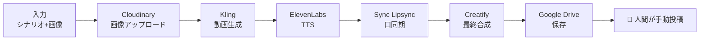

# AI-Influencer 戦略ドキュメント

> **最終更新**: 2026-02-09
> **ステータス**: 緊急 — コンテンツ生成パイプライン構築中
> **関係者**: Shungo (技術実装), チームメイト (クオリティ・コンテンツ)

---

## 目次

- [1. エグゼクティブサマリー](#1-エグゼクティブサマリー)
- [2. KPI計画](#2-kpi計画)
- [3. 収益モデル](#3-収益モデル)
- [4. 費用計画](#4-費用計画)
- [5. 動画制作コスト](#5-動画制作コスト)
- [6. マネタイズカテゴリ](#6-マネタイズカテゴリ)
- [7. 全体フロー](#7-全体フロー)
- [8. 自動化状況マップ](#8-自動化状況マップ)
- [9. プラットフォームAPI状況](#9-プラットフォームapi状況)
- [10. フェーズ計画](#10-フェーズ計画)
- [11. リスク一覧](#11-リスク一覧)
- [12. 中長期ロードマップ](#12-中長期ロードマップ)
- [13. 会議メモ](#13-会議メモ)
- [14. TODO・依頼事項](#14-todo依頼事項)
- [15. 意思決定ログ](#15-意思決定ログ)

---

## 1. エグゼクティブサマリー

AIインフルエンサーアカウントを大量運用し、ショート動画（YouTube Shorts / TikTok / Instagram Reels / X）を自動制作・投稿・分析するシステム。2月に50アカウントでMVP開始、6月までに700アカウントへスケール。

収益源はプラットフォーム広告収益＋アフィリエイト。最終的にはNode.jsパイプラインで動画生成→投稿→分析まで完全自動化し、既存GASアナリティクスでパフォーマンス分析を行う。

### 現状と緊急課題（2026-02-09時点）

**2月中旬に突入しているが、まだ1本も投稿できていない。** 2月KPI（50アカウント、17,600K再生）の達成が危機的状況。

投稿の自動化、分析ループ、クオリティ改善などの理想形は後回しにする。**今やるべきことは1つだけ**:

> **コンテンツ（動画）を自動生成し、Google Driveに溜める。人間がそこから手動で投稿する。**

- **Shungo**: チームメイトが作成したn8nワークフローを読み、使われている外部サービス/APIをNode.jsコードに落とし込む。入力を与えたら動画がDriveに保存される最低限のパイプラインを爆速で構築する。
- **チームメイト**: コンテンツのクオリティ担保。シナリオ・キャラクター・音声の品質チェック。
- **投稿**: 当面は人間が手動で各プラットフォームに投稿する。API自動投稿は後続タスク。

### 直近目標フロー

```
入力（シナリオ + キャラクター画像）
  → [自動] Kling で動画生成
  → [自動] ElevenLabs で音声生成
  → [自動] Lipsync で口同期
  → [自動] Creatify で最終合成
  → [自動] Google Drive に保存
  → [手動] 人間が各プラットフォームに投稿
```

**自動投稿、メトリクス収集、GAS分析ループは全て後続フェーズ。まずはDriveにコンテンツが溜まる状態を作る。**

---

## 2. KPI計画

### アカウント・再生数・収益目標

| 月 | アカウント数 | TT | IG | YT | X | 総再生数(千) | 総合収益(千) |
|---|---|---|---|---|---|---|---|
| 2月 | 50 | 12 | 12 | 12 | 14 | 17,600 | ¥5,386 |
| 3月 | 160 | 42 | 42 | 42 | 34 | 57,400 | ¥17,226 |
| 4月 | 340 | 92 | 92 | 92 | 64 | 122,800 | ¥36,598 |
| 5月 | 520 | 142 | 142 | 142 | 94 | 188,200 | ¥55,970 |
| 6月 | 700 | 192 | 192 | 192 | 124 | 253,600 | ¥75,342 |

---

## 3. 収益モデル

### 各プラットフォームの収益化条件

#### YouTube

**収益化条件（数値）:**
- 登録者 1,000人
- 直近90日で有効な公開アップロード 3本
- さらに以下のどちらか:
  - 過去12か月の公開の有効な総再生時間 4,000時間
  - 直近90日の有効な公開Shorts視聴数 1,000万回

**その他の条件:**
- YPP（YouTubeパートナープログラム）加入
- 2段階認証（2-Step Verification）ON
- AdSense for YouTube アカウントをリンク

**収益度合い:**
- 長尺動画: 200〜500円/1,000再生
- ショート: 3〜30円/1,000再生
- ※広告費をかける時期によって大幅に変動（広告プールの一定%がクリエイター割り当てという方式のため）

**アフィリエイト案件単価:**
- 長尺動画: 20〜100万円
- Shorts: 5〜20万円

#### TikTok

**収益化条件（数値）:**
- フォロワー 1万人+
- 直近30日間の総動画視聴数 10万回以上
- 1,000以上の動画から収益化発生
- 5秒未満の視聴はカウント外
- おすすめFeed以外からの流入分の視聴はカウント外

**その他の条件:**
- 日本在住 & 18歳以上
- 動画の長さが1分以上であること
- 政府関連やビジネス等の非個人アカウントは不可

**収益度合い:**
- CPM: 40円〜100円
- ※RPMはアカウントごとに異なる（自分のダッシュボード参照）

**アフィリエイト案件単価:** 10〜30万円

#### Instagram

- **プラットフォームからの収益は基本的に存在しない**
- あるにはあるが、Metaからの招待制で招待が来た人のみ可能
- **基本的にアフィリエイトでの収益がメイン**

**アフィリエイト案件単価:** 10〜50万円

#### X / Twitter

**収益化条件（数値）:**
- X Premium（有料）への加入
- フォロワー 500人以上
- 直近3ヶ月の総合インプレッション 500万回以上

**収益度合い:**
- CPM: 30〜100円
- ※ただし100万Imp単位での課金の可能性あり

**アフィリエイト案件単価:** 5〜30万円

---

### マネタイズ① プラットフォーム収益

各プラットフォームのCPM（1,000再生あたり収益）:

| プラットフォーム | CPM |
|---|---|
| TikTok | ¥40 |
| YouTube | ¥10 |
| Twitter/X | ¥30 |
| Instagram | ¥0 |

月次推移:
- 2月: ¥386K
- 3月: ¥1,226K
- 4月: ¥2,598K
- 5月: ¥3,970K
- 6月: ¥5,342K
- **累計: ¥13.5M**

### マネタイズ② アフィリエイト

プラットフォーム別単価:

| プラットフォーム | 単価/件 |
|---|---|
| TikTok | ¥10万 |
| Instagram | ¥10万 |
| YouTube | ¥5万 |
| X/Twitter | ¥5万 |

月次推移:
- 2月: ¥5.0M
- 3月: ¥17.0M
- 4月: ¥34.0M
- 5月: ¥51.0M
- 6月: ¥70.0M
- **累計: ¥177M**

---

## 4. 費用計画

### 月次費用

| 項目 | 2月 | 3月 | 4月+ |
|---|---|---|---|
| インターン (人数) | 4人 | 8人 | 12人 |
| インターン費 (@¥120K/月) | ¥480K | ¥960K | ¥1,440K |
| 給与 | ¥500K | ¥500K | ¥500K |
| その他（アカウント購入、メアド、VPN等） | ¥5K | ¥8K | ¥18K |
| **合計** | **¥985K** | **¥1,468K** | **¥1,958K** |

---

## 5. 動画制作コスト

### 1本あたりコスト: ~$2.64（10秒動画、720p）

| サービス | 単価 | 10秒あたり | 出典 |
|---|---|---|---|
| Kling 2.6 (動画生成) | $0.07/秒 | $0.70 | [fal.ai](https://fal.ai/models/fal-ai/kling-video/v2.6/pro/image-to-video) |
| TTS (ElevenLabs v3) | ~$0.05/1K文字 | ~$0.04 | [fal.ai](https://fal.ai/models/fal-ai/elevenlabs/tts/eleven-v3) |
| Sync Lipsync v2 | $3.00/分 | $0.50 | [fal.ai](https://fal.ai/models/fal-ai/sync-lipsync/v2) |
| Creatify Aurora (720p) | $0.14/秒 | $1.40 | [fal.ai](https://fal.ai/models/fal-ai/creatify/aurora) |
| **合計** | | **$2.64** | |

---

## 6. マネタイズカテゴリ

### TikTok

| カテゴリ | 成果地点 | 商品単価 | コミッション率 | 客単価 | CVR | ショート向けの型 |
|---|---|---|---|---|---|---|
| スキンケア・コスメ | 購入 | ¥3,819 | 5% | ~¥191 | 1.0〜2.0% | 変化/使用感→比較→結論 |
| アパレル・ファッション | 購入 | ¥4,277 | 8% | ~¥342 | 1.5〜2.5% | 着用→全身→ディテール→サイズ感 |
| 日用消耗品 | 購入 | ¥1,717 | 4% | ~¥69 | 1.0〜2.0% | 時短/ストレス解消の課題解決 |
| 食品（お取り寄せ/ギフト） | 購入 | ¥3,670 | 8% | ~¥294 | 0.8〜1.5% | シズル（湯気/断面）＋一言レビュー |
| 美容・健康家電 | 購入 | ¥8,949 | 2% | ~¥179 | 1.0〜2.0% | デモ→ベネフィット→注意点（正直） |

### Instagram リール

| カテゴリ | 成果地点 | 商品単価 | コミッション率 | 客単価 | CVR | ショート向けの型 |
|---|---|---|---|---|---|---|
| スキンケア/コスメ | 購入 | ¥3,819 | 5% | ~¥191 | 1.0〜1.6% | ルーティン→成分→悩み→使い方 |
| サプリ/プロテイン | 購入（定期） | ¥3,342 | 6% | ~¥201 | 0.9〜1.5% | 目的直線訴求／3日・1週間レビュー |
| レディースファッション | 購入 | ¥4,545 | 8% | ~¥364 | 0.7〜1.3% | 着回し/骨格・身長別/サイズ比較 |
| キッチン用品/生活雑貨 | 購入 | ¥2,620 | 3% | ~¥79 | 0.6〜1.1% | Before→After（時短/収納/ストレス減） |
| キッチン家電（時短家電） | 購入 | ¥11,838 | 2% | ~¥237 | 0.4〜0.9% | 比較/検証（旧型vs新型、買う前の3点） |

### YouTube Shorts

| カテゴリ | 成果地点 | 客単価 | CVR | ショート向けの型 |
|---|---|---|---|---|
| 低〜中単価の物販（ガジェット等） | 購入 | ¥75〜200/件 | 3〜6% | 用途→結論の即断型（これ買い） |
| 無料体験系サブスク（VOD等） | 無料体験 | ¥250〜1,500/件 | 2〜6% | 低ハードルで「試す理由」→即CTA |
| コスメ/スキンケア（D2C初回） | 初回購入 | ¥1,500〜5,000/件 | 1〜3% | 不安解消（比較/レビュー）→購入 |
| 学び/自己投資 | 無料体験/資料請求 | ~¥3,000/件 | 1〜4% | 成果物（学習計画/質問集）提示→申込 |
| 旅行/体験予約 | 予約 | ¥200〜800/件 | 0.5〜2% | 比較・失敗回避→検討補助 |

### 横断（AI自動化との相性）

| カテゴリ | 客単価 | CVR | AI自動化相性 | 理由 |
|---|---|---|---|---|
| EC物販（セール/クーポン/ガジェット） | ¥75〜200/件 | 0.8〜2.0% | **高** | 価格/在庫/順位の検知→差分を短文化→自動投稿しやすい |
| サブスク無料体験（VOD/音楽/電子書籍） | ¥250〜1,500/件 | 1.5〜4.0% | 中 | 用途別おすすめ自動生成→CTAテンプレ化 |
| マッチングアプリ/恋愛サービス | ¥2,000〜5,000/件 | 0.8〜2.5% | 中 | 悩み別セグメント→訴求軸テンプレ化 |
| 美容・健康（トライアル等） | ¥1,000〜5,000/件 | 0.4〜1.5% | 低 | 表現NGリスク（薬機法）→人手監修が前提 |
| 転職・求人/リスキリング | ¥5,000〜20,000/件 | 0.3〜1.0% | 中 | 職種別ロードマップ等の定型コンテンツ |

---

## 7. フロー

### 直近フロー（最優先 — コンテンツ生成→Drive保存）

今すぐ構築すべき範囲。入力を与えたらDriveにコンテンツが溜まる状態を作る。



```
入力（シナリオ + キャラクター画像）
    → Cloudinary に画像アップロード
    → Kling で動画生成
    → ElevenLabs で音声生成
    → Sync Lipsync で口同期
    → Creatify で最終合成
    → Google Drive に保存
    ─ ─ ─ ここから先は手動 ─ ─ ─
    → 人間が各プラットフォームに投稿
```

### 将来の全体フロー（後続フェーズ）

直近フローが安定した後に順次自動化していく。

```
[直近フロー] → 自動投稿 → メトリクス自動収集 → GAS分析 → 改善提案 → ループ
```

---

## 8. 自動化状況マップ

| ステップ | 状況 | ツール | 優先度 |
|---|---|---|---|
| シナリオ・画像の入力 | 🟡 手動 | Sheets + Drive | **直近** |
| 画像アップロード | 🔴 未実装 | Cloudinary | **直近** |
| 動画生成 | 🔴 未実装 | fal.ai / Kling | **直近** |
| TTS | 🔴 未実装 | fal.ai / ElevenLabs | **直近** |
| リップシンク | 🔴 未実装 | fal.ai / Sync Lipsync | **直近** |
| 動画合成 | 🔴 未実装 | fal.ai / Creatify | **直近** |
| Drive保存 | 🔴 未実装 | Google Drive API | **直近** |
| プラットフォーム投稿 | 🟡 手動 | 人間が手動投稿 | 後続 |
| メトリクス収集 | 🟡 手動CSV | GAS CSVParser | 後続 |
| 分析・スコア更新 | 🟢 自動 | GAS KPIEngine + LLMAnalyzer | 後続 |
| 改善提案 | 🟢 自動 | GAS + OpenAI | 後続 |

🟢 自動　🟡 半自動/手動　🔴 未実装

---

## 9. プラットフォームAPI状況

| プラットフォーム | API状況 | 制限・注意事項 |
|---|---|---|
| YouTube | 標準API | 最も安定。Data API v3 + upload |
| Instagram | Business API必須 | URL-basedアップロードのみ。Business/Creator アカウント必須 |
| TikTok | API審査要 | 15投稿/日制限。Content Posting API は審査必要 |
| X/Twitter | v2 API | 不安定。レート制限が厳しい |

---

## 10. フェーズ計画

### Phase 0: コンテンツ生成パイプライン（今すぐ — 最優先）

**目標**: 入力を与えたら動画がDriveに保存される最低限のパイプラインを動かす

- [ ] fal.ai APIキー取得（Tomoから）
- [ ] Kling動画生成の接続・動作確認
- [ ] ElevenLabs TTS接続・動作確認
- [ ] Sync Lipsync接続・動作確認
- [ ] Creatify Aurora接続・動作確認
- [ ] Google Driveへの自動保存
- [ ] **1本の動画がDriveに保存されるE2E確認**

**完了条件**: `node scripts/run-pipeline.js` を実行 → Driveに完成動画が1本保存される

### Phase 1: 量産体制（Phase 0完了後）

**目標**: 複数のコンテンツを連続生成し、Driveに溜めていく。人間が手動投稿。

- [ ] バッチ実行（複数シナリオを連続処理）
- [ ] content_pipelineシートにログを自動記録
- [ ] エラー時のリトライ・スキップ

### Phase 2: 投稿自動化（後続）

**目標**: Driveのコンテンツを各プラットフォームに自動投稿

- [ ] YouTube Data API投稿
- [ ] Instagram Business API投稿
- [ ] TikTok Content Posting API投稿
- [ ] X/Twitter v2 API投稿
- [ ] アカウント管理（accounts タブ連携）

### Phase 3: 分析ループ（後続）

**目標**: 投稿→メトリクス→分析→改善の自動ループ

- [ ] メトリクス自動収集（手動CSV → API自動化）
- [ ] GAS分析との連携
- [ ] 改善提案→次シナリオへのフィードバック

---

## 11. リスク一覧

| リスク | 影響度 | 対策 |
|---|---|---|
| TikTok API審査却下 | 高 | 手動投稿フォールバック、他プラットフォーム優先 |
| アカウントBAN | 高 | 投稿頻度制限、コンテンツ多様化、IP分散(VPN) |
| fal.ai サービス障害 | 中 | 代替APIの調査、ローカルバッファ |
| API費用超過 | 中 | 1本$2.64を前提とした予算管理、日次コスト監視 |
| 品質低下によるエンゲージメント低下 | 中 | GASスコアリング→低スコアコンポーネント排除 |
| プラットフォーム規約変更 | 中 | 複数プラットフォーム分散運用 |
| CSV形式変更 | 低 | 列名エイリアス対応済み(GAS) |

---

## 12. 中長期ロードマップ

| 時期 | マイルストーン |
|---|---|
| 2月 | 50アカウント運用開始 |
| 3月 | 160アカウント、アフィリエイト本格化 |
| 4月 | 340アカウント、インターン12人体制 |
| 5月 | 520アカウント |
| 6月 | 700アカウント、月次収益¥75M目標 |
| Q3以降 | OpenClaw統合検討、さらなるスケール |

---

## 13. 会議メモ

### 2026-02-09: MTG（1回目）

**議題**: n8nワークフローのコード化、技術スタック決定

**決定事項**:
- n8nワークフローをNode.jsコードに移行する
- fal.aiをメディア生成ハブとして使用する（Kling, ElevenLabs, Lipsync を統合）
- Google Sheetsをデータベースとして継続使用
- 既存GASアナリティクスはそのまま維持（変更なし）
- YouTube から投稿開始（API が最も安定）

**アクションアイテム**:
- チームメイト: fal.ai APIキー共有
- チームメイト: 各プラットフォームアカウント情報共有
- チームメイト: n8nワークフロー詳細の共有
- Shungo: Node.jsパイプライン実装開始

### 2026-02-09: 方針転換 — スコープ縮小

**背景**: 2月中旬に突入しているがまだ1本も投稿できていない。2月KPI（50アカウント、17,600K再生）の達成が危機的。理想形の全自動ループを追求していたら間に合わない。

**決定事項**:
- **スコープを大幅に縮小**: 全体フロー（自動投稿・メトリクス・分析ループ）は後回し
- **直近目標を1つに絞る**: 「入力→動画生成→Drive保存」のパイプラインだけを作る
- **投稿は当面手動**: Driveに溜まったコンテンツを人間が手動で各プラットフォームに投稿
- **役割分担**: Shungoがパイプラインのコード実装、チームメイトがコンテンツのクオリティ担保
- そもそも投稿しないことには何も始まらない。クオリティよりまず量。まずはDriveにコンテンツを溜める。

---

## 14. TODO・依頼事項

### チームメイトへの依頼（未完了）

- [ ] fal.ai APIキーの共有
- [ ] 各プラットフォームのアカウント情報（YouTube/IG/TikTok/X）
- [ ] n8nワークフローの詳細（ノード構成、パラメータ）
- [ ] Creatify APIキーまたはアカウント情報

### 技術タスク

- [x] pipeline/ ディレクトリの作成（コード骨格済み、動作未確認）
- [x] accountsシートタブの作成
- [x] content_pipelineシートタブの作成
- [ ] fal.ai SDK統合・動作確認
- [ ] 各メディア生成モジュールの動作確認（Kling, ElevenLabs, Lipsync, Creatify）
- [ ] Google Drive保存の動作確認
- [ ] E2E: 入力→動画生成→Drive保存の一気通貫テスト

### 後続TODO

- [ ] 投稿の自動化（YouTube/IG/TikTok/X API連携）
- [ ] GASメトリクス取り込みのAPI自動化（現状は手動CSV → 各プラットフォームAPIで自動収集に移行）

---

## 15. 意思決定ログ

| 日付 | 決定 | 理由 |
|---|---|---|
| 2026-02-09 | n8n → Node.jsに移行 | スケーラビリティ、バージョン管理、テスト容易性 |
| 2026-02-09 | fal.aiをメディアハブとして採用 | Kling/ElevenLabs/Lipsyncを統合的に利用可能 |
| 2026-02-09 | Google Sheetsを継続 | 既存GASアナリティクスとの統合、非エンジニアも閲覧可能 |
| 2026-02-09 | YouTube優先でMVP | API最安定、収益化最速 |
| 2026-02-09 | スコープ縮小: Drive保存までに集中 | 2月中旬で投稿ゼロ、まず量を確保。自動投稿・分析ループは後続 |
| 2026-02-09 | 投稿は当面手動 | パイプライン構築に集中、投稿自動化は後続フェーズ |
| 2026-02-06 | GASをアナリティクスに採用 | Sheets native統合、サーバーレス |
| 2026-02-06 | CSV-firstアプローチ | プラットフォームAPI制限が厳しいため |
