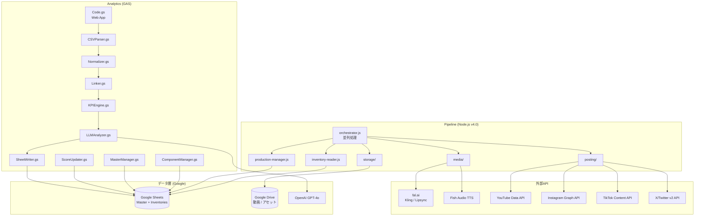
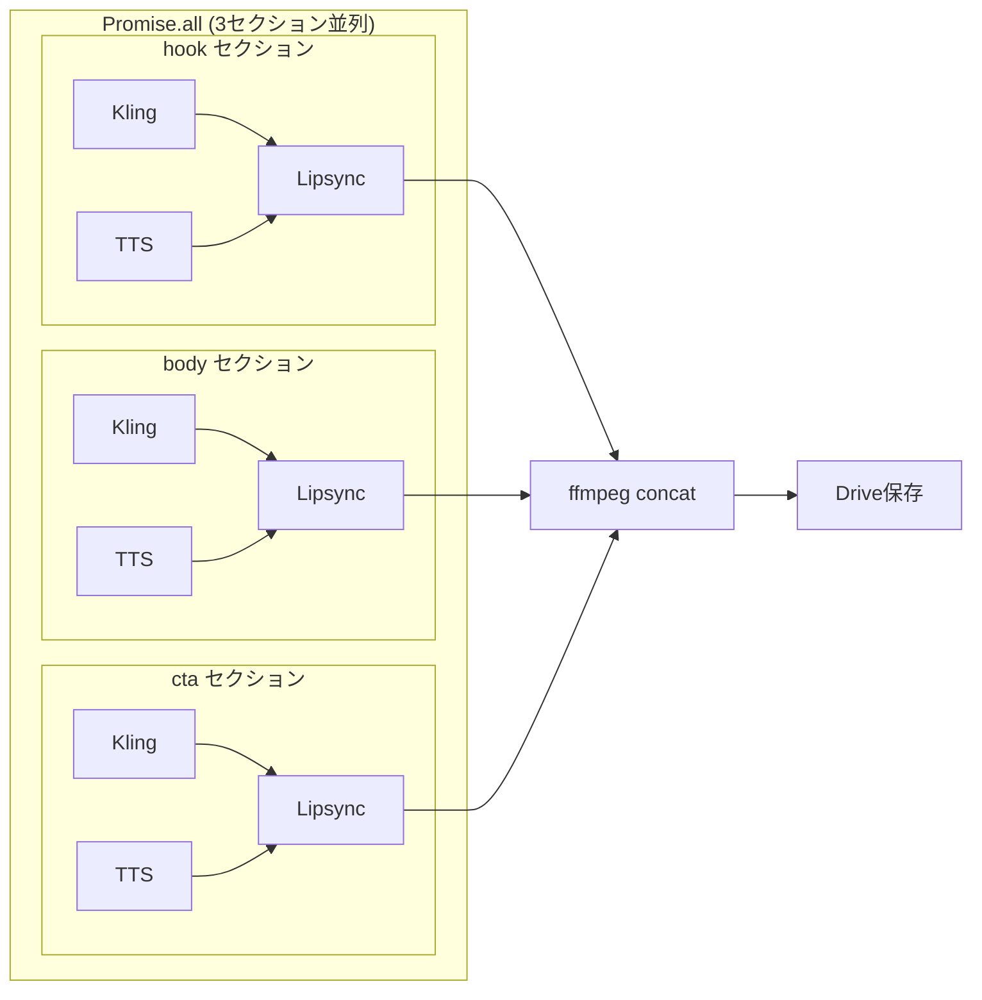

# AI-Influencer 技術アーキテクチャ

> **バージョン**: 4.0
> **最終更新**: 2026-02-13


## システム全体図



### ウォッチャーアーキテクチャ（GUI実行）

```
[Google Sheets UI]
  │  メニュー: Pipeline > Queue All Ready Videos...
  │  GAS: バリデーション → pipeline_status = 'queued' 設定
  │
  ▼
[production タブ]  pipeline_status = 'queued' or 'queued_dry'
  │
  │  30秒ポーリング
  ▼
[watch-pipeline.js on VM (PM2)]
  │  getQueuedRows(1) → 1行取得 → resolveProductionRow → runSingleJob
  │  処理完了 → 次のpoll → 次のqueued行を処理 → ...
  │
  ▼
[Pipeline Orchestrator] → fal.ai / Fish Audio / Drive
```

- GASはシートのステータス更新のみ。API呼び出しはVM上のNode.jsが担当。
- ウォッチャーは1回のpollで1行だけ処理（完了後に次をpoll）
- `SIGINT`/`SIGTERM` でグレースフルシャットダウン（現ジョブ完了後に停止）
- PM2で自動再起動・systemd起動を管理

### テキスト版

```
┌──────────────────────────────────────────────────────────────────┐
│                    Pipeline (Node.js v4.0)                        │
│                                                                  │
│  watch-pipeline.js ──► 30秒ポーリング (PM2常駐デーモン)         │
│       │                                                          │
│       ▼                                                          │
│  orchestrator.js ──► media/ ──► fal.ai (Kling / Lipsync)        │
│                      │     ──► Fish Audio TTS (直接API)          │
│       │              │         (3セクション並列処理)              │
│       │              └──► ffmpeg (3セクション結合)                │
│       │                                                          │
│       ├──► inventory-reader.js ──► Inventory Sheets (4つ)        │
│       ├──► production-manager.js ──► production タブ (32カラム)  │
│       ├──► storage/ ──► Google Drive                             │
│       │                                                          │
│       └──► posting/ ──► YouTube / Instagram / TikTok / X        │
│                                                                  │
│  sheets/ ◄──► Google Sheets (accounts, production, inventories)  │
└──────────────────────────────────────────────────────────────────┘
                              │
                              ▼
┌──────────────────────────────────────────────────────────────────┐
│                  Analytics (GAS v2.0) ※変更なし                  │
│                                                                  │
│  Code.gs ──► CSVParser ──► Normalizer ──► Linker                │
│                                              │                   │
│                                              ▼                   │
│  SheetWriter ◄── LLMAnalyzer ◄── KPIEngine                      │
│       │              │                                           │
│       ▼              ▼                                           │
│  ComponentManager  ScoreUpdater  MasterManager                   │
│       │              │              │                             │
│       ▼              ▼              ▼                             │
│              Google Sheets (Master + Inventories)                 │
└──────────────────────────────────────────────────────────────────┘
```


## データフロー

### 動画制作フロー（Pipeline v4.0）

```
1. インベントリ読み取り
   inventory-reader.js: Scenarios/Motions/Characters/Audio Inventory → 素材ID解決

2. キャラクター画像取得
   Google Drive (Characters/) → fal.storage アップロード → 一時公開URL

3. 3セクション(hook/body/cta) 並列処理 (Promise.all)
   各セクションで（セクション間は並列、セクション内も一部並列）:
   ┌─ fal.ai Kling motion-control (画像 + モーション参照動画 → 動画) ─┐ 並列
   └─ Fish Audio TTS 直接API (スクリプト → 音声MP3 → fal.storage URL) ─┘
   → fal.ai Sync Lipsync v2/pro (動画 + 音声 → 口同期動画)

4. 結合
   ffmpeg concat demuxer (3本のセクション動画 → final.mp4)

5. 保存
   4ファイル(01_hook.mp4, 02_body.mp4, 03_cta.mp4, final.mp4)
   → Google Drive (Productions/YYYY-MM-DD/VID_YYYYMM_XXXX/)

6. 記録
   production-manager.js: production タブにURL・ステータスを自動記録（32カラム）
```

### 並列処理フロー図



### 分析フロー（GAS）※既存

```
1. CSV取込
   プラットフォームCSV → CSVParser → Normalizer → 統一スキーマ

2. リンク
   Linker: プラットフォームID ↔ video_uid マッチング

3. 分析
   KPIEngine: 目標値との比較・スコア算出
   LLMAnalyzer: OpenAI GPT-4o でコンポーネント別分析

4. 更新
   ScoreUpdater: コンポーネントスコア更新
   MasterManager: マスターシートの分析結果更新
   SheetWriter: 分析レポート・推奨事項を書き込み
```


## API統合

### fal.ai（動画生成 + リップシンク）

Kling と Lipsync は fal.ai 経由で呼び出す。TTS は Fish Audio の直接REST API（fal.ai とは別サービス）。

| サービス | プロバイダー | 用途 | 何をするか | 単価 | 5秒あたり |
|---|---|---|---|---|---|
| Kling 2.6 motion-control | fal.ai | AI動画生成 | image_url + video_url → 動画を生成 | [$0.07/秒](https://fal.ai/models/fal-ai/kling-video/v2.6/standard/motion-control) | $0.35 |
| Fish Audio TTS API（直接REST API） | Fish Audio | テキスト音声合成 (TTS) | スクリプトテキスト → 音声MP3を生成 (reference_id指定) | ~$0.001/セクション | ~$0.001 |
| Sync Lipsync v2/pro | fal.ai | リップシンク | 動画+音声 → 口の動きを同期させた動画を生成 (sync_mode: "bounce") | [$5.00/分](https://fal.ai/models/fal-ai/sync-lipsync/v2/pro) | $0.42 |

**セクション単価: ~$0.77（5秒）/ 1本あたり(3セクション): ~$2.31**

### Google APIs

| API | 用途 |
|---|---|
| Google Sheets API v4 | データ読み書き（パイプライン側） |
| Google Drive API v3 | 動画・アセット保存 |
| YouTube Data API v3 | 動画アップロード |

### プラットフォーム投稿API

| プラットフォーム | API | 制限 |
|---|---|---|
| YouTube | Data API v3 | 最も安定 |
| Instagram | Graph API (Business) | URL-basedのみ |
| TikTok | Content Posting API | 15投稿/日、審査必要 |
| X/Twitter | v2 API | レート制限厳しい |

### OpenAI（分析）

| 用途 | モデル |
|---|---|
| コンポーネント別パフォーマンス分析 | GPT-4o |
| 改善提案・次回コンポーネント推奨 | GPT-4o |


## データ管理方針

### 設計原則

**Google Drive（ファイル実体）+ Google Sheets（メタデータ・ID管理）** の二層構造で全データを管理する。

| レイヤー | 役割 | 具体例 |
|---|---|---|
| Drive | ファイル実体の保存 | 動画、画像、音声、プロンプト |
| Sheets | メタデータ・ID・プロパティの紐付け管理 | インベントリ、content_pipeline、accounts |

### なぜこの構造か

1. **構造化データ**: Sheets上でID/プロパティ/ファイルリンクが紐付いているため、APIで一括読み取り可能
2. **AI連携**: パイプラインやLLMに読み込ませる際、シートからメタデータを取得→Drive URLでファイルアクセスという一貫したパターンで処理できる
3. **非エンジニアも操作可能**: Sheets/Driveはブラウザで誰でも確認・編集できる
4. **スケーラビリティ**: アカウント・コンテンツが増えてもシートの行追加とDriveフォルダで対応可能
5. **外部DB不要**: Google Workspace内で完結し、追加インフラ不要

### Drive フォルダ構造

起点: **Shared Drives > Product > AI-Influencer** (`1KRQuZ4W7u5CXRamjvN4xmavfu-7TPb0X`)

> 完全なフォルダツリー・命名規則は [README.md — Google Drive フォルダ構造](../README.md#google-drive-フォルダ構造) を参照。

主なフォルダ: Characters（入力画像）, Motions（参照動画）, Scenarios, Audio, Productions（出力）, Analytics（分析CSV）

### Sheets ↔ Drive の紐付け

- インベントリシートの `file_link` カラム → Drive内ファイルへのリンク
- content_pipeline シートの `drive_folder_id` カラム → 出力フォルダのDrive ID
- 全てのアセットはDriveに実体を保存し、Sheetsでメタデータを管理する（Sheets内にファイル実体を置かない）


## Google Sheetsスキーマ

> 全タブ・カラムの詳細は [README.md — Google Sheets データスキーマ](../README.md#google-sheets-データスキーマ) を参照。

### 概要

| カテゴリ | タブ | 管理 |
|---|---|---|
| パイプライン | `production`（32カラム、v4.0新規）, `accounts`, `content_pipeline`（レガシー） | Pipeline |
| アナリティクス | `master`, `metrics_*`, `kpi_targets`, `analysis_reports`, `recommendations`, `video_analysis`, `unlinked_imports` | GAS |
| 設定 | `_config` | GAS |

### インベントリスプレッドシート（5つ）

各コンポーネントタイプに1つずつ独立したスプレッドシート:

- **Scenarios Inventory** (`13Meu7cniKUr1JiEyKla0qhfiV9Az1IFuzIedzDxjpiY`)
- **Motions Inventory** (`1ycnmfpL8OgAI7WvlPTr3Z9p1H8UTmCNMV7ahunMlsEw`)
- **Characters Inventory** (`1-m4f5LgNmArtpECZqqxFL-6P4eabBmPkOYX2VkFHCHA`)
- **Audio Inventory** (`1Dw_atybwdGpi1Q0jh6CsuUSwzqVw1ZXB6jQT_-VDVak`)
- **Accounts Inventory** (`1CmT6C3qCW3md6lJ9Rvc2WNQkWa5zcvlq6Zp_enJHoUE`) — v4.0新規

共通カラム: component_id, type, name, description, file_link, drive_file_id, tags, times_used, avg_performance_score, created_date, status


## GASモジュール一覧

| モジュール | 行数 | 役割 |
|---|---|---|
| Code.gs | ~1160 | Web App エンドポイント + UIメニュー |
| Config.gs | ~400 | 設定値、スキーマ、定数 |
| PipelineUI.gs | ~250 | Pipeline メニューハンドラー（キューイング・バリデーション・ステータス表示） |
| Setup.gs | 762 | ワンクリックセットアップ |
| Migration.gs | 224 | v1→v2 マイグレーション |
| CSVParser.gs | 190 | プラットフォーム別CSVパーサー |
| Normalizer.gs | 208 | 統一スキーマ変換 |
| Linker.gs | 238 | video_uid マッチング |
| KPIEngine.gs | 249 | KPI比較・スコア算出 |
| LLMAnalyzer.gs | 665 | OpenAI連携分析 |
| SheetWriter.gs | 275 | シート書き込み |
| ComponentManager.gs | 283 | コンポーネントCRUD |
| MasterManager.gs | 255 | マスターシート操作 |
| ScoreUpdater.gs | 212 | コンポーネントスコア |
| Utils.gs | 544 | ユーティリティ・ID生成 |

GAS API エンドポイント詳細は [GAS操作マニュアル](manuals/GAS_MANUAL.md) を参照。


## n8n → Node.js コードマッピング

| n8n ノード | Node.js モジュール | 説明 |
|---|---|---|
| Google Sheets Read (Inventories) | pipeline/sheets/inventory-reader.js | インベントリ読み取り + ID解決（v4.0新規） |
| Google Sheets Write (Production) | pipeline/sheets/production-manager.js | productionタブ管理（v4.0新規） |
| Google Sheets Read (Scenarios) | pipeline/sheets/content-manager.js | シナリオ読み込み（レガシー） |
| fal.storage upload | pipeline/media/fal-client.js | キャラクター画像の一時URL生成 |
| fal-ai/kling-video motion-control | pipeline/media/video-generator.js | 画像+モーション参照動画→動画生成 |
| Fish Audio TTS API | pipeline/media/tts-generator.js | テキスト→音声生成 |
| fal-ai/sync-lipsync v2/pro | pipeline/media/lipsync.js | 動画+音声→口同期 |
| ffmpeg concat | pipeline/media/concat.js | 3セクション動画の結合 |
| Google Drive Upload | pipeline/storage/drive-storage.js | 完成動画のDrive保存 |
| YouTube Upload | pipeline/posting/adapters/youtube.js | YouTube Shorts投稿 |
| Instagram Publish | pipeline/posting/adapters/instagram.js | Instagram Reels投稿 |
| TikTok Publish | pipeline/posting/adapters/tiktok.js | TikTok投稿 |
| X Post | pipeline/posting/adapters/twitter.js | X投稿 |
| Google Sheets Write | pipeline/sheets/content-manager.js | パイプライン結果のシート書き込み（レガシー） |
| Schedule Trigger | scripts/run-daily.js | 日次バッチ (cron) |
| Queue Watcher | scripts/watch-pipeline.js | シートUIからのキュー監視デーモン (PM2) |


## コスト見積もり

> 詳細なコスト構造・月次見積もりは [README.md — コスト構造](../README.md#コスト構造) を参照。

**1動画（3セクション×5秒）あたり: ~$2.31**（fal.ai: Kling $1.05 + Lipsync $1.26 / Fish Audio: TTS ~$0.003）
