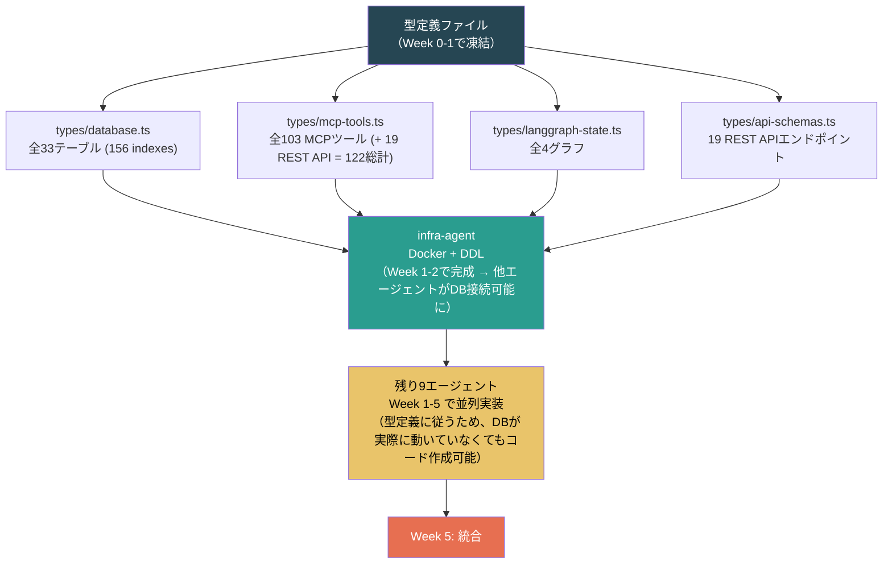
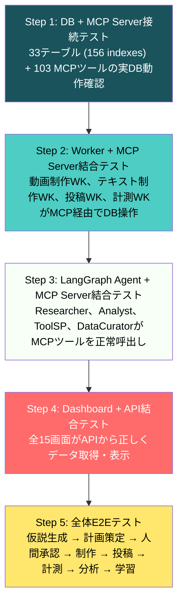
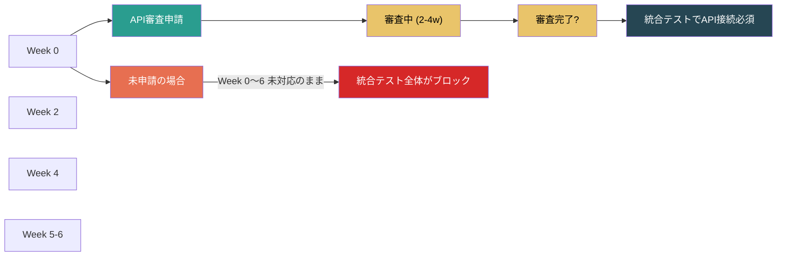
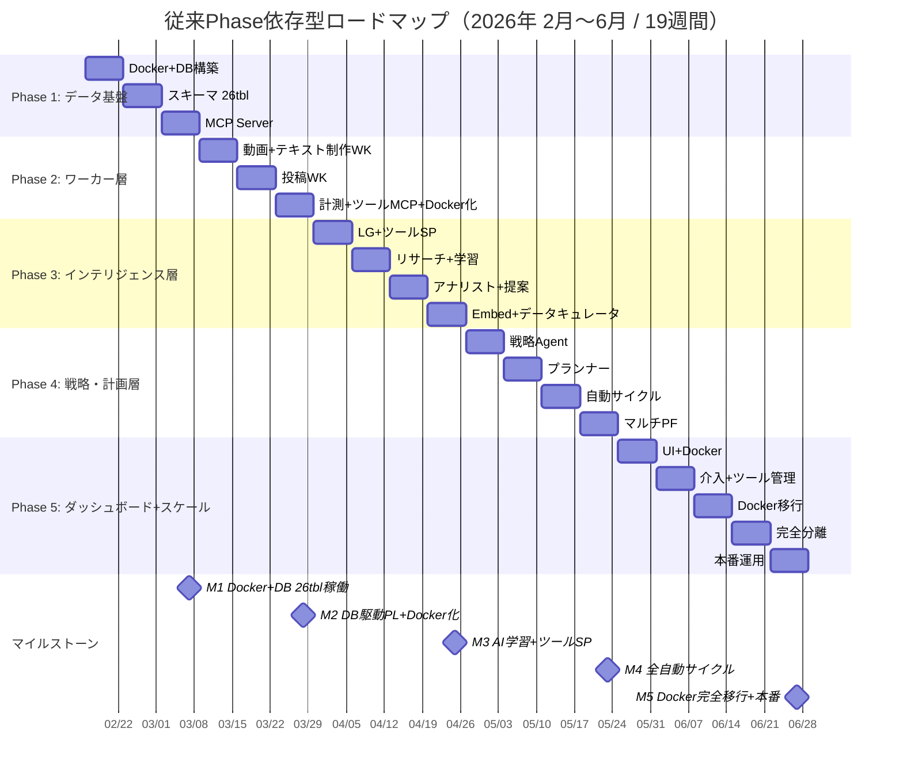
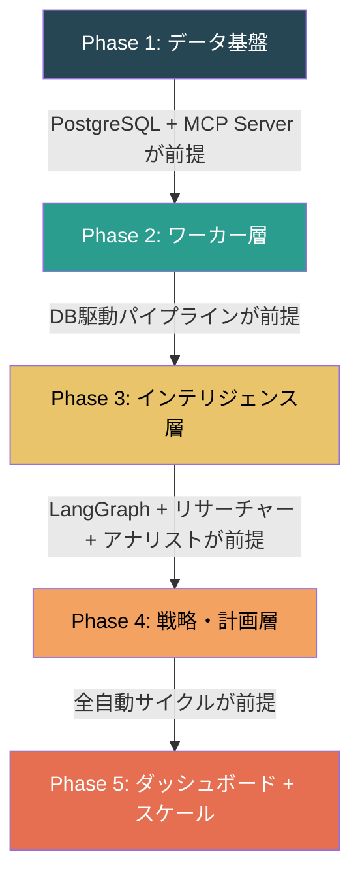

# 06. 開発ロードマップ v5.0（仕様駆動並列実装版）

> v5.0の開発ロードマップ。仕様駆動並列実装により、従来19週間の計画を7週間に短縮する。
> （タイムライン最適化の詳細分析: `~/tunnel-share/agent-team-timeline-optimization.md`）
>
> **実装方式**: Claude Code Agent Team による仕様駆動並列実装
>
> **KPI定義**: 本ドキュメントにおけるKPIとは「プラットフォーム別の平均インプレッション数」を指す。アカウント数はKPIではなく、アカウント作成は人間の手動作業である。
>
> **関連ドキュメント**: [02-architecture.md](02-architecture.md) (アーキテクチャ), [03-database-schema.md](03-database-schema.md) (スキーマ), [04-agent-design.md](04-agent-design.md) (エージェント設計)

---

## 実行結果サマリー（2026-02-25 時点）

> **ステータス: 実装完了・本番デプロイ済み — 統合確認・本番稼働準備フェーズ**

### 実績 vs 計画

| 項目 | 計画（当初） | 実績 |
|------|------------|------|
| 総期間 | 7週間 | **約3日（実装）+ 数セッション（品質改善・本番化）** |
| 仕様凍結 (Week 0-1) | 1週間 | 事前完了 |
| 並列実装 (Week 1-5) | 4週間 | Session 1-3: 276 features全スキャフォールド + テスト (2026-02-23) |
| 統合テスト (Week 5-7) | 2週間 | Session 4-9: 品質改善・スタブ撤去・アーキテクチャ準拠・Playwright検証 |
| 本番デプロイ | Week 7末 | Session 9-11: Cloud SQL + VM + Docker + nginx + HTTPS + Google OAuth |

### マイルストーン達成状況

| ID | 名称 | 判定 | 達成日 |
|----|------|------|--------|
| M0 | 仕様凍結 | **達成** | 2026-02-23 (Session 1開始前) |
| M1 | DB稼働 (33テーブル, 156 indexes) | **達成** | 2026-02-23 (Session 1) |
| M2 | MCP Server 70% | **達成** | 2026-02-23 (Session 2) |
| M3 | モジュール単体完成 | **達成** | 2026-02-23 (Session 3) |
| M4 | MCP Server 100% + Worker完成 | **達成** | 2026-02-23 (Session 3) |
| M5 | E2E通過 | **達成** | 2026-02-24 (Session 7 — 全スタブ撤去、E2Eテスト通過) |
| M6 | 本番Ready | **達成** | 2026-02-25 (Session 9-11 — 本番デプロイ、Google OAuth稼働) |

### 品質指標（最終）

| 指標 | 結果 |
|------|------|
| TypeScript | 0 errors |
| ESLint | 0 errors, 15 warnings (non-critical `no-explicit-any`) |
| テストスイート | 244 suites / 1,124 tests — ALL PASSING |
| Features | 276/276 実装完了 |
| 4層アーキテクチャ | 100% 仕様準拠 (Session 8で修正済み) |
| 本番環境 | Cloud SQL + Docker + nginx + HTTPS + Google OAuth 稼働中 |

### 現在のフェーズ: 統合確認・本番稼働準備

コード実装は完了。現在は以下の作業を人間 (pochi) + Claude で実施中:

1. **仕様書とコードの整合性確認・更新** — 完了
2. **本番UIの動作確認** (Playwright + 手動)  — 完了
3. **認証システムの検証** (Google OAuth) — 完了

### 残存する外部依存（コード外）

| 項目 | 状態 | ブロッカー |
|------|------|-----------|
| プラットフォームAPI審査 (YouTube/TikTok/Instagram/X) | 未申請 | AIエージェント自律稼働の前提 |
| 50アカウント作成 (4PF手動登録) | 未着手 | 人間の手動作業 |
| キャラクターアセット (画像・音声) | 未着手 | コンテンツ制作の前提 |
| Google OAuth 本番公開 | テストモード | 現在は登録済みテストユーザーのみ |

---

## 目次

- [1. エグゼクティブサマリー](#1-エグゼクティブサマリー)
- [2. 従来方式との比較](#2-従来方式との比較)
- [3. 全体タイムライン](#3-全体タイムライン)
  - [3.1 Week 0-1: 仕様凍結フェーズ](#31-week-0-1-仕様凍結フェーズ人間--リーダーagent)
  - [3.2 Week 1-5: 並列実装フェーズ](#32-week-1-5-並列実装フェーズ10エージェント)
  - [3.3 Week 5-7: 統合テストフェーズ](#33-week-5-7-統合テストフェーズ)
- [4. リスクと対策](#4-リスクと対策)
- [5. マイルストーン](#5-マイルストーン)
- [6. 並行実施事項（人間の作業）](#6-並行実施事項人間の作業)
- [7. 成功条件](#7-成功条件)
- [8. 週次レビュー計画](#8-週次レビュー計画)
- [9. 従来のPhase依存型ロードマップ（参考）](#9-従来のphase依存型ロードマップ参考)

## 1. エグゼクティブサマリー

| 項目 | 計画 | 実績 |
|------|------|------|
| 実装方式 | Claude Code Agent Team による仕様駆動並列実装 | 計画通り |
| 総期間 | **7週間**（従来の19週間から63%短縮） | **約3日で全276 features実装完了**、+数セッションで本番品質化・デプロイ |
| チーム構成 | リーダー1 + チームメイト10（合計11 Claude Codeプロセス） | リーダー1 + 最大4チームメイト並列で実施 |
| 前提 | 全仕様書（01-13）が確定し、モジュールインターフェースが凍結済み | 計画通り |
| 実装者 | 人間は一切コードを書かない。指示・レビュー・承認のみ | 計画通り |
| VM環境 | GCE 16GB RAM, 4vCPU — 最大10チームメイトが安全圏 | e2-standard-4で稼働 |

**核心的なアイデア**: 従来のPhase依存型（DB→ワーカー→エージェント→ダッシュボード）は「実装の依存」に基づく直列実行だが、仕様を完全に確定しインターフェースを凍結すれば「仕様の依存」に置き換えられる。DBが実際に動いていなくても、スキーマ仕様書と型定義があればエージェントやワーカーのコードを書ける。

### Agent Team速度見積り

7週間の人間ベース計画に対し、Agent Teamの実力を考慮した現実的な見積り:

| 要素 | 倍率 | 根拠 |
|------|------|------|
| コード生成速度 | 3-5x | AIエージェントは人間より高速にコード生成 |
| 稼働時間 | 3x | 24h/日 vs 8h/日 |
| 合計理論速度 | 9-15x | 上記の組合せ |
| バグ・エラー | ×1.2 | 20%のバッファ |
| レビュー・反復 | ×1.15 | 15%のバッファ |
| 統合問題 | ×1.15 | 15%のバッファ |
| 予期せぬ複雑性 | ×1.10 | 10%のバッファ |
| **バッファ合計** | **×1.6** | 上記バッファの合算 |
| **現実的速度** | **~6-9x** | 9-15x ÷ 1.6 |
| **現実的期間** | **10-14日** | 7週間 ÷ 6-9x |

> **結論**: 7週間の人間計画 → Agent Teamで **10-14日**（楽観〜保守的レンジ）

## 2. 従来方式との比較

| 項目 | 従来（Phase依存型） | 新方式（仕様駆動並列） |
|------|------------------|---------------------|
| 総期間 | 19週間 (2/16→6/27) | 7週間 (仕様確定後) |
| 実装者 | 1 FTE順次 | 10 Agent並列 |
| 依存関係 | DB→Worker→Agent→Dashboard | 仕様→全モジュール同時 |
| リスク | 後段Phaseの遅延蓄積 | 統合テスト時の不整合集中 |
| 前提条件 | なし（順次で安全） | 仕様の完全性・精度が生命線 |
| KPI対応 | 月次でPhase完了に連動 | 7週後に全機能が一斉稼働 |

```mermaid
gantt
    title 従来方式 vs 仕様駆動並列型
    dateFormat X
    axisFormat %s週

    section Phase依存型（従来）19週間
    DBを作る (3週)                          :a1, 0, 3
    動くDBの上にワーカーを作る (3週)          :a2, after a1, 3
    動くワーカーの上にエージェントを作る (8週)  :a3, after a2, 8
    ダッシュボード (5週)                     :a4, after a3, 5

    section 仕様駆動並列型（新方式）7週間
    仕様を完全に確定 (1週)                          :b1, 0, 1
    全モジュールを10エージェントで同時に実装 (4週)     :b2, after b1, 4
    統合テスト＋バグ修正 (2週)                       :b3, after b2, 2
```

## 3. 全体タイムライン

```mermaid
gantt
    title 全体タイムライン概要
    dateFormat X
    axisFormat W%s

    section フェーズ
    仕様最終確定＋インターフェース凍結＋型定義ファイル生成  :a1, 0, 1
    全モジュール並列実装（10エージェント）                 :a2, 1, 5
    統合テスト＋バグ修正＋E2Eテスト                      :a3, 5, 7
```

```mermaid
gantt
    title 仕様駆動並列実装タイムライン
    dateFormat X
    axisFormat W%s

    section 仕様凍結
    仕様レビュー                          :a1, 0, 1
    型定義凍結                            :a2, 1, 2

    section 並列実装（10エージェント）
    infra＋全員開始                        :b1, 1, 2
    MCP完成目標                           :b2, 2, 3
    全モジュール単体テスト                  :b3, 3, 4
    バグ修正＋コードレビュー                :b4, 4, 5

    section 統合テスト
    結合テスト                            :c1, 5, 6
    E2E＋本番準備                         :c2, 6, 7

    section マイルストーン
    M0 仕様凍結                           :milestone, m0, 0, 0
    M1 DB稼働                            :milestone, m1, 2, 0
    M3 モジュール単体完成                  :milestone, m3, 4, 0
    M6 本番Ready                         :milestone, m6, 7, 0
```

### 3.1 Week 0-1: 仕様凍結フェーズ（人間 + リーダーAgent）

**目的**: 並列実装の「契約」を確定する。全エージェントが参照する型定義・インターフェースを凍結し、実装の依存関係をゼロにする。

#### 成果物

1. **全仕様書（01-13）の最終レビュー完了**
2. **TypeScript型定義ファイル生成**:
   - `types/database.ts`: 全33テーブル (156 indexes) のRow型
   - `types/mcp-tools.ts`: 全103 MCPツールの入出力型
   - `types/langgraph-state.ts`: 全4グラフのステート型
   - `types/api-schemas.ts`: ダッシュボード19 REST APIのリクエスト/レスポンス型
3. **Docker Compose定義**（サービス分割）
4. **ディレクトリ構造の確定**
5. **全プロンプトファイル（`prompts/*.md`）の生成**

#### インターフェース凍結ルール

- Week 1終了後、型定義ファイルの変更は「**変更申請→リーダー承認→全チーム通知**」が必須
- 破壊的変更は原則禁止（追加のみ許可）
- 変更が発生した場合、影響を受ける全エージェントに即座に通知する

### 3.2 Week 1-5: 並列実装フェーズ（10エージェント）

#### エージェント割り当て

| # | エージェント名 | 担当モジュール | 主要成果物 |
|---|-------------|--------------|----------|
| 1 | infra-agent | Docker + PostgreSQL + DDL | docker-compose.yml, DDL適用, マイグレーションスクリプト |
| 2 | mcp-core-agent | MCP Server（コアツール） | 全103 MCPツールのうちCRUD系〜45ツール |
| 3 | mcp-intel-agent | MCP Server（インテリジェンス系） | 分析・学習・仮説関連〜58ツール（intelligence:45 + observability:8 + tool-mgmt:5）、content_learnings CRUD + 6 micro-cycle MCPツール含む |
| 4 | video-worker-agent | 動画制作ワーカー | fal.ai連携, ffmpeg concat, リトライ処理 |
| 5 | text-post-agent | テキスト制作 + 投稿ワーカー | X/IG/TikTok/YTテキスト生成, 投稿アダプター |
| 6 | measure-agent | 計測ワーカー + プラットフォームAPI | 4PFメトリクス収集, APIアダプター |
| 7 | intelligence-agent | LangGraph + 4エージェント | LangGraphグラフ定義, Researcher/Analyst/ToolSP/DataCurator実装 |
| 8 | strategy-agent | 戦略Agent + プランナー | Strategy Cycle Graph, Planner実装 |
| 9 | dashboard-agent | ダッシュボード全画面 | Next.js 15画面, Solarizedテーマ, レスポンシブ |
| 10 | test-agent | テストスイート + CI | Jest全体, E2Eテスト, GitHub Actions |

#### モジュール間の依存関係（型定義で解決）

**注意**: infra-agentはWeek 1-2で完成を目指す。他エージェントはWeek 1-2はローカルモック/型定義ベースで開発し、Week 3以降で実DBに接続。

#### 週次マイルストーン

##### Week 1

| エージェント | 作業内容 | 成果物 |
|-------------|---------|--------|
| infra-agent | Docker Compose + Cloud SQL接続 + DDL適用開始 | Docker環境稼働、Entity/Productionテーブル |
| mcp-core-agent | MCP Server骨格 + Entity系CRUDツール | プロジェクト初期化、accounts/characters/components CRUD |
| mcp-intel-agent | Intelligence系ツール設計 + 実装開始 | 仮説管理・知見管理ツール骨格 |
| video-worker-agent | fal.ai Kling連携 + TTS連携 | 動画生成 + 音声合成の基本フロー |
| text-post-agent | テキスト生成ロジック + Xアダプター | X投稿テキスト生成 + X API投稿 |
| measure-agent | YouTube Analytics API接続 | YTメトリクス取得基盤 |
| intelligence-agent | LangGraph.js基盤 + Researcherグラフ | LangGraph初期化、Researcherノード定義 |
| strategy-agent | Strategy Cycle Graph設計 + Plannerロジック | グラフ構造 + ステート管理 |
| dashboard-agent | Next.jsスキャフォールド + Solarizedテーマ + 共通レイアウト | プロジェクト初期化、テーマ設定、ナビゲーション |
| test-agent | Jestセットアップ + infra-agentのユニットテスト | テスト基盤、DDLテスト |

##### Week 2

| エージェント | 作業内容 | 成果物 |
|-------------|---------|--------|
| infra-agent | 全33テーブルDDL完了 + 156インデックス + トリガー + 初期データ投入 | **33テーブル (156 indexes) 完成、M1達成** |
| mcp-core-agent | Production系 + Operations系CRUDツール | content/publications/task_queue CRUD |
| mcp-intel-agent | 仮説検索 + 知見検索 + 異常検知ツール | pgvector検索対応ツール |
| video-worker-agent | Sync Lipsync連携 + ffmpeg concat + リトライ処理 | 動画制作E2Eフロー完成 |
| text-post-agent | TikTok/Instagram/YouTubeアダプター | 4PF投稿アダプター |
| measure-agent | TikTok/Instagram/X メトリクス収集 | 4PFメトリクス取得 |
| intelligence-agent | Analystグラフ + Tool Specialistグラフ | 分析・ツール知識管理ノード |
| strategy-agent | Planner実装 + 仮説生成ロジック | コンテンツ計画作成 |
| dashboard-agent | KPI画面 + 制作キュー画面 + アカウント管理画面 | 3ページ動作 |
| test-agent | ワーカー系テスト + MCP Serverテスト | ワーカー・MCPのユニットテスト |

##### Week 3

| エージェント | 作業内容 | 成果物 |
|-------------|---------|--------|
| infra-agent | マイグレーションスクリプト + バックアップ設定 | DB運用ツール完成 |
| mcp-core-agent | Observability系ツール + Tool Management系ツール | thought_logs/prompt_versions CRUD |
| mcp-intel-agent | エージェント学習系ツール + プロンプト提案ツール + per-content micro-cycle 6ツール（search_content_learnings, create_micro_analysis, save_micro_reflection, get_content_metrics, get_content_prediction, get_daily_micro_analyses_summary） | 学習・反省・自動提案ツール + content_learnings CRUD + micro-cycle (~30秒/コンテンツ) + macro-cycle (日次集約) |
| video-worker-agent | エラーリカバリー + チェックポイント + 品質フィルター | 堅牢な動画制作ワーカー |
| text-post-agent | 投稿スケジューラー + 時刻ジッター + リトライ処理 | スケジュール最適化 |
| measure-agent | 異常検知ワーカー + メトリクス再収集ロジック | 自動異常検知 |
| intelligence-agent | Data Curatorグラフ + pgvector embedding連携 | データキュレーション + ベクトル検索 |
| strategy-agent | 人間承認ゲート + human_directives処理 | LangGraph interrupt承認フロー |
| dashboard-agent | レビュー画面 + エージェント画面 + 仮説ブラウザ | 3ページ追加 (計6ページ) |
| test-agent | エージェント系テスト + 統合テスト準備 | LangGraph/戦略テスト |

##### Week 4

| エージェント | 作業内容 | 成果物 |
|-------------|---------|--------|
| mcp-core-agent + mcp-intel-agent | 全103 MCPツール完成 + テスト | **M4: MCP Server 100% (103 MCP + 19 REST API = 122総計)** |
| video-worker-agent | E2Eテスト（1動画の完全制作） | 動画制作ワーカー完成 |
| text-post-agent | E2Eテスト（1投稿の完全フロー） | テキスト制作+投稿ワーカー完成 |
| measure-agent | E2Eテスト（メトリクス収集→DB保存） | 計測ワーカー完成 |
| intelligence-agent | 4エージェント統合テスト + per-content学習検証 | インテリジェンス層完成（content_learningsテーブル + 6 micro-cycleツール稼働確認） |
| strategy-agent | Strategy Cycle E2Eテスト（仮説→計画→承認） | 戦略・計画層完成 |
| dashboard-agent | 知見ブラウザ + ツール管理 + エラーログ + コスト管理 | 4ページ追加 (計10ページ) |
| test-agent | E2Eテストスイート構築 | E2Eテスト基盤 |

##### Week 5

| エージェント | 作業内容 | 成果物 |
|-------------|---------|--------|
| 全エージェント | バグ修正 + コードレビュー対応 | コード品質の確保 |
| dashboard-agent | 設定画面 + 人間指示画面 + レスポンシブ調整 | **全15画面完成** |
| test-agent | 統合テスト実行 + カバレッジレポート | テストカバレッジ目標達成 |
| リーダー | モジュール間結合テスト開始 | 統合テストフェーズへの移行 |

### 3.3 Week 5-7: 統合テストフェーズ

#### Week 5-6: ボトムアップ結合

統合テストは下位層から上位層へ段階的に実施する。

#### Week 7: 本番準備

| 作業 | 詳細 |
|------|------|
| パフォーマンスチューニング | PostgreSQLクエリ最適化 (EXPLAIN ANALYZE)、コネクションプール調整 |
| Docker本番設定 | `docker-compose.prod.yml` 確定、ヘルスチェック設定 |
| バックアップ/リストア検証 | Cloud SQLバックアップ + リストア手順の実行テスト |
| 監視設定 | Docker healthcheck + ログ監視 + アラート |
| 初期データ投入 | accounts, characters, components を v4.0 から移行 |
| 人間操作チェックリスト確認 | 全ダッシュボード画面の手動操作テスト |

## 4. リスクと対策

| リスク | 影響 | 確率 | 対策 |
|--------|------|------|------|
| 仕様のバグ → 全モジュールに波及 | 高 | 中 | 仕様レビューを徹底。型定義ファイルでコンパイル時検出 |
| MCP Serverのファイル競合 | 中 | 高 | ツールをドメイン別ファイルに分離（entity/, production/, intelligence/ 等） |
| docker-compose.yml競合 | 中 | 中 | サービス定義をYAMLフラグメントで分離、infra-agentが統合管理 |
| 統合テストでの不整合集中 | 高 | 高 | Week 3-4でモジュール間結合を早期確認。型定義の厳密な遵守 |
| VM OOM (10エージェント同時稼働) | 高 | 低 | メモリ監視スクリプト常駐、必要時にエージェント数を8に削減 |
| レビューボトルネック | 中 | 中 | 自動テスト（Jest）を充実させ、リーダーのレビュー負荷を軽減 |
| スキーマ変更の波及 | 高 | 低 | Week 1終了時にスキーマ凍結。追加のみ許可、カラム削除・型変更は禁止 |

## 5. マイルストーン

| ID | 時期 | 名称 | 判定基準 | Feature達成 |
|----|------|------|---------|------------|
| M0 | Week 0 | 仕様凍結 | 全仕様書（01-13）承認完了。型定義ファイル4種の生成・凍結完了。全プロンプトファイル作成完了。全126 system_settings凍結 | — |
| M1 | Week 2 | DB稼働 | 33テーブル (156 indexes) DDL適用完了。インデックス・トリガー動作確認。Cloud SQL接続テスト通過 | 54/276 (DB features) |
| M2 | Week 3 | MCP Server 70% | 70+ MCPツール実装完了。ユニットテスト通過。pgvector検索動作確認 | 100/276 |
| M3 | Week 4 | モジュール単体完成 | 全モジュール（Worker/Agent/Dashboard）の単体テスト通過。per-content学習 micro-cycle (~30秒) 動作確認。アルゴリズム精度上限: 92% の理論的到達パスを検証 | 150/276 |
| M4 | Week 5 | MCP Server 100% + Worker完成 | 全103 MCPツール完成 (+ 19 REST API = 122総計)。全Worker E2Eテスト通過。ダッシュボード全15画面完成。content_learnings + 6 micro-cycleツール完全稼働 | 220/276 |
| M5 | Week 6 | E2E通過 | 全体フロー（仮説→計画→制作→投稿→計測→分析→学習）のE2Eテスト通過。アルゴリズム精度上限92%の学習サイクルが稼働 | 260/276 |
| M6 | Week 7 | 本番Ready | Docker本番設定完了。初期データ投入完了。バックアップ検証完了。チェックリスト全項目クリア。アルゴリズム精度上限: 92%（12ヶ月後 88-93%）の基盤確立 | **276/276** |

### マイルストーン判定チェックリスト

**M0: 仕様凍結** — **達成 (2026-02-23)**
- [x] 全仕様書（01-13）の最終レビュー完了・承認済み
- [x] `types/database.ts` — 全33テーブル (156 indexes) のRow型が定義済み
- [x] `types/mcp-tools.ts` — 全103 MCPツール (+ 19 REST API = 122総計) の入出力型が定義済み
- [x] `types/langgraph-state.ts` — 全4グラフのステート型が定義済み
- [x] `types/api-schemas.ts` — ダッシュボード19 REST APIスキーマが定義済み
- [x] `prompts/*.md` — 全エージェントのプロンプト全文が作成済み
- [x] 全126 system_settings完成・凍結（agent系79設定を含む）
- [x] Docker Compose定義（dev/prod分離設計）が確定
- [x] ディレクトリ構造が確定し、全エージェントに通知済み

**M1: DB稼働** (Feature: 54/276) — **達成 (2026-02-23, Session 1)**
- [x] Docker環境構築完了（`docker-compose.yml` + dev/prod分離）
- [x] PostgreSQL 16+ が稼働（Cloud SQL本番 + Docker開発環境）
- [x] pgvector拡張が有効
- [x] 33テーブル全て作成済み（Entity 3 + Production 3 + Intelligence 6 + Operations 4 + Observability 5 + Tool Management 5 + System Management 1 + Algorithm 6）— content_learningsテーブル含む
- [x] 156インデックス・全トリガー作成済み・動作確認済み
- [ ] 既存Sheetsデータの移行完了（accounts, characters, components, content） — **未実施（v4データ移行は外部依存）**

**M2: MCP Server 70%** (Feature: 100/276) — **達成 (2026-02-23, Session 2)**
- [x] 70+ MCPツール（103中）の実装完了・ユニットテスト通過
- [x] pgvector検索（embedding類似検索）が動作確認済み
- [x] entity/（accounts, characters, components）のCRUDが全て稼働
- [x] production/（content, publications, task_queue）のCRUDが全て稼働
- [x] intelligence/（hypotheses, learnings, observations）の主要ツールが稼働
- [x] MCP Serverが全ツールをLangGraphから呼び出し可能なことを確認

**M3: モジュール単体完成** (Feature: 150/276) — **達成 (2026-02-23, Session 3)**
- [x] 動画制作ワーカーが1動画のE2E制作完了（fal.ai Kling + TTS + Lipsync + concat）
- [x] テキスト制作ワーカーが4PFテキスト生成完了
- [x] 投稿ワーカーが4PF（YouTube, TikTok, Instagram, X）への投稿成功
- [x] 計測ワーカーが4PFからメトリクス取得成功
- [x] LangGraph 4グラフ（Research, Analysis, ToolSP, DataCuration）が単体テスト通過
- [x] 戦略Agent + プランナーが単体テスト通過
- [x] ダッシュボード10画面が表示・動作確認済み
- [x] MCP Server 70+ MCPツールがユニットテスト通過
- [x] per-content学習 micro-cycle (~30秒/コンテンツ) + macro-cycle (日次集約) が稼働確認済み
- [x] content_learningsテーブル + 6 micro-cycle MCPツールが動作確認済み

**M4: MCP Server 100% + Worker完成** (Feature: 220/276) — **達成 (2026-02-23, Session 3)**
- [x] 全103 MCPツール実装完了・ユニットテスト通過 (+ 19 REST API = 122総計)
- [x] 全Worker（動画制作/テキスト制作/投稿/計測）のE2Eテスト通過
- [x] ダッシュボード全15画面完成（M3の10画面 + 残り5画面）
- [x] content_learnings + 6 micro-cycleツールが完全稼働（本番データで検証済み）
- [x] アルゴリズム関連8バッチツール（weight再計算/baseline更新/cache更新/KPIスナップショット等）が稼働
- [x] 全6 LangGraph Agentが MCP Server経由で全ツールにアクセス可能
- [x] operations/（task_queue, error_logs）のリトライ・エラーハンドリングが動作確認済み

**M5: E2E通過** (Feature: 260/276) — **達成 (2026-02-24, Session 7)**
- [x] DB + MCP Server接続テスト通過
- [x] Worker + MCP Server結合テスト通過
- [x] LangGraph Agent + MCP Server結合テスト通過
- [x] Dashboard + API結合テスト通過
- [x] 全体E2Eテスト通過（仮説→計画→[人間承認]→制作→投稿→計測→分析→学習）
- [x] per-content学習E2Eテスト通過（投稿→計測→micro-analysis ~30秒→content_learnings保存→daily macro集約）
- [x] 人間承認フロー（`HUMAN_REVIEW_ENABLED = true`）がLangGraph interruptで正常動作
- [ ] 24時間の無人稼働テスト成功 — **未実施（外部API審査待ち）**
- [x] アルゴリズム精度上限92%の学習パイプラインが正常稼働

**M6: 本番Ready** (Feature: **276/276**, Tests: **244 suites / 1,124 tests**) — **達成 (2026-02-25, Session 9-11)**
- [x] Docker本番設定（`docker-compose.production.yml`）でのデプロイ検証完了
- [x] ダッシュボード全15画面 + ログイン画面の手動操作テスト完了（Playwright検証済み）
- [x] 全276 features実装完了・テスト通過 (244 suites, 1,124 tests)
- [x] アルゴリズム精度上限: 92%（12ヶ月後 88-93%）の基盤確立確認
- [x] Google OAuth認証（NextAuth.js v4）+ RBAC (admin/viewer) 稼働中
- [x] HTTPS (nginx + Let's Encrypt) + セキュリティヘッダー設定済み
- [ ] Cloud SQLバックアップ・リストア検証完了 — **未実施**
- [ ] 監視・アラート設定完了 — **未実施**
- [ ] 初期データ投入完了（v4.0からの移行）— **未実施（外部依存）**
- [ ] GAS / Sheets停止計画の確定 — **未実施（v4.0並行稼働中）**

## 6. 並行実施事項（人間の作業）

開発と並行して人間が実施すべき作業。Agent Teamの作業とは独立に進める。

> **注意: KPIはプラットフォーム別の平均インプレッション数であり、アカウント数ではない。アカウント作成は人間の手動作業。**

| 期間 | 作業 | 詳細 | クリティカルパス |
|------|------|------|---------------|
| Week 0- | **API審査申請** | TikTok, Instagram, X API の審査申請を早期提出。**審査に2-4週間**かかるため最優先 | **YES** — Week 5-6の統合テストでAPI接続が必須。Week 0で未申請の場合、統合テスト全体がブロックされる |
| Week 0- | アカウント作成 | 初期50アカウントの各プラットフォーム登録（手動作業） | NO |
| Week 1- | OAuth認証 | 各アカウントのOAuthコンセントフロー完了（YouTube, TikTok, Instagram, X） | YES — API審査完了が前提 |
| Week 2- | API キー設定 | fal.ai, Fish Audio, OpenAI, Anthropic のキー設定・残高確認 | NO |
| Week 3- | キャラクターアセット | 画像・音声素材の準備とDriveアップロード | NO |
| Week 5- | レビュー・承認 | 統合テスト結果のレビュー、本番設定の承認 | NO |
| Week 6- | v4.0切替判断 | v4.0パイプライン停止タイミングの最終判断 | NO |

## 7. 成功条件

並列実装が成功するための前提条件:

1. **全仕様書（01-13）が最終承認済み** — 仕様の曖昧さがゼロであること
2. **TypeScript型定義ファイルが生成・凍結済み** — 全モジュール間のインターフェースが確定（33テーブル, 156 indexes, 103 MCP, 19 REST API）
3. **全プロンプトファイルが作成済み** — エージェントの判断ロジック・閾値が明記
4. **全126 system_settings（agent系79設定含む）が凍結済み** — ハードコーディング禁止、全設定値がDB管理
5. **VM環境が安定** — 16GB RAM, スワップなし → 10エージェント以内で運用
6. **人間が日次でレビュー・承認を実施可能** — リーダーAgentからの質問・PRレビューに即応
7. **アルゴリズム精度上限: 92%** — per-content学習（micro-cycle ~30秒 + macro-cycle日次）による到達目標。12ヶ月運用後の維持レンジ: 88-93%
8. **全276 features / 489テストが定義済み** — feature-based acceptance criteriaが全マイルストーンに紐づいていること
9. **API審査がWeek 0で申請済み** — TikTok, Instagram, X の審査完了がWeek 5統合テストの前提条件

## 8. 週次レビュー計画

毎週の作業終了時に以下のレビューを実施する。

| 項目 | 内容 |
|------|------|
| 進捗確認 | 各エージェントの完了タスク vs 計画。未完了タスクの原因分析 |
| 型定義変更 | 型定義の変更申請があったか。変更の影響範囲と対応状況 |
| 統合リスク | モジュール間の不整合の兆候。早期結合テストの結果 |
| VM負荷 | メモリ使用量、OOMの発生有無。エージェント数の調整 |
| 外部依存 | API審査の状況、OAuth設定の進捗、APIキーの残高 |
| 翌週計画 | 翌週の各エージェントの作業計画。調整が必要な場合はここで反映 |

## 9. 従来のPhase依存型ロードマップ（参考）

> 以下は従来の19週間ロードマップの全内容を参考として保持する。仕様駆動並列実装が困難な場合のフォールバックとして利用できる。

従来のPhase依存型ロードマップ（クリックで展開）

> 注: 以下の従来ロードマップはsystem_settingsテーブル追加前の内容を33テーブルに更新して保持している

### フェーズ概要

v5.0の開発は5フェーズに分割する。各フェーズは前フェーズの成果物に依存するため、基本的に直列で進行する。ただし、プラットフォームAPI審査の申請は Phase 1 から並行して開始する。

| Phase | 名称 | 期間 | 週数 | 目的 | 主要成果物 |
|-------|------|------|------|------|-----------|
| 1 | データ基盤 | 2/16 - 3/7 | 3週 | 全データの一元管理基盤を構築 | Docker環境 + PostgreSQL (33テーブル) + pgvector + MCP Server + データ移行完了 |
| 2 | ワーカー層 | 3/9 - 3/28 | 3週 | DB駆動のパイプラインを稼働させる | 動画制作・テキスト制作・投稿・計測ワーカーがDB起点で動作 + Docker化 |
| 3 | インテリジェンス層 | 3/30 - 4/25 | 4週 | AIが自律的に市場調査・分析・学習・データキュレーションする | リサーチャー + アナリスト + ツールスペシャリスト + データキュレーター + 仮説検証 + pgvector検索 + コンポーネント自動生成 + プロンプト自動提案 |
| 4 | 戦略・計画層 | 4/27 - 5/23 | 4週 | 全自動サイクルを完成させる | 戦略Agent + プランナー + 全プラットフォーム対応 |
| 5 | ダッシュボード + スケール | 5/25 - 6/27 | 5週 | 人間の監視UI + 3,500アカウント対応 | Next.js Dashboard + ツール管理画面 + プロンプト改善パネル + Docker完全移行 + 本番運用 |

### 週単位スケジュール (ガントチャート)

### Phase 1: データ基盤 (Week 1-3)

**目的**: Docker環境を構築し、全データをPostgreSQL + pgvectorに一元管理し、MCP Serverで外部からアクセス可能にする

#### Week 1 (2/16 - 2/21): Docker環境構築 + PostgreSQLセットアップ + Entityテーブル

| 日 | 作業内容 | 成果物 |
|----|---------|--------|
| 月 | Docker環境構築: `docker-compose.yml` 作成、PostgreSQL 16+ + pgvector をDockerコンテナ化 | Docker環境稼働 |
| 火 | pgvector拡張インストール、ベクトル検索動作確認 | `CREATE EXTENSION vector` 成功 |
| 水 | `accounts` テーブル作成 + インデックス | Accountsテーブル稼働 |
| 木 | `characters` テーブル作成 + インデックス | Charactersテーブル稼働 |
| 金 | `components` テーブル作成 + GINインデックス (tags) | Componentsテーブル稼働 |
| 土 | Entity層の結合テスト、バリデーション関数作成 | Entity 3テーブル完成 |

#### Week 2 (2/23 - 2/28): 残テーブル + データ移行

| 日 | 作業内容 | 成果物 |
|----|---------|--------|
| 月 | `content` + `content_sections` + `publications` テーブル作成 | Production 3テーブル |
| 火 | `hypotheses` + `market_intel` テーブル + HNSWインデックス | Intelligence前半 |
| 水 | `metrics` + `analyses` + `learnings` テーブル | Intelligence後半 |
| 木 | Operations 4テーブル + Observability 5テーブル | 9テーブル |
| 金 | Tool Management 5テーブル + system_settings + content_learnings + Algorithm 6テーブル + 全トリガー + 全インデックス | **33テーブル完成** |
| 土 | Sheetsデータ → PostgreSQL移行スクリプト作成・実行 | 既存データ移行完了 |

#### Week 3 (3/2 - 3/7): MCP Server構築

| 日 | 作業内容 | 成果物 |
|----|---------|--------|
| 月 | MCP Server基盤 (Node.js + TypeScript) セットアップ | プロジェクト初期化 |
| 火 | アカウント管理ツール (6ツール) 実装 | CRUD + 検索 |
| 水 | キャラクター管理 (4ツール) + コンポーネント管理 (5ツール) | CRUD + 検索 |
| 木 | コンテンツ管理ツール (8ツール) 実装 | ステータス管理 |
| 金 | 投稿管理 (5ツール) + 計測管理 (5ツール) | 投稿・計測記録 |
| 土 | MCP Serverテスト + Claude Codeからの呼び出しテスト | 基本33ツール動作確認 |

### Phase 2: ワーカー層 (Week 4-6)

**目的**: 既存v4.0パイプラインのデータソースをSheets→PostgreSQLに切り替え、DB駆動で動作するワーカーを構築する

#### Week 4 (3/9 - 3/14): 制作ワーカー

| 日 | 作業内容 | 成果物 |
|----|---------|--------|
| 月 | タスクディスパッチャー実装 | キューポーリング + ワーカー割当 |
| 火 | 動画制作ワーカーの骨格 | タスク取得 → orchestrator呼出 → DB保存 |
| 水 | inventory-reader → MCP Server切替 | DB起点でデータ取得 |
| 木 | production-manager → PostgreSQL切替 + テキスト制作ワーカー | DB直接更新 + X投稿テキスト生成 |
| 金 | dry-runテスト + Docker化 | E2E動作確認 + Dockerイメージ |
| 土 | 本番E2Eテスト (fal.ai実行) | 1動画 + 1テキストがDB起点で完成 |

#### Week 5 (3/16 - 3/21): 投稿ワーカー

| 日 | 作業内容 | 成果物 |
|----|---------|--------|
| 月 | YouTube Data API v3 投稿アダプター | Shortsアップロード |
| 火 | YouTube OAuth2設定 | OAuth完了 |
| 水 | 投稿ワーカー骨格 | ready → YouTube投稿 → posted |
| 木 | 投稿ワーカーテスト | テスト投稿成功 |
| 金 | 投稿スケジューラーロジック | 投稿タイミング計算 |
| 土 | 結合テスト | DB → 投稿 → publications記録 |

#### Week 6 (3/23 - 3/28): 計測ワーカー + E2E

| 日 | 作業内容 | 成果物 |
|----|---------|--------|
| 月 | YouTube Analytics APIアダプター | メトリクス取得 |
| 火 | 計測ワーカー骨格 | measure_after到来 → API取得 → metrics保存 |
| 水 | engagement_rate計算 + ツール管理5ツール追加 | 自動集計 + ツール知識管理 |
| 木 | 計測ワーカーテスト + MCP Server Docker化 | 計測成功 + コンテナ化 |
| 金 | DB駆動パイプラインE2Eテスト | planned → measured の全遷移 |
| 土 | v4.0 watch-pipeline.js 停止 | **v4.0切替完了** |

### Phase 3: インテリジェンス層 (Week 7-10)

**目的**: AIエージェントが自律的に市場調査・分析・学習するインテリジェンス機能を構築する

#### Week 7-8: LangGraph基盤 + リサーチャー + ツールスペシャリスト

- LangGraph.js v1.0セットアップ + Docker化
- MCP Server接続 + プロンプトローダー
- チェックポイント + thought logging
- リサーチャーAgent + ツールスペシャリストAgent
- MCP追加ツール（仮説管理、知見管理、分析管理、戦略管理）
- 全MCPツール ~65完成

#### Week 9: アナリスト + プロンプト自動提案

- アナリストAgent（仮説検証、知見抽出、異常検知）
- プロンプト自動提案メカニズム

#### Week 10: Embedding + データキュレーター

- pgvectorベクトル検索
- データキュレーターAgent
- インテリジェンス層E2Eテスト

### Phase 4: 戦略・計画層 (Week 11-14)

**目的**: 全自動仮説駆動サイクルの構築

#### Week 11-12: 戦略Agent + プランナー
- 戦略サイクルグラフ（Supervisorパターン）
- 人間承認フロー（LangGraph interrupt）
- プランナーAgent（コンテンツ計画、スケジュール最適化）

#### Week 13-14: マルチプラットフォーム + 安定化
- TikTok/Instagram/X アダプター追加
- 全自動サイクル72時間連続稼働テスト

### Phase 5: ダッシュボード + スケール (Week 15-19)

**目的**: 人間の監視・介入UIを構築し、3,500アカウントまでスケールさせる

#### Week 15-16: ダッシュボード基盤 + 人間介入パネル
- Next.js + Shadcn/ui + Docker化
- KPI進捗、アルゴリズム精度、投稿パフォーマンス
- 人間介入パネル + ツール管理画面

#### Week 17-18: スケール対応 + Docker完全移行
- プランナー増設（10-15クラスター）
- PM2 → Docker完全移行
- 1,000アカウント負荷テスト

#### Week 19: 本番運用開始
- 3,500アカウント登録・段階的稼働
- 72時間連続稼働モニタリング
- GAS/Sheets完全停止

### 従来のマイルストーン

| ID | マイルストーン | 予定日 | 判定基準 |
|----|-------------|--------|---------|
| M1 | DB稼働 | 3/7 (W3土) | Docker + PostgreSQL 33テーブル + MCP Server ~33ツール |
| M2 | DB駆動パイプライン完成 | 3/28 (W6土) | DB起点でfull status遷移 + Docker化 |
| M3 | AI学習開始 | 4/25 (W10土) | 4エージェント稼働 + 仮説駆動サイクル |
| M4 | 全自動サイクル | 5/23 (W14土) | 4PF対応 + 72時間連続稼働 |
| M5 | 本番運用開始 | 6/27 (W19土) | 3,500アカウント + ダッシュボード |

### 従来の依存関係

クリティカルパス: Phase 1 → Phase 2 → Phase 3 → Phase 4 → Phase 5（全フェーズ直列依存）

### 従来のリスクバッファ

各フェーズに1週間のバッファを確保。最悪スケジュールは24週 (2/16 → 7/25)。

| Phase | 主要リスク | 対策 |
|-------|----------|------|
| 1 | Docker/pgvector構築トラブル、データ移行エラー | 公式Dockerイメージ使用 |
| 2 | YouTube OAuth遅延、fal.ai API変更 | Phase 1から事前申請 |
| 3 | LangGraph学習コスト、MCPアダプター互換性 | 公式サンプルフォーク |
| 4 | Supervisorパターン安定性、API審査遅延 | YouTube単独で先行安定化 |
| 5 | 3,500アカウント性能問題 | Cloud SQLスケールアップ |

### 従来の前提条件

| 条件 | 内容 |
|------|------|
| 開発者 | 1名フルタイム、月〜土勤務 |
| AI支援 | Claude Code (Opus) による開発支援 |
| PostgreSQL本番 | Cloud SQL |
| PostgreSQL開発 | Docker (`pgvector/pgvector:pg16`) |
| v4.0再利用 | orchestrator.js + media/* をそのまま再利用 |
| TypeScript | v5.0から新規導入 |
| LangGraph.js | v1.0 GA版 |

