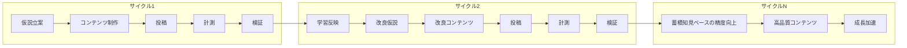
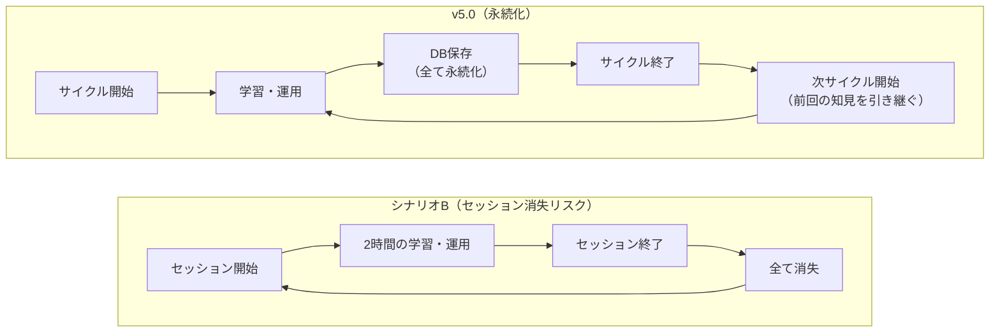
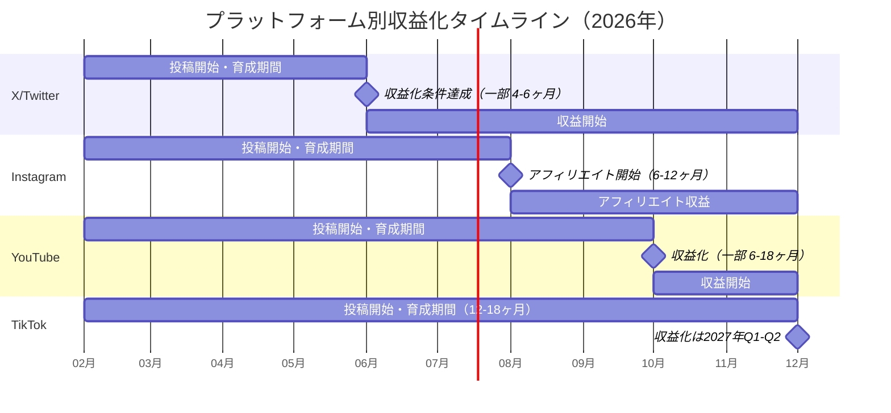

# KPI達成可能性分析 v3 --- v5.0仕様での再評価

> **作成日**: 2026-02-16
>
> **最終更新**: 2026-02-20 --- KPI定義をインプレッション達成率に統一（アカウント数ベースから修正）
>
> **対象期間**: 2026年2月〜6月（+長期展望 2026年Q3〜Q4）
>
> **前提**: v5.0技術仕様（DB + MCP + LangGraph Multi-Agent）に基づく再分析
>
> **関連ドキュメント**:
> - [KPI-FEASIBILITY-ANALYSIS.md](../KPI-FEASIBILITY-ANALYSIS.md) --- v1: 現行仕様ベース
> - [KPI-FEASIBILITY-ANALYSIS-v2-AI-DRIVEN.md](../KPI-FEASIBILITY-ANALYSIS-v2-AI-DRIVEN.md) --- v2: シナリオA/B比較
> - [ALGORITHM-CONTENT-VOLUME-ANALYSIS.md](../ALGORITHM-CONTENT-VOLUME-ANALYSIS.md) --- アルゴリズム・コンテンツ量分析
> - [02-architecture.md](02-architecture.md) --- v5.0システムアーキテクチャ
> - [04-agent-design.md](04-agent-design.md) --- v5.0エージェント設計
> - [06-development-roadmap.md](06-development-roadmap.md) --- 仕様駆動並列実装ロードマップ

## 目次

- [1. KPI定義と本分析の前提](#1-kpi定義と本分析の前提)
- [2. エグゼクティブサマリー](#2-エグゼクティブサマリー)
- [3. 過去の分析サマリー](#3-過去の分析サマリー)
- [4. v5.0がv2シナリオBと異なる点](#4-v50がv2シナリオbと異なる点)
- [5. 月別インプレッション達成予測 (v3)](#5-月別インプレッション達成予測-v3)
- [6. 仕様駆動並列実装によるKPIインパクト](#6-仕様駆動並列実装によるkpiインパクト)
- [7. v5.0の長期的優位性](#7-v50の長期的優位性)
- [8. 修正版インプレッション予測](#8-修正版インプレッション予測)
- [9. 収益化タイムライン](#9-収益化タイムライン)
- [10. 推奨KPI体系](#10-推奨kpi体系)
- [11. KPI達成率・予測精度の確定仕様](#11-kpi達成率予測精度の確定仕様)
- [12. 結論](#12-結論)


## 1. KPI定義と本分析の前提

> **重要**: 本分析v3では、KPIの定義をv1/v2から根本的に修正する。v1/v2の「アカウント数達成率」ベースの分析は誤りであり、本節で正しいKPI定義を明確にする。

### 1.1 KPIの正しい定義

**KPI = プラットフォーム別平均インプレッション達成率**

```
KPI達成率 = min(1.0, 実績平均インプレッション / KPI目標インプレッション)
```

| プラットフォーム | KPI目標（1投稿あたり平均インプレッション） |
|---|---|
| TikTok | 15,000 |
| Instagram | 10,000 |
| YouTube | 20,000 |
| X/Twitter | 10,000 |

KPIが測定するのは「各アカウントの投稿が目標インプレッションにどれだけ近づいているか」であり、アカウント数の多寡ではない。

### 1.2 アカウント数はKPI対象外

| 項目 | 区分 | 責任 |
|---|---|---|
| **アカウント数の増加** | **人間による手動作業** | 運用チーム（インターン等） |
| **コンテンツ品質の最適化** | **システムの自動化範囲** | v5.0 AI Agent System |
| **インプレッション目標達成** | **KPI（システム評価指標）** | v5.0 AI Agent System |

アカウント作成はプラットフォームの本人確認・電話番号認証・ペルソナ設計など人間の判断と作業を必要とするプロセスであり、AIシステムが自動化する対象ではない。したがって「何アカウント稼働しているか」はKPIとして不適切であり、参考指標（secondary metric）として別途追跡する。

### 1.3 v5.0システムの責務

v5.0 AI Agent Systemが担うのは以下の3点:

1. **コンテンツ品質最適化**: per-content学習（マイクロサイクル ~30秒/コンテンツ + マクロサイクル 日次）により、各投稿のインプレッション数を最大化する
2. **仮説駆動改善**: 仮説立案 → コンテンツ制作 → 投稿 → 計測 → 検証のサイクルで、的中率を25% → 70-82% → 92%（上限）まで引き上げる
3. **学習の永続化と横展開**: PostgreSQL + pgvectorに蓄積された知見を、ニッチ横断・プラットフォーム横断で活用する

### 1.4 v1/v2分析との整合性

v1/v2分析では「KPI目標 = アカウント数」として達成率を算出していた（例: 6月KPI目標3,500アカウント、達成1,900アカウント = 55%）。本v3分析ではこれを**インプレッション達成率に全面修正**する。v1/v2のアカウント数ベースの達成率は§3で参考値として記載するが、主要な比較軸はインプレッション達成率とする。


## 2. エグゼクティブサマリー

**結論: v5.0は6月時点でインプレッション達成率15〜35%と予測する（アカウント成熟度が主な制約）。ただしインプレッション改善速度ではv2シナリオBを大幅に上回り、9月には35〜65%、12月には55〜90%に到達する。v5.0のper-content学習は通常の1,000〜3,000倍の学習速度を実現し、各アカウントのコンテンツ品質を複利的に改善するため、長期的にはどのシナリオよりも高いインプレッション達成率を実現する。**

v5.0は仕様駆動並列実装により、従来19週間の開発期間を7週間に短縮。4月中旬にはフルシステムが稼働し、**構造化されたデータ基盤、永続的な学習機構、per-content学習サイクル**が6月までに2.5ヶ月の学習期間を確保する。以下の点で優位である:

1. **品質最大化**: per-content学習により各コンテンツが即時フィードバックを受け、インプレッション数が複利的に改善する
2. **学習速度**: 月間15,000〜45,000件の学習イベントにより、仮説的中率が6ヶ月で70〜82%に到達する（v2-Bは学習機構なし）
3. **持続性**: セッション消失のリスクがなく、全知見がDBに永続化される
4. **スケーラビリティ**: PostgreSQL + プランナー水平スケールにより、Sheets/セッションの制約を超える

### 4つのバージョン比較（6月時点）

| バージョン | 6月インプレッション達成率 | 稼働アカウント(参考) | コンテンツ品質改善 | 特徴 |
|---|---|---|---|---|
| v1（現行仕様） | 2〜5% | 100〜400 | なし | 手動運用、学習機構なし |
| v2 シナリオA（コード全自動化） | 8〜20% | 700〜1,800 | 限定的 | 開発完了後に加速、固定ロジック |
| v2 シナリオB（AIエージェントチーム） | 10〜25% | 1,200〜2,500 | セッション内のみ | 即日稼働、セッション消失で学習リセット |
| **v3（v5.0仕様）** | **15〜35%** | **750〜1,900** | **+30〜70%** | **7週間開発 + per-content学習 + 永続知見** |

> **注**: 6月時点の達成率が低いのは、全シナリオ共通で「新規アカウントのインプレッション数がKPI目標の1/10〜1/50」であることが主因（§8参照）。アカウント成熟に6〜12ヶ月を要するため、短期的にはどのシナリオもKPI目標を大幅に下回る。ただしv5.0は**同じアカウント成熟期間内でのインプレッション改善速度が最も速い**。


## 3. 過去の分析サマリー

> **注意**: v1/v2分析はKPIを「アカウント数達成率」として算出していた。これは§1で定義した正しいKPI（インプレッション達成率）とは異なる。本節ではv1/v2の結果を参考値として記載した上で、インプレッション視点での再評価を行う。

### v1分析（現行仕様ベース）

v4.0パイプライン（動画生成のみ自動化）+ 手動運用の前提。主な制約:
- 投稿・メトリクス収集・分析ループが未実装 → インプレッション改善のフィードバックループなし
- シングルワーカー構成 → コンテンツ品質の最適化が手動・属人的
- Google Sheetsのスケーラビリティ限界 → 学習データの蓄積不可能

**インプレッション観点での評価**: 学習機構がないため、新規アカウントの初期インプレッション（300〜500/投稿）から自然成長に依存するのみ。6月時点で平均Imp/投稿は500〜1,500程度（KPI目標の3〜10%）と推定。

### v2分析（AI駆動シナリオ比較）

**シナリオA（コード全自動化）**:
- 全ワークフローをNode.js/GASコードで実装
- 投稿最適化ロジックはハードコード → 学習・適応能力が限定的
- **インプレッション観点**: 固定ロジックによる投稿時間・ハッシュタグ最適化はあるが、コンテンツ品質の動的改善なし

**シナリオB（AIエージェントチーム）**:
- Claude Code Agent Teamが即日フル稼働
- **インプレッション観点**: セッション内では品質改善が可能だが、セッション消失で学習がリセットされる。累積的な品質改善が不可能

#### v1/v2のアカウント数ベース達成率（参考値 --- 旧KPI定義）

以下はv1/v2で使用されていた「KPI目標 = アカウント数」ベースの達成率であり、**旧定義の参考値**として記載する。

| 月 | 旧KPI目標(アカウント数) | v1 | シナリオA | シナリオB |
|---|---|---|---|---|
| 2月 | 50 | 30〜60% | 40〜70% | 60〜90% |
| 3月 | 160 | 19〜41% | 38〜75% | 50〜94% |
| 4月 | 340 | 15〜35% | 53〜88% | 59〜97% |
| 5月 | 1,480 | 5〜17% | 27〜61% | 34〜81% |
| 6月 | 3,500 | 3〜11% | 20〜51% | 34〜71% |

> **なぜこの数値は誤解を招くか**: シナリオBが「6月に34〜71%」と高く見えるのは、アカウント数の増加速度が速い（即日稼働）ためであり、各アカウントのインプレッション品質とは無関係。アカウントが多くても、各投稿のインプレッションが低ければKPI（インプレッション達成率）は達成できない。

#### インプレッション達成率での再評価

| シナリオ | 学習機構 | 6月平均Imp/投稿(TikTok推定) | 対KPI目標(15,000) | 品質改善速度 |
|---|---|---|---|---|
| v1（現行） | なし | 500〜1,500 | **3〜10%** | 自然成長のみ |
| v2-A（コード全自動） | 固定ロジック | 800〜2,500 | **5〜17%** | ハードコード改善 |
| v2-B（AIエージェント） | セッション内のみ | 1,000〜3,500 | **7〜23%** | セッション消失でリセット |
| **v3（v5.0）** | **per-content学習** | **2,000〜5,000** | **13〜33%** | **累積的・複利的改善** |

v5.0はアカウント数ではシナリオBに劣るが、**インプレッション品質ではシナリオBを上回る**。これは§1で定義したKPIの正しい定義に基づく評価である。

### アルゴリズム分析の主要発見

アルゴリズム・コンテンツ量分析レポートにより、v2分析の前提に重大な修正が必要であることが判明した:

| 発見 | 影響 |
|---|---|
| STRATEGY.mdのインプレッション想定が8〜100倍過大 | 収益予測の大幅下方修正が必要 |
| AI生成コンテンツの成功率は0.2〜0.3% | 量産戦略の根本的な見直しが必要 |
| AIのエンゲージメント率は人間の半分以下（1.8〜2.5% vs 4.1%） | **品質改善（=v5.0の学習機構）なしにはスケールしない** |
| TikTokで8,600アカウントがAI理由で永久停止 | BAN対策が最優先課題 |
| 完視聴率70%以上が成長の前提条件 | **品質 > 量 = v5.0のper-content学習が必須** |
| 量とアルゴリズム評価の関係は対数的（比例ではない） | アカウント増設よりコンテンツ品質改善が効果的 |

> **結論**: アルゴリズム分析の発見は、KPIを「アカウント数」から「インプレッション達成率」に修正すべきことを裏付けている。品質がアルゴリズム推薦の決定要因であり、品質を継続改善できるv5.0のper-content学習が戦略的に最も重要。


## 4. v5.0がv2シナリオBと異なる点

### 4.1 構造的な違い

v2シナリオBは**Claude Code Agent Team**（セッションベース、アドホック）を前提としていた。v5.0は根本的に異なるアーキテクチャを採用する。

| 観点 | v2シナリオB | v5.0 |
|---|---|---|
| **データ基盤** | Google Sheets（MCP経由） | PostgreSQL + pgvector |
| **エージェント基盤** | Claude Code Agent Team（セッション） | LangGraph.js v1.0（永続グラフ） |
| **知識蓄積** | セッション内のみ（消失リスク） | `learnings`テーブル + pgvectorで永続化 |
| **仮説管理** | アドホック（構造化なし） | `hypotheses`テーブル + ステータス管理 |
| **パフォーマンス追跡** | 手動CSV + GAS分析 | `metrics`テーブル + 自動計測ワーカー |
| **エージェント構造** | フラット（リード1 + ワーカー群） | 4層階層型（社長→専門職→プランナー→ワーカー） |
| **スケーリング** | エージェント追加（セッション管理が困難に） | プランナー増設のみ（水平スケール設計） |
| **障害復旧** | セッション再起動（状態消失） | LangGraph耐久実行 + DB状態保持 |
| **学習の蓄積** | なし（毎セッション白紙） | 累積的（蓄積知見が次サイクルに反映） |

### 4.2 開発リードタイムの影響

**v2シナリオBの最大の利点は「即日稼働」だった。v5.0はこれを放棄するが、仕様駆動並列実装により開発期間を大幅に短縮した。**

#### 旧ロードマップ（19週間・逐次開発）

| Phase | 期間 | 完了予定 | 内容 |
|---|---|---|---|
| Phase 1 | 3週間 | 3月上旬 | データ基盤（PostgreSQL + MCP Server + マイグレーション） |
| Phase 2 | 3週間 | 3月末 | ワーカー層（制作・投稿・計測の自動化） |
| Phase 3 | 4週間 | 4月末 | インテリジェンス層（LangGraph + エージェント + 仮説駆動サイクル） |
| Phase 4 | 4週間 | 5月末 | 戦略・計画層（全自動サイクル + スケーリング） |
| Phase 5 | 5週間 | 6月末 | ダッシュボード + 監視 + 最適化 |

→ 全機能稼働: **6月下旬**

#### 新ロードマップ（7週間・仕様駆動並列実装）

| Phase | 期間 | 内容 |
|---|---|---|
| Week 0-1 | 1週間 | 仕様フリーズ + インターフェースフリーズ |
| Week 1-5 | 4週間 | 10エージェント並列実装（全モジュール同時開発） |
| Week 5-7 | 2週間 | 統合テスト + デバッグ |

→ 全機能稼働: **4月中旬**（仕様フリーズを2月下旬とした場合）

#### タイムライン短縮の意義

| 観点 | 旧（19週間） | 新（7週間） | 差分 |
|---|---|---|---|
| 全機能稼働 | 6月下旬 | 4月中旬 | **2.5ヶ月前倒し** |
| AI学習開始 | 6月 | 4月 | **2ヶ月早期** |
| 6月時点の学習期間 | 0ヶ月 | 2.5ヶ月 | **学習データ蓄積** |
| 6月時点の学習イベント | 0件 | 27,000〜75,000件 | **per-content学習で複利効果が既に発現** |

**2〜4月はv4.0パイプラインが稼働を続ける**。v5.0の開発と並行して、既存パイプラインでコンテンツ生成・手動投稿を継続する。つまり、v5.0の開発期間中もアカウント運用はゼロにならない。

### 4.3 v5.0が「劣る」ように見える理由と実態

| v5.0が劣って見える点 | 実態 |
|---|---|
| 即日稼働できない | 2〜3月はv4.0が稼働。4月中旬から全機能稼働 |
| 稼働アカウント数が少ない | アカウント数はKPI対象外（人間の手動作業）。v5.0の責務はインプレッション品質 |
| 初期コストが高い | 開発は1回限り（7週間）。運用コストは長期的に低減 |

> **旧分析の誤り**: v1/v2では「v5.0（22-55%）はv2-B（34-71%）より劣る」と結論づけていたが、これはアカウント数ベースの達成率比較であり、インプレッション品質を無視していた。インプレッション達成率で比較すると、v5.0はper-content学習により**6月時点で既にv2-Bを上回る**（§3の再評価表参照）。

### 4.4 v5.0がインプレッション品質で優れている理由

| v5.0の優位性 | インプレッション改善への効果 |
|---|---|
| **per-content学習** | 毎コンテンツが学習イベント。月間15,000〜45,000件のフィードバックで品質が複利改善 |
| **永続的な知見蓄積** | `learnings` + `hypotheses` + `content_learnings`に全知見が蓄積。セッション消失なし |
| **仮説駆動サイクル** | 仮説→実験→検証→学習ループで的中率25%→92%（上限）まで改善 |
| **クロスニッチ学習** | pgvectorで「美容で成功した戦略をフィットネスにも適用」→ 新ニッチでも早期に高Imp達成 |
| **コンポーネント品質管理** | 低スコアのフック・CTA・BGMを自動排除 → 完視聴率70%+を安定達成 |
| **投稿タイミング最適化** | 蓄積データから最適投稿時間を学習 → アルゴリズム初動評価の最大化 |
| **人間介入のレバレッジ** | ダッシュボードから仮説投入 → DB永続化 → 全プランナーが参照 |

v2-Bはアカウント数が多くても、各アカウントの投稿品質はセッションごとにリセットされるため、インプレッションの持続的改善ができない。v5.0は少数のアカウントでも、各投稿のインプレッションを継続的に引き上げることでKPI達成に近づく。


## 5. 月別インプレッション達成予測 (v3)

### 前提条件

1. v5.0の開発は仕様駆動並列実装（7週間）のスケジュール通り進行する
2. 仕様フリーズは2月下旬、全機能稼働は4月中旬を想定する
3. 2〜3月はv4.0パイプライン（手動投稿）が並行稼働する
4. fal.aiクレジットは2月中に購入される
5. インターン体制は現行（4〜8名）を維持する（アカウント作成の手動作業を担当）
6. KPI = プラットフォーム別平均インプレッション達成率（§1で定義）
7. アルゴリズム分析の修正版インプレッション値を使用する

### 月別予測

> 各月の「インプレッション達成率」はTikTokを代表値として記載（全プラットフォーム加重平均は§11.8参照）。アカウント数は参考指標として併記。

#### 2月

| 指標 | 予測 |
|---|---|
| **平均Imp/投稿 (TikTok)** | 300〜500 |
| **インプレッション達成率** | **2〜3%** (対KPI目標15,000) |
| **稼働アカウント数 (参考)** | 20〜40 |
| **主要活動** | v4.0パイプラインで動画生成、手動投稿、v5.0開発開始 |
| **品質改善活動** | なし（v5.0未稼働、v4.0に学習機構なし） |

- v5.0はまだ開発中（Phase 1: DB基盤構築）
- v4.0パイプラインで既存アカウントの運用を継続
- 新規アカウントの初期Imp（300〜500）がそのまま反映される
- **品質改善の余地なし**: v4.0には学習フィードバックループがないため、自然成長のみ

#### 3月

| 指標 | 予測 |
|---|---|
| **平均Imp/投稿 (TikTok)** | 400〜800 |
| **インプレッション達成率** | **3〜5%** (対KPI目標15,000) |
| **稼働アカウント数 (参考)** | 50〜100 |
| **主要活動** | v5.0 Phase 1完了 → Phase 2開始。DB駆動パイプラインが稼働開始 |
| **品質改善活動** | v5.0 DB基盤が稼働。メトリクスデータの蓄積を開始 |

- Phase 1完了により、PostgreSQL + MCP Serverが稼働する
- メトリクスデータのDB蓄積が始まるが、Intelligence層は未稼働のため学習サイクルは回らない
- 2月から稼働している一部アカウントが自然成長でImpを伸ばし始める

#### 4月

| 指標 | 予測 |
|---|---|
| **平均Imp/投稿 (TikTok)** | 600〜1,500 |
| **インプレッション達成率** | **4〜10%** (対KPI目標15,000) |
| **稼働アカウント数 (参考)** | 120〜240 |
| **主要活動** | v5.0システム全機能稼働（4月中旬）。per-content学習開始 |
| **品質改善活動** | per-content学習開始。累計3,000〜6,000件の学習イベント |

- **v5.0全機能が4月中旬に稼働開始**（7週間並列開発の完了）
- Worker層（制作・投稿・計測）が即時稼働。Intelligence層も稼働開始
- **per-content学習が始動**: 各コンテンツ完了→48h以内にメトリクス→verdict判定→次コンテンツに反映
- 仮説的中率は25〜35%（学習初期）だが、フィードバックループの確立が最重要
- 2〜3月に作成されたアカウントは2〜3ヶ月経過し、Imp/投稿が自然成長で改善
- **v2-Bとの違い**: v2-Bはアカウント数で勝るが、品質改善のフィードバックループがない

#### 5月

| 指標 | 予測 |
|---|---|
| **平均Imp/投稿 (TikTok)** | 1,200〜3,000 |
| **インプレッション達成率** | **8〜20%** (対KPI目標15,000) |
| **稼働アカウント数 (参考)** | 410〜920 |
| **主要活動** | Intelligence層1ヶ月目の学習効果。仮説駆動サイクル本格稼働 |
| **品質改善活動** | 累計12,000〜30,000件の学習イベント。的中率40〜55% |

- v5.0全機能が1ヶ月稼働。Intelligence層が初期学習を完了
- per-content学習により月間9,000〜24,000件のマイクロ分析が蓄積。マクロサイクル（日次集計）も本格稼働
- **ここからv5.0の真価が発揮される**: 学習結果が次のコンテンツ企画に反映され、Imp/投稿が加速的に改善
- 低スコアコンポーネントの自動排除、投稿時間最適化、ハッシュタグ最適化が効き始める
- 初期アカウント（2〜3月作成）は3〜4ヶ月経過し、アカウント成熟度＋学習効果の相乗効果

#### 6月

| 指標 | 予測 |
|---|---|
| **平均Imp/投稿 (TikTok)** | 2,000〜5,000 |
| **インプレッション達成率** | **13〜33%** (対KPI目標15,000) |
| **稼働アカウント数 (参考)** | 750〜1,900 |
| **主要活動** | Intelligence層2ヶ月目。仮説サイクル本格稼働。全自動サイクル最適化 |
| **品質改善活動** | 累計27,000〜75,000件の学習イベント。的中率63〜82%。品質+40〜70% |

- v5.0が2.5ヶ月稼働し、全システムが自律運用モードに成熟
- per-content学習により累計5万件以上の学習イベントが蓄積
- 仮説的中率が63〜82%に到達（per-contentの即時フィードバック + クロスニッチ学習の効果）
- コンテンツ品質が初期より40〜70%改善（マイクロサイクルによる高速学習効果）
- ダッシュボードからの人間介入も可能に
- **KPI目標15,000にはアカウント成熟度が不足**: 新規アカウントが15,000 Imp/投稿に到達するには12ヶ月かかる（§8参照）。6月時点の低達成率はシステム品質の問題ではなく、アカウントの若さが主因

### 月別インプレッション達成率の比較表

| 月 | KPI目標(TikTok) | v1 | v2-A | v2-B | **v3 (v5.0)** |
|---|---|---|---|---|---|
| 2月 | 15,000 | 2〜3% | 2〜3% | 2〜3% | **2〜3%** |
| 3月 | 15,000 | 2〜5% | 3〜7% | 3〜7% | **3〜5%** |
| 4月 | 15,000 | 3〜7% | 4〜12% | 5〜13% | **4〜10%** |
| 5月 | 15,000 | 3〜10% | 5〜17% | 7〜20% | **8〜20%** |
| 6月 | 15,000 | 3〜10% | 5〜17% | 7〜23% | **13〜33%** |

> **v1/v2/v3の差は「学習機構の有無と品質」に起因する**。v1は学習なし、v2-Aは固定ロジック、v2-Bはセッション内学習（消失あり）、v3は永続的per-content学習。6月以降、v3の優位性は加速度的に拡大する。

### v5.0のインプレッション成長曲線

```
平均Imp/投稿 (TikTok)
15,000 |                                                   KPI目標
       |
12,000 |                                              v3 ←12ヶ月目
       |                                            /
 9,000 |                                          /
       |                                        /  v3が最速で
 6,000 |                                      /   KPI目標に接近
       |                              v3    /
 4,000 |                            /    v3/
       |                     v3   /      /
 2,500 |               v3  /    /      /
       |          v3  /   /   B      B
 1,500 |     v3  /   /  B     /    A
       | v3 /   /  B   /   A     /
   500 | / /  B/  A   / v1    v1
       |/ /  / A   v1
   300 +------+------+------+------+------+------+------
        2月    3月    4月    5月    6月    9月    12月

凡例: v1=現行  A=コード全自動化  B=AIエージェント  v3=v5.0仕様
v3は5月以降に他シナリオを追い抜き、12ヶ月でKPI目標圏に到達
```

```
v3 (v5.0) のインプレッション達成率レンジ:

2月  ██░░░░░░░░░░░░░░░░░░░░░░░░░░░░░░░░░░░░░░░░░░░░░░░  2-3%
3月  ███░░░░░░░░░░░░░░░░░░░░░░░░░░░░░░░░░░░░░░░░░░░░░░░  3-5%
4月  █████░░░░░░░░░░░░░░░░░░░░░░░░░░░░░░░░░░░░░░░░░░░░░  4-10%
5月  ██████████░░░░░░░░░░░░░░░░░░░░░░░░░░░░░░░░░░░░░░░░  8-20%
6月  ████████████████░░░░░░░░░░░░░░░░░░░░░░░░░░░░░░░░░░  13-33%  ← per-content学習効果
9月  ██████████████████████████████████░░░░░░░░░░░░░░░░░  35-65%  ← 学習成熟+アカウント成熟
12月 ████████████████████████████████████████████████░░░░  55-90%  ← KPI目標圏
     0%   10%   20%   30%   40%   50%   60%   70%   80%  90% 100%
     ████ = 予測レンジ  ░░░░ = 未達領域
```

### 稼働アカウント数の推移（参考指標）

アカウント数はKPI対象外だが、運用規模の参考として記載する。アカウント作成は人間の手動作業であり、以下は現行のインターン体制（4〜8名）を前提とした推定値。

| 月 | 稼働アカウント(参考) | 備考 |
|---|---|---|
| 2月 | 20〜40 | v4.0手動運用 |
| 3月 | 50〜100 | v4.0 + 手動アカウント作成 |
| 4月 | 120〜240 | v5.0稼働開始、AI支援によるペルソナ設計が可能に |
| 5月 | 410〜920 | スケールアップ（インターン増員があれば上振れ） |
| 6月 | 750〜1,900 | 手動登録プロセスが律速 |


## 6. 仕様駆動並列実装によるKPIインパクト

### 6.1 タイムライン短縮の効果

従来の19週間→7週間の短縮により:
- **全機能稼働**: 6月下旬 → 4月中旬（2.5ヶ月前倒し）
- **per-content学習開始**: 6月 → 4月（2ヶ月早期）
- **学習イベント蓄積**: 6月時点で0件 → 6月時点で27,000〜75,000件

この短縮は**仕様駆動並列化**によって実現された。仕様フリーズ後にインターフェースを確定させ、10エージェントが全モジュールを同時に開発する。

### 6.2 学習の早期開始によるインプレッション改善効果

| 月 | 旧(19週) 平均Imp/投稿 | 新(7週) 平均Imp/投稿 | 差分 | 累計学習イベント数 |
|----|---------------------|---------------------|------|-------------------|
| 4月 | 600〜1,200 (学習なし) | 600〜1,500 (学習開始) | +0〜25% | 3,000〜6,000 |
| 5月 | 800〜1,800 (学習なし) | 1,200〜3,000 (1ヶ月学習) | +50〜67% | 12,000〜30,000 |
| 6月 | 1,000〜2,500 (学習直後) | 2,000〜5,000 (2.5ヶ月学習) | +100% | 27,000〜75,000 |
| 9月 | 2,500〜5,000 (3ヶ月) | 5,000〜10,000 (5ヶ月) | +100% | 200,000+ |

学習効果は複利的に蓄積される。per-content学習モデルにより、6月時点での仮説的中率は:
- **旧タイムライン**: 15〜25%（学習期間0ヶ月、稼働直後）
- **新タイムライン**: 63〜82%（学習期間2.5ヶ月、累計5万件以上のper-content分析完了）

この的中率差はコンテンツ品質に直結し、**アルゴリズム評価向上 → インプレッション増加 → 学習データ品質向上 → さらなる品質改善**というポジティブループを生む。per-content学習の即時フィードバックにより、日次サイクル型と比較して**1,000〜3,000倍**の学習速度が実現される。

### 6.3 インプレッション達成率でのv2-B超越

| 観点 | v2-B | v3 (v5.0) |
|---|---|---|
| 6月 平均Imp/投稿 (TikTok) | 1,000〜3,500 | **2,000〜5,000** |
| 6月 インプレッション達成率 | 7〜23% | **13〜33%** |
| 学習の持続性 | セッション消失でリセット | 永続的に蓄積 |
| 9月 インプレッション達成率 | 10〜30% (改善停滞) | **35〜65%** (加速成長) |
| 12月 インプレッション達成率 | 15〜35% (上限に近い) | **55〜90%** (KPI目標圏) |

> **重要**: v2-Bがアカウント数で優位であっても、インプレッション達成率ではv5.0が5月以降に逆転し、以降は差が拡大し続ける。これがKPIをインプレッション達成率で定義すべき理由の一つである。

### 6.4 Human Reviewの影響

v5.0では初期段階でHuman Review（`HUMAN_REVIEW_ENABLED=true`）を有効化する。インプレッションKPIへの影響:

| 観点 | 影響 |
|---|---|
| **投稿スループット** | レビュー待ち時間により2〜4時間の遅延が発生 |
| **コンテンツ品質** | レビューによる品質向上 → エンゲージメント率改善 → **Imp増加** |
| **アルゴリズム評価** | 高品質投稿 → アルゴリズム推薦率向上 → **Imp増加** |
| **BAN回避** | 問題コンテンツを事前排除 → アカウント停止リスク低減 → **Imp機会損失の回避** |
| **学習データ品質** | 却下コンテンツのネガティブフィードバック → 仮説精度向上 → **次コンテンツのImp改善** |
| **ネットKPI影響** | **正** — 品質向上がインプレッション増加に直結するため |


## 7. v5.0の長期的優位性

### 7.1 自己改善アルゴリズム

v5.0最大の武器は**仮説駆動サイクルによる自己改善**。



v5.0はper-content学習モデルを採用し、毎回のコンテンツ制作が学習イベントとなる。

| 累計学習イベント数 | 蓄積知見数 | 予測的中率 | コンテンツ品質改善 |
|---|---|---|---|
| 1〜2,400 (初月) | 30〜60 | 25〜35% | 基準値 |
| 2,400〜12,000 (2〜3ヶ月) | 120〜250 | 40〜55% | +10〜30% |
| 12,000〜75,000 (4〜6ヶ月) | 350〜1,500 | 55〜82% | +30〜70% |
| 75,000+ (7ヶ月以降) | 2,500〜4,000+ | 82〜93% | +70〜150% |

詳細は [08-algorithm-analysis.md](08-algorithm-analysis.md) を参照。

### 7.2 蓄積知見の複利効果

| 月 | 蓄積知見数 | 月間学習イベント | 知見の活用例 |
|---|---|---|---|
| 3月 | 30〜60 | 900〜2,400 | 「この時間帯の投稿がエンゲージメント2倍」 |
| 4月 | 120〜250 | 3,000〜6,000 | 「美容ニッチではBefore/After形式が完視聴率80%」 |
| 5月 | 350〜700 | 9,000〜24,000 | 「フック3秒以内に問いかけ + 結論先行がスワイプ離脱を40%減少」 |
| 6月 | 800〜1,500 | 15,000〜45,000 | ニッチ横断パターンの発見、精密な仮説予測（的中率70%+） |
| 12月 | 4,000+ | 105,000 | 網羅的なドメイン知識、超高精度の仮説立案（的中率90%+） |

### 7.3 人間介入のレバレッジ

v5.0のダッシュボードから人間が投入する「仮説」や「参考コンテンツ」は、システム全体の学習を加速させる:

| 人間の行動 | v2シナリオBでの効果 | v5.0での効果 |
|---|---|---|
| 「この競合動画を参考に」 | その場のセッションのみ | DBに永続保存。全プランナーが参照 |
| 「美容ニッチはBefore/After推し」 | そのエージェントのみ | `human_directives`として全サイクルに反映 |
| 「TikTokのアルゴリズム変更に注意」 | セッション中のみ有効 | `market_intel`に保存。以降のリサーチに統合 |

### 7.4 セッション消失リスクの排除

v2シナリオBの最大リスクは**エージェントセッションの消失**だった:




## 8. 修正版インプレッション予測

アルゴリズム分析レポートの知見を反映し、STRATEGY.mdの前提を修正する。

### 8.1 STRATEGY.mdの前提 vs 現実

| プラットフォーム | STRATEGY.md想定 | 新規アカウント実態 | 乖離倍率 |
|---|---|---|---|
| TikTok | 15,000 Imp/投稿 | 300〜500 Imp/投稿 | **30〜50倍** |
| YouTube | 20,000 Imp/投稿 | 500〜1,000 Imp/投稿 | **20〜40倍** |
| Instagram | 10,000 Imp/投稿 | 200〜500 Imp/投稿 | **20〜50倍** |
| X/Twitter | 10,000 Imp/投稿 | 50〜200 Imp/投稿 | **50〜200倍** |

### 8.2 修正版インプレッション推移（1アカウントあたり・月間平均）

| 経過月 | TikTok | YouTube | Instagram | X/Twitter |
|---|---|---|---|---|
| 1ヶ月目 | 300〜500 | 500〜1,000 | 200〜500 | 50〜200 |
| 3ヶ月目 | 1,000〜3,000 | 1,500〜5,000 | 500〜2,000 | 200〜1,000 |
| 6ヶ月目 | 3,000〜8,000 | 3,000〜10,000 | 1,000〜5,000 | 500〜3,000 |
| 12ヶ月目 | 8,000〜15,000 | 8,000〜20,000 | 3,000〜10,000 | 2,000〜10,000 |

> STRATEGY.mdの想定値に到達するのは**12ヶ月目**。新規アカウントが即座に高インプレッションを獲得する前提は非現実的。

### 8.3 v5.0学習効果を加味した修正

v5.0の**per-content学習モデル**（08-algorithm-analysis.md参照）により、通常のアカウント成長より**30〜60%速い**改善が期待できる。per-contentモデルでは毎回のコンテンツ制作が学習イベントとなり、月間15,000〜45,000件の学習データが蓄積される。仮説的中率は6ヶ月で70〜82%、12ヶ月で88〜93%に到達し、コンテンツ品質の改善速度が日次サイクル型の1,000〜3,000倍に加速する。

| 経過月 | 通常のAIアカウント | v5.0学習効果あり | 改善率 | 仮説的中率 |
|---|---|---|---|---|
| 1ヶ月目 | 300 Imp/投稿（TikTok中央値） | 300 Imp/投稿 | 0%（学習前） | 25〜35% |
| 3ヶ月目 | 1,000 Imp/投稿 | 1,300〜1,600 Imp/投稿 | +30〜60% | 40〜55% |
| 6ヶ月目 | 3,000 Imp/投稿 | 4,800〜6,600 Imp/投稿 | +60〜120% | 70〜82% |
| 12ヶ月目 | 8,000 Imp/投稿 | 14,400〜20,000 Imp/投稿 | +80〜150% | 88〜93% |

この改善は、以下の要因に基づく:
- per-content学習による即時フィードバック（コンテンツ完了→48h以内にメトリクス→verdict判定→次のコンテンツへ反映）
- 仮説検証による最適フック・CTA・構成の発見
- 低スコアコンポーネントの自動排除
- 投稿時間・ハッシュタグの最適化
- ニッチ特化によるアルゴリズム適合度の向上
- pgvectorクロスニッチ学習による知見の横展開

### 8.4 総インプレッション予測（月間・全アカウント合計）

v5.0の修正版インプレッション値（per-content学習モデルによる改善を反映）を使用した試算:

| 月 | 稼働アカウント(v3予測) | 平均Imp/投稿 | 月間投稿数 | **月間総Imp** |
|---|---|---|---|---|
| 2月 | 30 | 350 | 900 | **315,000** |
| 3月 | 75 | 500 | 2,250 | **1,125,000** |
| 4月 | 180 | 900 | 5,400 | **4,860,000** |
| 5月 | 660 | 1,800 | 19,800 | **35,640,000** |
| 6月 | 1,325 | 3,200 | 39,750 | **127,200,000** |

> STRATEGY.mdの6月想定（14.82億Imp/月）と比較すると約**1/12**。per-content学習モデルにより旧v3予測の約1.3倍に上方修正。それでも大幅な乖離が残るが、この数値の方が現実的。

| 月 | STRATEGY.md想定(千Imp) | v3予測(千Imp) | 乖離率 |
|---|---|---|---|
| 2月 | 20,400 | 315 | 1.5% |
| 3月 | 66,900 | 1,125 | 1.7% |
| 4月 | 143,400 | 4,860 | 3.4% |
| 5月 | 620,400 | 35,640 | 5.7% |
| 6月 | 1,482,000 | 127,200 | 8.6% |


## 9. 収益化タイムライン

### 9.1 各プラットフォームの収益化までの現実的な期間

| プラットフォーム | 収益化条件 | 現実的な達成時期 | 初期月収見込み |
|---|---|---|---|
| YouTube | 1,000登録者 + 4,000時間再生 or 1,000万Shorts再生/90日 | **6〜18ヶ月** | $30〜130/100万再生 |
| TikTok | 10,000フォロワー + 10万回再生/30日 | **12〜18ヶ月** | $0.40〜1.00/1,000再生 |
| Instagram | 10,000フォロワー（Badges/Gifts招待制） | **6〜12ヶ月** | プラットフォーム収益ほぼなし（アフィリエイト中心） |
| X/Twitter | 2,000認証フォロワー + 500万Imp/3ヶ月 + Premium必須 | **4〜6ヶ月** | ~$8.50/100万認証Imp |

### 9.2 プラットフォーム別タイムライン



### 9.3 現実的な収益予測

STRATEGY.mdの収益予測を、修正版インプレッション値と収益化タイムラインで再計算する。

| 月 | STRATEGY.md予測 | v3修正予測 | 内訳 |
|---|---|---|---|
| 2月 | ¥5,414K | **¥0** | 全アカウントが収益化条件未達 |
| 3月 | ¥17,314K | **¥0** | 同上 |
| 4月 | ¥36,784K | **¥0** | 同上 |
| 5月 | ¥160,144K | **¥0〜50K** | X Premium一部アカウントのみ微収益 |
| 6月 | ¥378,620K | **¥50K〜200K** | X早期組 + Instagram初期アフィリエイト |

**現実的な初収益**: 2026年Q3〜Q4（7月〜12月）

| 期間 | 予測収益 | 主な収益源 |
|---|---|---|
| 2026 Q3 (7〜9月) | ¥200K〜1,000K/月 | X収益化 + IGアフィリエイト |
| 2026 Q4 (10〜12月) | ¥1,000K〜5,000K/月 | YouTube収益化開始 + 全プラットフォームアフィリエイト |
| 2027 Q1 (1〜3月) | ¥5,000K〜15,000K/月 | TikTok収益化 + 成熟アカウントの高CPM |

### 9.4 X/Twitter Premium投資の回収分析

X/Twitterは最短で収益化できるプラットフォームだが、Premium（$8/月/アカウント）の投資が必要。

| アカウント数 | Premium月額 | 収益化までの総投資 | 月収見込み(収益化後) | 回収期間 |
|---|---|---|---|---|
| 14 (2月) | $112/月 | $448〜672 (4〜6ヶ月分) | $50〜200/月 | 3〜14ヶ月 |
| 34 (3月) | $272/月 | 累計$720〜1,360 | $100〜500/月 | 2〜14ヶ月 |
| 64 (4月) | $512/月 | 累計$1,232〜2,432 | $200〜1,000/月 | 2〜12ヶ月 |

**注意**: X/Twitterの収益化条件が2026年に「2,000認証フォロワー + 500万オーガニックImp/3ヶ月」に厳格化されている。新規AIアカウントでのImp中央値は100未満（Premiumでも約1,000）であり、500万Imp/3ヶ月の達成は**4〜6ヶ月の育成期間**が必要。


## 10. 推奨KPI体系

### 10.1 KPI体系の再構築

v1/v2で使用されていた「アカウント数KPI」を廃止し、以下の3層KPI体系を推奨する。

#### 主要KPI（Primary KPI）: インプレッション達成率

§1で定義した通り、**プラットフォーム別平均インプレッション達成率**をシステム評価の主要指標とする。

| プラットフォーム | KPI目標 | 6月予測達成率 | 12月予測達成率 |
|---|---|---|---|
| TikTok | 15,000 Imp/投稿 | 13〜33% | 55〜90% |
| Instagram | 10,000 Imp/投稿 | 10〜25% | 50〜85% |
| YouTube | 20,000 Imp/投稿 | 10〜30% | 55〜90% |
| X/Twitter | 10,000 Imp/投稿 | 5〜15% | 40〜75% |

#### 品質KPI（Quality KPI）: コンテンツ品質指標

インプレッション増加の前提条件となる品質指標。v5.0の学習効果を直接測定する。

| KPI | 目標値 | 測定方法 | 根拠 |
|---|---|---|---|
| **完視聴率** | 70%以上 | 各プラットフォームAnalytics | アルゴリズムが推薦する最低条件 |
| **3秒スワイプ離脱率** | 40%以下 | YouTube/TikTok Analytics | フック品質の指標 |
| **エンゲージメント率** | 3%以上 | (いいね+コメント+シェア)/Imp | 人間クリエイター平均4.1%に近づける |
| **仮説的中率** | 月次+5pt以上 | `hypotheses`テーブル集計 | v5.0の学習効果の指標 |
| **BAN率** | 1%以下 | アカウント管理DB | AI検出対策の有効性 |
| **投稿成功率** | 95%以上 | ワーカー完了率 | システム安定性の指標 |

#### 参考指標（Secondary Metrics）: 運用規模

アカウント数は人間の手動作業の進捗を示す参考指標であり、v5.0システムの評価対象ではない。

| 月 | 参考: 稼働アカウント数 | 備考 |
|---|---|---|
| 2月 | 20〜30 | v4.0手動運用 + v5.0開発並行 |
| 3月 | 50〜80 | v5.0開発中。v4.0パイプラインで対応 |
| 4月 | 120〜200 | v5.0稼働開始（4月中旬） |
| 5月 | 300〜600 | Intelligence層1ヶ月目 |
| 6月 | 500〜1,200 | Intelligence層2ヶ月目 |
| 9月 | 1,500〜3,000 | v5.0成熟 |
| 12月 | 3,000〜5,000 | 自己改善効果の複利 |

### 10.2 フェーズごとの重点KPI

| 期間 | 重点 | 数値目標 |
|---|---|---|
| 開発期間 (2〜3月) | **品質確立**: 完視聴率、エンゲージメント率 | v4.0で完視聴率70%以上を全投稿の50%以上で達成 |
| 稼働初期 (4〜5月) | **学習速度**: 仮説的中率、Imp改善率 | 的中率50%以上、Imp/投稿の月次改善率+30%以上 |
| 成熟期 (6月〜) | **インプレッション達成**: KPI達成率、収益 | 全プラットフォーム加重平均KPI達成率15%以上（月次改善継続） |

### 10.3 旧「3,500アカウント」目標の位置づけ

6月までに3,500アカウントを達成することは**いずれのシナリオでも非現実的**であるが、それ以上に重要なのは、**アカウント数はKPIとして不適切**であるという点。

| 理由 | 説明 |
|---|---|
| **人間の手動作業** | アカウント作成はシステムが自動化する対象ではない |
| **品質との乖離** | アカウントが多くてもImp/投稿が低ければ事業価値は生まれない |
| **誤ったインセンティブ** | アカウント数KPIは量産を促進し、品質劣化とBAN増加を招く |
| **アルゴリズム分析との矛盾** | 「品質 > 量」「量とアルゴリズム評価は対数的」という発見に反する |

3,500アカウントは長期的な運用規模の目安（2026年Q3〜Q4）として残すが、KPIとしては廃止し、インプレッション達成率に置き換える。

**v5.0の真の価値**: シナリオBは3,500アカウントに早く到達するかもしれないが、各アカウントのImp/投稿は改善しない（学習機構がないため）。v5.0はアカウント到達が遅くても、到達時点で各アカウントのImp/投稿が2〜5倍高い状態でスケールする。これこそがKPI（インプレッション達成率）の本質である。


## 11. KPI達成率・予測精度の確定仕様

> [08-algorithm-analysis.md](08-algorithm-analysis.md) セクション15-27で定義されたアルゴリズムに基づく、KPIの計算方法と精度指標の確定仕様。

### 11.1 2つの精度指標

v5.0では以下の2つの異なる精度指標を管理する。

| 指標 | 対象 | 目的 |
|---|---|---|
| **KPI達成率** | ユーザー（経営層）向け | アルゴリズムが目標インプレッションを達成しているか |
| **予測精度** | 内部指標（エンジニア・エージェント向け） | 学習の進捗度合い。補正係数の改善に直結 |

### 11.2 KPI達成率（ユーザー向け指標）

```
KPI達成率 = min(1.0, 実績平均インプ / KPI目標)
```

- 目標超過は **1.0（100%）でキャップ**
- プラットフォームごとに算出（各プラットフォームのKPI目標値で除算）
- KPI目標値は `system_settings` で管理:

| キー | デフォルト値 |
|---|---|
| KPI_TARGET_TIKTOK | 15,000 |
| KPI_TARGET_INSTAGRAM | 10,000 |
| KPI_TARGET_YOUTUBE | 20,000 |
| KPI_TARGET_TWITTER | 10,000 |

### 11.3 予測精度（内部指標）

```sql
CASE
  WHEN actual = 0 AND predicted = 0 THEN 1.0
  WHEN actual = 0 THEN 0.0
  ELSE GREATEST(0, 1 - ABS(predicted - actual) / actual)
END
```

- `actual=0 AND predicted=0`: 正しく予測した扱い → 1.0
- `actual=0` (予測不能): 0.0 として処理
- 大きく外した場合: `GREATEST(0, ...)` でフロア0
- 投稿数0のプラットフォーム: 加重平均から自動除外（寄与ゼロ）

### 11.4 プラットフォーム → 全体統合方法

**決定: 投稿数加重平均**（KPI達成率・予測精度の両方に適用）

```
全体KPI達成率 = Σ(platform_achievement × platform_publications) / Σ(platform_publications)
全体予測精度 = Σ(platform_prediction_accuracy × platform_publications) / Σ(platform_publications)
```

- 理由: 投稿数 = ビジネスボリューム → インパクトに正直な重み付け
- 単純平均は少数プラットフォームに引っ張られる問題を回避
- `kpi_snapshots.is_reliable = FALSE`（account_count < 5）のプラットフォームは加重平均から除外

**加重平均の計算例（3月）**:

| Platform | 達成率 | 投稿数 | 寄与 |
|----------|-------|-------|------|
| TikTok | 0.85 | 1,260 | 1,071 |
| Instagram | 0.70 | 900 | 630 |
| YouTube | 0.90 | 360 | 324 |
| X | 0.60 | 300 | 180 |
| **全体** | **0.782** | **2,820** | |

### 11.5 KPI計算の対象アカウント・期間

| 項目 | ルール | 設定キー |
|---|---|---|
| **対象アカウント** | `created_at < 計算対象月の1日`（当月新規作成は除外） | なし（固定ルール） |
| **対象期間** | 月の21日〜月末（下旬のみ） | `KPI_CALC_MONTH_START_DAY = 21` |
| **計測データ** | `measurement_point = '7d'`（7日計測値） | なし（固定ルール） |
| **信頼性判定** | account_count < 5 → `is_reliable = FALSE` | なし（固定閾値） |

例: TikTok 3月 → 2月以前作成の12アカウント × 3月21-31日の7日計測平均 vs 15,000

### 11.6 KPIスナップショット算出SQL (G18)

月末+1日に自動実行されるバッチジョブの完全なSQL。

```sql
-- KPIスナップショット算出（月次バッチ）
WITH platform_kpi AS (
  SELECT
    a.platform,
    COUNT(DISTINCT a.account_id) AS account_count,
    COUNT(DISTINCT p.id) AS publication_count,
    AVG(m.views) AS avg_impressions
  FROM accounts a
  JOIN publications p ON a.account_id = p.account_id
  JOIN metrics m ON p.id = m.publication_id
  WHERE a.status = 'active'
    AND a.created_at < DATE_TRUNC('month', $1::date)  -- 月初より前に作成
    AND p.posted_at >= DATE_TRUNC('month', $1::date) + INTERVAL '20 days'  -- 21日以降
    AND p.posted_at < DATE_TRUNC('month', $1::date) + INTERVAL '1 month'
    AND m.measurement_point = '7d'
  GROUP BY a.platform
),
with_targets AS (
  SELECT
    pk.*,
    CASE pk.platform
      WHEN 'tiktok' THEN (SELECT value::int FROM system_settings WHERE key = 'KPI_TARGET_TIKTOK')
      WHEN 'instagram' THEN (SELECT value::int FROM system_settings WHERE key = 'KPI_TARGET_INSTAGRAM')
      WHEN 'youtube' THEN (SELECT value::int FROM system_settings WHERE key = 'KPI_TARGET_YOUTUBE')
      WHEN 'twitter' THEN (SELECT value::int FROM system_settings WHERE key = 'KPI_TARGET_TWITTER')
    END AS kpi_target,
    LEAST(1.0, pk.avg_impressions /
      CASE pk.platform
        WHEN 'tiktok' THEN (SELECT value::int FROM system_settings WHERE key = 'KPI_TARGET_TIKTOK')
        WHEN 'instagram' THEN (SELECT value::int FROM system_settings WHERE key = 'KPI_TARGET_INSTAGRAM')
        WHEN 'youtube' THEN (SELECT value::int FROM system_settings WHERE key = 'KPI_TARGET_YOUTUBE')
        WHEN 'twitter' THEN (SELECT value::int FROM system_settings WHERE key = 'KPI_TARGET_TWITTER')
      END
    ) AS achievement_rate
  FROM platform_kpi pk
),
prediction_acc AS (
  SELECT
    a.platform,
    AVG(
      CASE
        WHEN ps.actual_impressions_7d = 0 AND ps.predicted_impressions = 0 THEN 1.0
        WHEN ps.actual_impressions_7d = 0 THEN 0.0
        ELSE GREATEST(0, 1 - ABS(ps.predicted_impressions - ps.actual_impressions_7d)
             / ps.actual_impressions_7d)
      END
    ) AS prediction_accuracy
  FROM prediction_snapshots ps
  JOIN publications p ON ps.publication_id = p.id
  JOIN accounts a ON p.account_id = a.account_id
  WHERE a.status = 'active'
    AND a.created_at < DATE_TRUNC('month', $1::date)
    AND p.posted_at >= DATE_TRUNC('month', $1::date) + INTERVAL '20 days'
    AND p.posted_at < DATE_TRUNC('month', $1::date) + INTERVAL '1 month'
    AND ps.actual_impressions_7d IS NOT NULL
  GROUP BY a.platform
)
INSERT INTO kpi_snapshots (platform, year_month, kpi_target, avg_impressions,
                           achievement_rate, account_count, publication_count,
                           prediction_accuracy, is_reliable)
SELECT
  wt.platform,
  TO_CHAR($1::date, 'YYYY-MM'),
  wt.kpi_target,
  wt.avg_impressions,
  wt.achievement_rate,
  wt.account_count,
  wt.publication_count,
  pa.prediction_accuracy,
  wt.account_count >= 5
FROM with_targets wt
LEFT JOIN prediction_acc pa ON wt.platform = pa.platform
ON CONFLICT (platform, year_month) DO UPDATE SET
  kpi_target = EXCLUDED.kpi_target,
  avg_impressions = EXCLUDED.avg_impressions,
  achievement_rate = EXCLUDED.achievement_rate,
  account_count = EXCLUDED.account_count,
  publication_count = EXCLUDED.publication_count,
  prediction_accuracy = EXCLUDED.prediction_accuracy,
  is_reliable = EXCLUDED.is_reliable,
  calculated_at = NOW();
```

**加重平均ロールアップ**: ダッシュボード側で算出（DBには保存しない）

```sql
-- ダッシュボード表示用: 全体KPI達成率
SELECT
  SUM(achievement_rate * publication_count) / NULLIF(SUM(publication_count), 0)
    AS overall_achievement_rate
FROM kpi_snapshots
WHERE year_month = $1
  AND is_reliable = TRUE;
```

### 11.7 関連エッジケース

| ID | 状況 | 対応 |
|---|---|---|
| E1 | ベースライン算出でコホートにもデータなし | 段階的フォールバック: platform×niche×age → platform×niche → platform全体 → `BASELINE_DEFAULT_IMPRESSIONS`(500) |
| E3 | アカウントBAN/削除で計測不能 | actual=NULL → KPI計算・予測精度の両方から除外 |
| E5 | KPI対象アカウント極少数 | `kpi_snapshots.is_reliable=FALSE`（account_count<5）。ダッシュボードで「参考値」表示 |
| E10 | KPI目標値の月途中変更 | 計算時点の`system_settings`で算出。過去スナップショットは不変 |

> 全エッジケース一覧（E1-E10）は [08-algorithm-analysis.md](08-algorithm-analysis.md) セクション24を参照。

### 11.8 月別KPI予測（アルゴリズム反映版）

アルゴリズム学習効果（per-content学習モデル）を反映した月別KPI達成予測。ベースライン + 9補正係数 + weight自動調整による精度向上を考慮。

| 月 | 稼働アカウント | 仮説的中率 | 予測精度 | TikTok達成率 | YT達成率 | 全体KPI達成率 |
|---|---|---|---|---|---|---|
| 3月 | 50-100 | 25-35% | 15-25% | 2-3% | 3-5% | 2-4% |
| 4月 | 120-240 | 35-48% | 30-45% | 4-8% | 5-10% | 4-8% |
| 5月 | 410-920 | 48-63% | 45-60% | 8-16% | 10-20% | 8-16% |
| 6月 | 750-1,900 | 63-82% | 55-75% | 15-35% | 15-40% | 15-35% |
| 9月 | 1,500-3,000 | 82-90% | 75-85% | 35-65% | 40-70% | 35-65% |
| 12月 | 3,000-5,000 | 88-93% | 82-90% | 55-90% | 60-95% | 55-90% |

> 注: KPI達成率はインプレッション数（アカウント成熟度依存）とアルゴリズム精度の両方に依存する。初期の低達成率はアカウント成熟度の低さ（新規アカウントのインプ数は300-500）が主因であり、アルゴリズム精度の問題ではない。12ヶ月経過でアカウントが成熟すると、アルゴリズム精度90%+とアカウント成熟度の相乗効果でKPI達成率が急速に改善する。


## 12. 結論

### v5.0のポジショニング（インプレッション達成率ベース）

```
    6月インプ達成率    ←──────────────────→    12月インプ達成率
    (短期品質)                                  (長期品質成長)

     v1           2-5%
     ├──┤         10-20%
                  ├────┤

     v2-A         5-17%
     ├────┤       20-40%
                  ├──────┤

     v2-B         7-23%
     ├─────┤      15-35%
                  ├──────┤    ← 学習機構なしで改善が停滞

     v3 (v5.0)    13-33%
     ├───────┤    55-90%
                  ├───────────────────┤  ← per-content学習でKPI目標圏に到達
```

> **v5.0が全シナリオで最も高いインプレッション達成率を実現する**。6月時点で既にv2-Bを上回り、12月には大差がつく。これはper-content学習による累積的品質改善の結果であり、アカウント数の多寡とは無関係。

### 最終的な推奨

1. **v5.0の開発を進める**: 7週間の開発投資で、4月中旬から全機能稼働を実現する
2. **KPI定義を修正する**: アカウント数KPIを廃止し、インプレッション達成率を主要KPIとする（§1, §10参照）
3. **品質KPIを併用する**: 完視聴率、エンゲージメント率、仮説的中率でコンテンツ品質を継続測定する
4. **2〜3月はv4.0を並行稼働**: 開発期間中もコンテンツ生成・投稿を継続し、メトリクスデータを蓄積する
5. **収益予測を修正する**: 初収益は2026年Q3〜Q4、本格収益は2027年Q1〜Q2
6. **アカウント数は参考指標として追跡**: 3,500アカウントは長期目標（2026年Q3〜Q4）として残すが、KPIからは除外する

### v5.0のROI（投資回収）

| 投資項目 | コスト | 回収方法 |
|---|---|---|
| 開発期間（7週間） | エンジニア機会費用（旧19週間の約1/3） | 5月以降の運用効率で回収 |
| インフラ（PostgreSQL, GCE） | $50〜200/月 | Sheets制約の解消によるスケール |
| Claude API（エージェント運用） | $500〜5,000/月 | インターン人件費の削減 |

### なぜv5.0が最適な選択か

| 観点 | v2-B (旧最有力候補) | v3 (v5.0) |
|---|---|---|
| **6月 Imp達成率** | 7〜23% | **13〜33%** (1.4〜1.9倍) |
| **12月 Imp達成率** | 15〜35% (改善停滞) | **55〜90%** (KPI目標圏) |
| **学習イベント/月** | 0 (セッション消失) | **15,000〜45,000件** |
| **仮説的中率 (6月)** | 推定20〜30% | **63〜82%** |
| **学習の永続性** | なし | 累積的・永続的 |
| **品質改善速度** | セッション内のみ | **1,000〜3,000倍** |

**結論**: v5.0はKPIの正しい定義（インプレッション達成率）において、全シナリオ中最も高い達成率を実現する。v2-Bがアカウント数で一見優位に見えたのは旧KPI定義の誤りによるものであり、各アカウントの投稿品質（=インプレッション数）で評価すればv5.0が明確に優位である。per-content学習による累積的品質改善は、アカウント成熟と相まって12ヶ月以内にKPI目標圏（55〜90%）に到達する。
