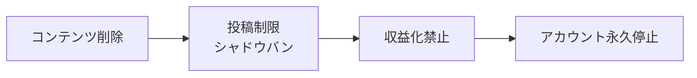
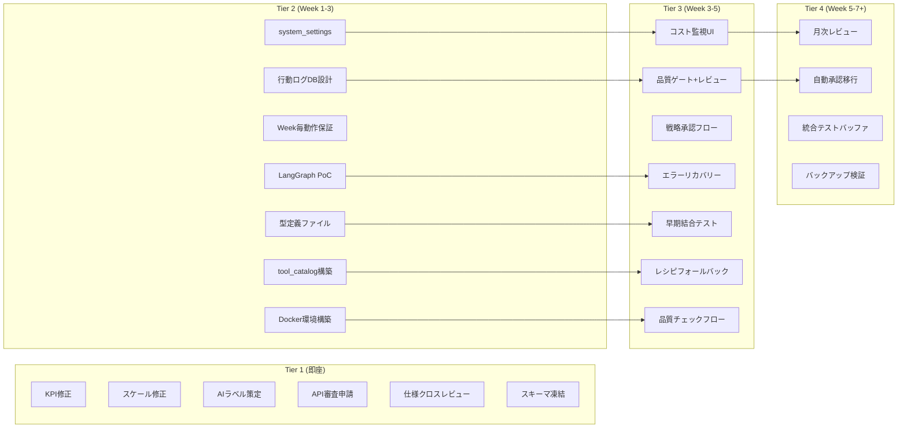

# リスク・ボトルネック分析

> v5.0のビジネスリスク、技術リスク、プラットフォームリスク、運用リスクを網羅的に分析し、ボトルネックの特定と緩和策の優先順位を定義する
>
> **作成日**: 2026-02-16
>
> **対象**: AI-Influencer v5.0 (DB + MCP + Multi-Agent アーキテクチャ)
>
> **関連ドキュメント**: [STRATEGY.md](../STRATEGY.md), [KPI-FEASIBILITY-ANALYSIS-v2-AI-DRIVEN.md](../KPI-FEASIBILITY-ANALYSIS-v2-AI-DRIVEN.md), [ALGORITHM-CONTENT-VOLUME-ANALYSIS.md](../ALGORITHM-CONTENT-VOLUME-ANALYSIS.md), [04-agent-design.md](04-agent-design.md)

## 目次

- [1. リスク分類と評価基準](#1-リスク分類と評価基準)
- [2. ビジネスリスク](#2-ビジネスリスク)
  - [2.1 アカウントBAN・規約違反](#21-アカウントban規約違反)
  - [2.2 KPI達成不能](#22-kpi達成不能)
  - [2.3 コスト超過](#23-コスト超過)
  - [2.4 市場変化](#24-市場変化)
- [3. 技術リスク](#3-技術リスク)
  - [3.1 開発スケジュール遅延](#31-開発スケジュール遅延)
  - [3.2 LangGraph.js の技術リスク](#32-langgraphjs-の技術リスク)
  - [3.3 PostgreSQL + pgvector の運用](#33-postgresql--pgvector-の運用)
  - [3.4 外部API依存](#34-外部api依存)
  - [3.5 ツールスペシャリスト関連リスク](#35-ツールスペシャリスト関連リスク)
  - [3.6 マルチツール連携リスク](#36-マルチツール連携リスク)
  - [3.7 Docker関連リスク](#37-docker関連リスク)
  - [3.8 開発/本番環境分離リスク](#38-開発本番環境分離リスク)
  - [3.9 アルゴリズム学習システムリスク](#39-アルゴリズム学習システムリスク)
- [4. プラットフォームリスク](#4-プラットフォームリスク)
  - [4.1 API審査・アクセス制限](#41-api審査アクセス制限)
  - [4.2 AIコンテンツ検出の高度化](#42-aiコンテンツ検出の高度化)
  - [4.3 アカウント登録のスケーリング](#43-アカウント登録のスケーリング)
- [5. 運用リスク](#5-運用リスク)
  - [5.1 エージェントの暴走](#51-エージェントの暴走)
  - [5.2 コスト暴走](#52-コスト暴走)
  - [5.3 データ整合性](#53-データ整合性)
  - [5.4 ダッシュボード運用リスク](#54-ダッシュボード運用リスク)
- [6. 仕様駆動並列実装リスク](#6-仕様駆動並列実装リスク)
  - [6.1 仕様の不完全性 → 全モジュール同時手戻り](#61-仕様の不完全性--全モジュール同時手戻り)
  - [6.2 統合テスト時の不整合集中](#62-統合テスト時の不整合集中)
  - [6.3 VM リソース不足 (OOM)](#63-vm-リソース不足-oom)
  - [6.4 エラーリカバリーの連鎖障害](#64-エラーリカバリーの連鎖障害)
  - [6.5 人間レビューのボトルネック](#65-人間レビューのボトルネック)
- [7. ボトルネック分析](#7-ボトルネック分析)
- [8. リスクマトリクス](#8-リスクマトリクス)
- [9. 緩和策の実装優先順位](#9-緩和策の実装優先順位)


## 1. リスク分類と評価基準

### 分類体系

v5.0のリスクを以下の4カテゴリに分類する。

| カテゴリ | 対象範囲 | 主な観点 |
|---|---|---|
| **ビジネスリスク** | 事業戦略・収益・KPI | 規約違反、KPI未達、コスト、市場変化 |
| **技術リスク** | 開発・アーキテクチャ | スケジュール、技術選定、外部依存 |
| **プラットフォームリスク** | 各SNS・配信基盤 | API制限、AI検出、スケーリング |
| **運用リスク** | 日常運用・保守 | エージェント暴走、コスト管理、データ整合性 |

### 評価基準

| レベル | 影響度 | 定義 |
|---|---|---|
| **致命的** | 事業継続不可 | プロジェクト全体の存続に関わる |
| **高** | 重大な遅延・損失 | KPI達成率に30%以上の影響 |
| **中** | 部分的な影響 | 回避策の実装で対処可能 |
| **低** | 軽微 | 運用での対処で十分 |

| レベル | 発生確率 | 定義 |
|---|---|---|
| **極めて高い** | 80%以上 | ほぼ確実に発生する |
| **高い** | 50-80% | 発生する可能性が高い |
| **中程度** | 20-50% | 条件次第で発生 |
| **低い** | 20%未満 | 可能性は低いが無視できない |


## 2. ビジネスリスク

### 2.1 アカウントBAN・規約違反

**影響度: 致命的** / **発生確率: 極めて高い**

AIコンテンツに対する各プラットフォームの規制は急速に強化されており、本プロジェクトの根幹に関わるリスクである。

#### 直近の事例

| 時期 | プラットフォーム | 内容 |
|---|---|---|
| 2025年下半期 | TikTok | **8,600のAIアカウントが永久停止**。AIラベル非開示が主因 |
| 2026年初頭 | YouTube | **3,500万登録者相当のAIチャンネルが停止**。"inauthentic content"ポリシー適用 |
| 継続中 | 全プラットフォーム | AI生成コンテンツの開示義務化の法制化が進行 |

#### 段階的処罰の流れ



プラットフォームは即座にBANするのではなく、段階的に制裁を強化する。しかし、一度「AIスパム」と判定されたアカウントは信頼スコアが回復しない。

#### AI専用アカウントの成功率

[ALGORITHM-CONTENT-VOLUME-ANALYSIS.md](../ALGORITHM-CONTENT-VOLUME-ANALYSIS.md) の調査結果より、AI専用アカウントの成功率（1万フォロワー到達）は **0.2-0.3%** に過ぎない。100アカウント作成して1つ成功するかどうかの確率であり、3,500アカウント運用計画の前提を大きく揺るがす数字である。

#### 緩和策

| 優先度 | 施策 | 効果 |
|---|---|---|
| **最優先** | AIラベル開示の徹底 | BAN理由の最大要因を排除 |
| **最優先** | AI+人間ハイブリッドアプローチ | 人間の創造的関与を組み込む。ハイブリッドアカウントは純AI比で**180%高速成長** |
| **高** | コンテンツの多様性確保 | テンプレート感を排除し、アルゴリズムの「同質コンテンツ」判定を回避 |
| **高** | 投稿頻度の適正化 | `MAX_POSTS_PER_ACCOUNT_PER_DAY` (デフォルト: 2) で制限。**5本以上は逆効果**（シャドウバン・スパム判定リスク増大） |
| **高** | 人間レビューによる品質保証 | `HUMAN_REVIEW_ENABLED` (デフォルト: true) でコンテンツ公開前に人間が品質チェック。不適切コンテンツの投稿を防止 |
| **高** | 投稿タイミングのランダム化 | `POSTING_TIME_JITTER_MIN` (デフォルト: 15) で投稿時刻にランダムなジッターを付与し、ボット的パターンを回避 |
| **中** | プラットフォーム分散 | 1つのプラットフォームでBANされても他で運用継続可能 |


### 2.2 KPI達成不能

**影響度: 高** / **発生確率: 極めて高い**

STRATEGY.mdで設定されているインプレッション前提は、現実的な数値と大きな乖離がある。

#### KPI前提 vs 現実

| 指標 | STRATEGY.md前提 | 現実的な数値 | 乖離倍率 |
|---|---|---|---|
| TikTok 平均Imp/投稿 | 15,000 | 300-500（新規アカウント） | **30-50倍の過大評価** |
| YouTube 平均Imp/投稿 | 8,000 | 500-1,000（新規アカウント） | **8-16倍の過大評価** |
| Instagram 平均Imp/投稿 | 10,000 | 200-500（新規アカウント） | **20-50倍の過大評価** |
| X 平均Imp/投稿 | 5,000 | 100-300（新規アカウント） | **17-50倍の過大評価** |

新規アカウントが安定的なインプレッションを獲得するには最低でも3-6ヶ月の育成期間が必要であり、2月開始のアカウントが6月までに収益化ラインに到達する可能性は極めて低い。

ただし、仕様駆動並列実装により開発タイムラインが**19週→7週**に短縮されたことで、v5.0のAI学習・最適化サイクルが従来より**約2.5ヶ月早く**開始可能になる。これにより、6月時点でのKPI達成率は v3見積もり 14-43% → **22-55%** に改善される見込み。

#### 緩和策

| 優先度 | 施策 | 効果 |
|---|---|---|
| **最優先** | KPIの現実的修正 | 達成不能な目標を追うリソース浪費を防止 |
| **高** | 品質重視への戦略シフト | 少数アカウントの深掘り育成で、成功確率の高いアカウントを確実に伸ばす |
| **高** | 開発短縮によるAI学習期間の前倒し | 7週完了（4月初旬）→ 6月まで約2.5ヶ月のAI学習・最適化期間を確保 |
| **中** | v5.0のフィードバックループ活用 | アナリストエージェントが仮説検証サイクルを回し、コンテンツ品質を継続改善 |


### 2.3 コスト超過

**影響度: 中** / **発生確率: 高い**

STRATEGY.mdのスケール目標（6月に3,500アカウント）を前提とした場合、月額コストは以下の規模に達する。

#### スケール別月額コスト試算

詳細なコスト分析は [05-cost-analysis.md](05-cost-analysis.md) を参照。以下はリスク評価に関連するコスト要約のみ記載:

- **コンテンツ制作API (fal.ai)**: 全体の93%以上を占める最大コストドライバー。3,500アカウント規模で月額$242,550
- **Claude API**: $630-16,620/月（規模依存）。Prompt Caching・Batch APIで最大50-90%削減可能
- **Fish Audio (TTS)**: 月額固定 $11/month (Fish Audio Plus)。スケールに関わらず一定

fal.aiの費用が全体の93%以上を占める。3,500アカウント×30日×$2.31/動画 = $242,550/月は、収益化前の段階では資金繰りを圧迫する。

#### 緩和策

| 優先度 | 施策 | 効果 |
|---|---|---|
| **最優先** | 段階的スケール | 収益が確認できてからスケールアップ |
| **最優先** | 日次・月次予算上限 | `DAILY_BUDGET_LIMIT_USD` (デフォルト: 100.0) と `MONTHLY_BUDGET_LIMIT_USD` (デフォルト: 2000.0) を `system_settings` で管理。超過時に全制作を自動停止 |
| **高** | コスト監視ダッシュボード | 日次でAPI費用を可視化し、異常値を即検知。ダッシュボード `/costs` ページで確認 |
| **高** | fal.ai残高アラート | `FAL_AI_BALANCE_ALERT_USD` (デフォルト: 50.0) で残高低下を事前警告。枯渇前に対応可能 |
| **高** | エラーリカバリーによる無駄削減 | 3段階エラーリカバリー（APIリトライ → チェックポイント復旧 → ダッシュボード通知）で部分失敗時のAPI費用浪費を防止 |
| **中** | 代替動画生成APIの調査 | fal.ai一択からの脱却 |
| **中** | バッチ処理・キャッシュ | 類似コンテンツの重複生成を削減 |


### 2.4 市場変化

**影響度: 中** / **発生確率: 高い**

AIコンテンツを取り巻く市場環境は急速に変化しており、半年先の予測すら困難な状況にある。

#### 主要な市場変化要因

| 要因 | 動向 | 影響 |
|---|---|---|
| **AIコンテンツ規制強化** | EU AI Act施行、各国で同様の法制化 | 開示義務・罰則の厳格化 |
| **アルゴリズム変更** | 各プラットフォームが四半期ごとに調整 | 過去の成功パターンが突然機能しなくなる |
| **競合の増加** | 毎日**750万本**のAI動画がTikTokに投稿 | コンテンツの飽和と差別化の困難化 |
| **視聴者の目の肥え** | AI生成コンテンツへの慣れ・飽き | エンゲージメント率の構造的低下 |

#### 緩和策

| 優先度 | 施策 | 効果 |
|---|---|---|
| **高** | リサーチャーエージェントによる継続的監視 | 市場変化を数時間単位で検知し、戦略エージェントに報告 |
| **中** | コンテンツスタイルの多様化 | 特定パターンへの依存を避け、変化への耐性を確保 |
| **中** | 複数ニッチへの分散投資 | 特定ジャンルの規制・飽和リスクを分散 |


## 3. 技術リスク

### 3.1 開発スケジュール遅延

**影響度: 高** / **発生確率: 中程度** ← 並列実装により低減

v5.0は仕様駆動並列実装（Agent Team 10エージェント）により、従来の19週→**7週**に短縮された開発計画で進行する。単一ポイント障害のリスクは大幅に低減されたが、代わりに統合・調整リスクが発生する。

#### スケジュールリスクの構造

| 要因 | 詳細 | 遅延インパクト |
|---|---|---|
| ~~**1人開発**~~ | ~~全フェーズを1人のエンジニアが実装~~ → **Agent Team 10エージェントによる並列実装** | 単一障害点は解消。ただし調整オーバーヘッドが発生 |
| **新技術採用** | LangGraph.js v1.0 GA、MCP Server自作 | 学習曲線による初期フェーズの遅延 |
| **MCPツール数** | 103 MCPツール + 19 Dashboard REST APIの設計・実装・テスト | 並列実装で分担可能だが、統合テストの工数は残る |
| **統合リスク** | 10エージェントが並列開発したモジュールのWeek 5-7での統合 | インターフェース不整合の集中発見 |
| **仕様品質依存** | 全エージェントが同一仕様を参照して実装 | 仕様バグ → 全モジュール同時手戻り |

#### 7週間タイムライン（並列実装）

| Week | 内容 | 並列度 | 遅延確率 | 主な遅延要因 |
|---|---|---|---|---|
| Week 1 | DB基盤 + スキーマ凍結 | 2-3エージェント | 低 | PostgreSQL/pgvectorは枯れた技術 |
| Week 2-3 | MCP Server + ワーカー層 | 6-8エージェント | 中 | v4.0コードの再利用で軽減 |
| Week 3-4 | インテリジェンス層 | 6-8エージェント | **中-高** | LangGraph.js + Supervisorパターンの複雑さ |
| Week 4-5 | 戦略・計画層 + ダッシュボード | 8-10エージェント | 中 | 並列で進行、Next.js + Shadcn/uiは経験あり |
| Week 5-7 | 統合テスト + デバッグ | 全エージェント | **高** | モジュール間の不整合集中（§6.2参照） |

#### 緩和策

| 優先度 | 施策 | 効果 |
|---|---|---|
| **最優先** | フェーズごとに動く状態を作る | Week 2完了時点でDB駆動パイプラインが動く。後続が遅れてもDB基盤は使える |
| **最優先** | TypeScript型定義ファイルでインターフェース強制 | コンパイル時にモジュール間の不整合を検出 |
| **高** | MCPツールを段階的に実装 | 最初は10-15ツール(CRUD基本)から始め、必要に応じて追加 |
| **高** | Week 3-4で早期結合テスト | モジュール間の統合を前倒しで検証し、Week 5-7の修正量を削減 |
| **中** | v4.0パイプラインとの並行運用 | v5.0が完成するまでv4.0で本番運用を継続 |
| **中** | 統合バッファとしてWeek 7を確保 | Week 5-6で発見されたバグの修正に専用期間を設ける |


### 3.2 LangGraph.js の技術リスク

**影響度: 中** / **発生確率: 中程度**

LangGraph.jsはv1.0 GAに到達しているが、本番でのマルチエージェント運用の事例は限定的である。

#### リスク要因

| 要因 | 詳細 |
|---|---|
| **日本語リソースの不足** | v1.0 GAだが、日本語でのチュートリアル・事例・トラブルシュートが極めて少ない |
| **langchain-mcp-adaptersとの互換性** | MCPクライアントとLangGraphの統合は比較的新しく、エッジケースが未知 |
| **Supervisorパターンの複雑さ** | 4層階層型のSupervisor構造は設計・デバッグが難しい。ループ・デッドロック・無限再帰のリスク |
| **チェックポイントの信頼性** | 長時間実行（per-contentサイクル多数並行）でのステート保存・復元の安定性が未検証 |
| **エラーハンドリング** | エージェント内でのLLMエラー、ツールエラーの伝搬パスが複雑 |

#### 緩和策

| 優先度 | 施策 | 効果 |
|---|---|---|
| **最優先** | 段階的に複雑さを追加 | 初期は単一エージェント+3-5ツールのシンプルなグラフから開始 |
| **高** | Supervisorパターンの事前PoC | Week 2の実装開始前に最小限のSupervisorグラフで検証 |
| **高** | 短縮タイムラインによるリスク露出期間の削減 | 7週間完了 → LangGraph.jsの不確実性に曝される期間が19週→7週に短縮 |
| **中** | LangGraph公式のTypeScript examples活用 | Python版の事例が多いため、TS版への変換に注意 |
| **低** | フォールバック設計 | 最悪の場合、LangGraphを使わずcronベースのエージェント間連携で代替 |


### 3.3 PostgreSQL + pgvector の運用

**影響度: 低-中** / **発生確率: 低い**

PostgreSQL自体は成熟した技術だが、pgvectorを含めた運用にはいくつかの考慮点がある。

#### リスク要因

| 要因 | 詳細 |
|---|---|
| **ベクトルインデックスの性能チューニング** | IVFFlat/HNSWの選択、リスト数・ef_constructionの調整 |
| **ディスク容量** | 3,500アカウント×30本/月×メタデータ+ベクトルの蓄積 |
| **バックアップ・リカバリ** | Cloud SQLの自動バックアップ設定・リカバリ手順の確認 |
| **接続プーリング** | 複数エージェントの同時接続管理 |

#### 緩和策

| 優先度 | 施策 | 効果 |
|---|---|---|
| **中** | Cloud SQLの自動バックアップ設定確認 | Phase 1からCloud SQLを使用するため、バックアップ・HA・スケーリングはマネージド |
| **中** | Cloud SQLインスタンスのモニタリング | CPU/メモリ/接続数の監視ダッシュボード設定 |
| **低** | PgBouncerの導入 | 接続プーリングで同時接続数の問題を解消 |


### 3.4 外部API依存

**影響度: 中** / **発生確率: 中程度**

v5.0は複数の外部APIに強く依存しており、いずれかの障害・変更がパイプライン全体に影響する。

#### API依存マップ

| API | 用途 | リスク | 代替候補 |
|---|---|---|---|
| **fal.ai** | 動画生成 (Kling) | サービス障害、価格変更、同時タスク制限、残高枯渇(403) | Replicate, RunwayML API |
| **Fish Audio** | TTS音声生成 | サービス障害、API変更、Plusプラン($11/月)が必要 | ElevenLabs, Google Cloud TTS |
| **Anthropic (Claude)** | エージェントLLM | レート制限、価格変更、APIバージョン更新 | OpenAI GPT-4o, Google Gemini |
| **Google Drive API** | ファイル保存 | クォータ制限 | S3, Cloud Storage |
| **各SNS API** | 投稿・計測 | 審査、レート制限、仕様変更 | 代替なし（プラットフォーム固有） |

#### v4.0で確認済みの障害パターン

- **fal.ai 403 "Forbidden"**: 残高枯渇時に発生。エラーメッセージでは原因が不明瞭（fal-client.jsで enrichment済み）
- **fal.ai 部分成功**: Kling+TTS成功後にlipsync段階で残高切れ → 中途半端な成果物が残る
- **fal.storage URLの有効期限**: 一時URLは数時間で失効 → 長時間パイプラインで要注意

#### 緩和策

| 優先度 | 施策 | 効果 |
|---|---|---|
| **最優先** | 3段階エラーリカバリーフレームワーク | Level 1: APIリトライ (`MAX_RETRY_ATTEMPTS` デフォルト: 3, `system_settings`で設定可能) → Level 2: チェックポイント復旧 (部分完了から再開) → Level 3: ダッシュボード通知 (`failed_permanent`ステータスで人間に報告) |
| **高** | 残高監視の自動化 | fal.ai残高を定期チェックし、`FAL_AI_BALANCE_ALERT_USD` (デフォルト: 50.0) 以下でアラート |
| **中** | 代替サービスの事前調査 | 主要APIの代替候補をリストアップし、切り替え手順を文書化 |
| **低** | マルチプロバイダー抽象化 | 動画生成・TTS層を抽象化し、プロバイダー切り替えを容易にする設計 |


### 3.5 ツールスペシャリスト関連リスク

**影響度: 中** / **発生確率: 高い**

v5.0で新設されるツールスペシャリストAgentは、制作ジョブごとに最適なツール組み合わせ (レシピ) を選択する。初期段階では経験データが不足しており、判断精度に課題がある。

#### リスク要因

| 要因 | 詳細 |
|---|---|
| **ツール選択の判断ミス** | 経験データ不足の初期段階で不適切なツールを選択し、品質低下やコスト増大を招く |
| **外部ツールのAPI変更/停止** | 依存ツールの仕様変更・サービス終了により、既存レシピが動作しなくなる |

#### 緩和策

| 優先度 | 施策 | 効果 |
|---|---|---|
| **最優先** | 初期はv4.0デフォルトレシピをフォールバック | ツールスペシャリストの判断が不確実な間は、実績あるKling + Fish Audio + Lipsyncの組み合わせを使用。データ蓄積後に徐々にツールスペシャリストの判断を採用 |
| **高** | tool_catalogで複数代替ツールを管理 | 各カテゴリ (動画生成/TTS/リップシンク) に複数の代替ツールを登録し、API変更・停止時に自動切り替え |


### 3.6 マルチツール連携リスク

**影響度: 中** / **発生確率: 中程度**

ツールスペシャリストがデフォルトレシピ以外のツール組み合わせを選択した場合、ツール間の互換性問題が発生する可能性がある。

#### リスク要因

| 要因 | 詳細 |
|---|---|
| **出力フォーマットの不一致** | ツールごとに動画解像度・コーデック・音声フォーマット等が異なり、後続工程で処理できない |
| **未検証の組み合わせ** | 新しいツール組み合わせが品質基準を満たさない可能性 |

#### 緩和策

| 優先度 | 施策 | 効果 |
|---|---|---|
| **高** | production_recipesで検証済み組み合わせのみ使用 | 品質チェック済みの組み合わせをDBに登録し、未検証の組み合わせは使用しない |
| **中** | 新組み合わせは品質チェック必須 | ツールスペシャリストが新レシピを提案した場合、テスト制作 + 品質評価を経てから本番採用 |


### 3.7 Docker関連リスク

**影響度: 低-中** / **発生確率: 低い**

v5.0ではdocker-composeによるコンテナ化を導入する。Docker自体は成熟技術だが、1人体制での運用には考慮点がある。

#### リスク要因

| 要因 | 詳細 |
|---|---|
| **コンテナ運用の学習コスト** | 1人体制でDockerの構築・運用・トラブルシュートを行う負荷 |
| **ボリュームデータの永続性** | PostgreSQLデータを格納するDockerボリュームのデータ保全 |

#### 緩和策

| 優先度 | 施策 | 効果 |
|---|---|---|
| **中** | Claudeが構築・運用を支援 | Dockerfile, docker-compose.ymlの作成・メンテナンスはClaudeが担当。複雑さをdocker-composeレベルに抑制し、Kubernetes等は使用しない |
| **中** | named volume + 定期バックアップスクリプト | PostgreSQLデータにnamed volumeを使用し、pg_dumpによる定期バックアップスクリプトをcronで実行 |


### 3.8 開発/本番環境分離リスク

**影響度: 低** / **発生確率: 低い**

docker-composeで開発/本番を分離する設計だが、環境間の設定差異が本番障害を引き起こすリスクがある。

#### リスク要因

| 要因 | 詳細 |
|---|---|
| **環境間のドリフト** | 開発環境と本番環境の設定が徐々に乖離し、開発で正常に動いたコードが本番で障害を起こす |

#### 緩和策

| 優先度 | 施策 | 効果 |
|---|---|---|
| **中** | 同一docker-compose.ymlベース、環境変数のみ差分 | docker-compose.ymlを共通ベースとし、docker-compose.dev.yml / docker-compose.prod.ymlで環境変数のみをオーバーライド。サービス構成自体は同一に保つ |


### 3.9 アルゴリズム学習システムリスク

**影響度: 中** / **発生確率: 中程度**

v5.0のインプレッション予測アルゴリズム（[08-algorithm-analysis.md](08-algorithm-analysis.md) セクション15-27）は、データ蓄積に依存する学習システムであるため、以下の固有リスクが存在する。

#### リスク要因

| ID | リスク | 影響度 | 発生確率 | 詳細 |
|---|---|---|---|---|
| **R-24** | **コールドスタート期間** | 中 | 極めて高い (100%) | 運用開始時は全weight=1/9均等、adjustment=0（補正なし）。`predicted = pure baseline` のみ。ANALYSIS_MIN_SAMPLE_SIZE(5)を満たすまで各補正係数が機能しない |
| **R-25** | **プラットフォームアルゴリズム変更** | 中-高 | 高い | プラットフォームが推薦アルゴリズムを変更すると、学習済みの補正係数・weightが陳腐化。90日ハードカットオフで自然に減衰するが、急変時は数週間〜1ヶ月の精度低下 |
| **R-26** | **weight収束速度** | 中 | 中程度 | EMA α=0.3 + ±20%変更制限は安定性を優先した保守的設計。急激な環境変化への追従が遅い。tier1(週次)では特に遅い |
| **R-27** | **累積分析の計算負荷** | 中 | 中程度 | 3,500アカウント規模で月間105,000回×90秒=2,625h/月の累積分析。20並列でも4.4h/日。Cloud SQL・VMの計算リソース不足リスク |
| **R-28** | **データ品質・外れ値** | 中 | 高い | バイラル化による異常値（通常の100倍のインプ）が補正係数を歪める。単発の外れ値がniche/hook_type全体のadjustmentに波及 |
| **R-29** | **embeddingモデル変更** | 低-中 | 低い | OpenAI text-embedding-3-smallの廃止・変更時に全5テーブルの再embedding(E4)が必要。処理中は累積分析の精度が低下 |

#### 緩和策

| 優先度 | 施策 | 対象リスク | 効果 |
|---|---|---|---|
| **高** | コールドスタート期間の期待値設定 | R-24 | 運用開始1-2ヶ月は「学習期間」としてKPI評価対象外に設定。ダッシュボードに「コールドスタート中」表示 |
| **高** | 異常値フィルタリング | R-28 | 補正係数算出時にMAD（中央絶対偏差）ベースの外れ値除外。`WHERE actual / baseline BETWEEN 0.05 AND 20.0`（baseline比20倍超を除外） |
| **高** | weight変更レートの動的調整 | R-25, R-26 | 環境急変検知時（予測精度が前週比20%以上低下）に`WEIGHT_CHANGE_MAX_RATE`を一時的に0.4に引き上げ（`system_settings`で設定可能） |
| **中** | 累積分析の並列度スケーリング | R-27 | ワーカープール数を`system_settings`で管理。負荷に応じて10→20→30並列に動的スケール |
| **中** | Embedding再生成バッチの高速化 | R-29 | バッチサイズ100件、id順OFFSET処理。5テーブル並列で再生成可能。`EMBEDDING_MODEL_VERSION`で管理 |
| **低** | 90日カットオフの動的調整 | R-25 | プラットフォーム変更検知時に`ADJUSTMENT_DATA_DECAY_DAYS`を30日に一時短縮し、古いデータの影響を迅速に排除 |


## 4. プラットフォームリスク

### 4.1 API審査・アクセス制限

**影響度: 高** / **発生確率: 高い**

投稿自動化の実現には各プラットフォームのAPI審査を通過する必要があるが、審査基準は厳格であり、AIコンテンツの自動投稿は審査でのリスク要因となる。

#### プラットフォーム別API要件

| プラットフォーム | API | 審査期間 | 主な障壁 |
|---|---|---|---|
| **TikTok** | Content Posting API | 2-4週間 | アプリ審査が厳格。AI自動投稿は拒否される可能性 |
| **YouTube** | YouTube Data API v3 | 1-2週間 | クォータ上限 (10,000units/日)。増加申請が必要 |
| **Instagram** | Graph API | 2-3週間 | Meta Business Account必須。Reels投稿はContent Publishing API |
| **X** | API v2 | 即時-1週間 | Premium必須 (**$8/月/アカウント**)。3,500アカウントで$28,000/月 |

#### 投稿自動化のボトルネック

X API v2のPremiumプランは**アカウント単位**で課金されるため、スケール時のコストが急増する。3,500アカウント × $8/月 = **$28,000/月**は、fal.aiに次ぐ第2の固定費となる。

#### 緩和策

| 優先度 | 施策 | 効果 |
|---|---|---|
| **最優先** | 開発と並行して早期申請 | Phase 3-4でAPI連携を実装する前に審査を開始 |
| **高** | X投稿はFree/Basicプランで可能な範囲に限定 | Premium不要な運用設計を検討 |
| **中** | プラットフォーム優先順位の明確化 | TikTok/YouTubeを優先し、Xは段階的に対応 |


### 4.2 AIコンテンツ検出の高度化

**影響度: 高** / **発生確率: 極めて高い**

各プラットフォームはAI生成コンテンツの検出技術を急速に高度化しており、この傾向は今後さらに加速する。

#### 検出技術の現状

| 技術 | 概要 | 影響 |
|---|---|---|
| **C2PA (コンテンツ来歴証明)** | Adobe・Google・Microsoft等が推進する電子証明規格。画像・動画の生成元を追跡 | fal.ai/Kling生成動画にC2PAメタデータが付与される可能性 |
| **TikTokのAIプラットフォーム検知** | **47のAI生成プラットフォーム**を自動検知し、ラベル付与 | fal.ai経由のKling動画が検知対象に含まれるリスク |
| **YouTubeの"inauthentic content"ポリシー** | AI生成であること自体は問題ないが、「人間であるかのように偽装」すると違反 | AIラベル非開示でのインフルエンサー運用が直接的な違反に |
| **統計的パターン検出** | 投稿時刻・頻度・コンテンツ類似度等のメタ情報から自動化を推定 | 3,500アカウントの同時運用は統計的に異常値として検知される |

#### 緩和策

| 優先度 | 施策 | 効果 |
|---|---|---|
| **最優先** | 人間の創造的関与を組み込む設計 | v5.0のダッシュボードに「人間介入パネル」を実装。コンテンツ企画段階で人間のアイデアを反映 |
| **高** | AIラベルの積極的開示 | 隠すのではなく、堂々とAI活用を宣言するブランディング |
| **中** | 投稿タイミングの分散 | アカウントごとにランダムな投稿時刻を設定し、統計的パターンを回避 |
| **中** | C2PAメタデータの監視 | 生成動画に埋め込まれるメタデータの確認と必要に応じた対応方針策定 |


### 4.3 アカウント登録のスケーリング

**影響度: 高** / **発生確率: 極めて高い**

STRATEGY.mdの目標では、5月に1,140アカウント/月の新規作成が必要だが、アカウント登録はAIでの自動化が極めて困難な領域である。

#### 自動化困難な要因

| 障壁 | 詳細 | AI突破可能性 |
|---|---|---|
| **CAPTCHA** | reCAPTCHA v3、hCaptcha等 | 突破サービスは存在するが規約違反 |
| **電話番号認証** | SMS認証必須。1番号1アカウント制約 | 仮想番号サービスは検知対象 |
| **本人確認** | 身分証・顔認証が要求されるケース | AI生成IDは詐欺行為に該当 |
| **IP制限** | 同一IPからの大量登録をブロック | VPN/プロキシは検知対象 |
| **デバイス制限** | デバイスフィンガープリントでの制限 | 回避は技術的に可能だが規約違反 |

#### 月別必要新規アカウント数

| 月 | 必要新規数 | 1日あたり | 必要人員(推定) |
|---|---|---|---|
| 2月 | 50 | ~2 | 1人 |
| 3月 | 110 | ~4 | 1-2人 |
| 4月 | 180 | ~6 | 2人 |
| 5月 | **1,140** | ~38 | **10-15人** |
| 6月 | **2,020** | ~67 | **20-25人** |

5月以降の新規アカウント作成には**10人以上の人的リソース**が必要となり、これは現行の体制では対応不可能である。

#### 緩和策

| 優先度 | 施策 | 効果 |
|---|---|---|
| **最優先** | 現実的なスケール目標の設定 | 月50-100アカウント増を上限として再計画 |
| **高** | アカウント登録の標準化・マニュアル化 | インターンでも迷わず作業できる手順書の整備 |
| **中** | 既存アカウントの多プラットフォーム展開 | 1キャラクター/1アカウント設計で、プラットフォーム間の再利用を最大化 |


## 5. 運用リスク

### 5.1 エージェントの暴走

**影響度: 中-高** / **発生確率: 中程度**

v5.0ではLLMエージェントが自律的に判断・実行するため、予期しない動作が発生するリスクがある。

#### 暴走シナリオ

| シナリオ | 概要 | 想定される被害 |
|---|---|---|
| **大量低品質コンテンツ生成** | プランナーが「量」を最適化し、品質を犠牲にする | アカウントのシャドウバン、ブランド毀損 |
| **不適切コンテンツ投稿** | LLMが文化的に不適切・攻撃的なコンテンツを生成 | アカウントBAN、法的リスク |
| **無限ループ** | エージェント間の指示循環でリソースを消費し続ける | API費用の浪費、システムハング |
| **戦略の暴走** | 戦略エージェント(Opus)が過激な方針転換を指示 | 全アカウントの方向性が一斉に変わる |
| **APIの乱用** | エージェントが不必要に大量のAPIコールを発行 | レート制限到達、コスト超過 |

#### 緩和策

| 優先度 | 施策 | 効果 |
|---|---|---|
| **最優先** | 品質ゲートの実装 | コンテンツ公開前に品質スコア閾値をチェック。基準未達は人間レビューキューへ |
| **最優先** | 人間レビューゲート | `HUMAN_REVIEW_ENABLED` (デフォルト: true) で全コンテンツを投稿前に人間が確認。`system_settings`で設定管理 |
| **最優先** | 戦略承認必須化 | `STRATEGY_APPROVAL_REQUIRED` (デフォルト: true) で戦略エージェントの方針変更に人間承認を必須化。`system_settings`で設定管理 |
| **高** | コンテンツフィルター | 不適切コンテンツ検出 (Anthropic Content Filter等) をパイプラインに組み込む |
| **高** | エージェントの行動ログ | 全エージェントの判断理由・実行結果をPostgreSQLに記録し、監査可能にする |
| **中** | サーキットブレーカー | 異常な実行パターン（短時間での大量API呼び出し等）を検知して自動停止 |


### 5.2 コスト暴走

**影響度: 中** / **発生確率: 中程度**

エージェントが自律的にAPIを呼び出す設計のため、予期しないコスト増大のリスクがある。

#### コスト暴走シナリオ

| シナリオ | 最悪ケース |
|---|---|
| プランナーが全アカウントのコンテンツを一斉再生成 | fal.ai: 3,500 × $2.31 = **$8,085/日** |
| リサーチャーが過剰にWebクローリングを実行 | Claude API: 数千回のリクエスト = **$500-1,000/日** |
| 品質不足でリトライが連鎖 | 同一コンテンツの3-5回再生成 = **3-5倍のコスト** |
| fal.ai残高が予告なく枯渇 | パイプライン中断 + 中途半端な成果物のストレージ浪費 |

#### 緩和策

| 優先度 | 施策 | 効果 |
|---|---|---|
| **最優先** | 日次・月次コスト上限 | `DAILY_BUDGET_LIMIT_USD` (デフォルト: 100.0) で超過時に全制作を自動停止。`MONTHLY_BUDGET_LIMIT_USD` (デフォルト: 2000.0) で月次上限も設定。`system_settings`で管理 |
| **高** | リアルタイムアラート | 日次予算の70%到達時点でSlack/メール通知 |
| **高** | コスト監視ダッシュボードページ | `/costs` ページでリアルタイムのAPI費用を可視化。エージェント別・API種別の内訳表示 |
| **中** | コスト帰属追跡 | アカウント別・エージェント別のAPI費用をPostgreSQLに記録 |
| **低** | 月次コストレビュー | 人間が月次で傾向分析し、予算配分を調整 |


### 5.3 データ整合性

**影響度: 低-中** / **発生確率: 低い**

複数エージェントが同一データベースに対して並行に読み書きするため、レースコンディションのリスクがある。

#### 想定される競合パターン

| パターン | 例 | 影響 |
|---|---|---|
| **同一アカウントへの同時書き込み** | プランナーAとアナリストBが同じaccountsレコードを更新 | 一方の変更が消失 |
| **タスクの二重取得** | 2つのワーカーが同じタスクを同時に取得 | リソースの無駄遣い、成果物の重複 |
| **カウンターの不整合** | daily_post_countの並行更新 | 投稿数上限の超過 |

#### 緩和策

| 優先度 | 施策 | 効果 |
|---|---|---|
| **高** | PostgreSQLのACID保証の活用 | トランザクション分離レベルの適切な設定 |
| **高** | SELECT FOR UPDATE | タスク取得時の排他ロックで二重取得を防止 |
| **中** | 楽観的ロック (version column) | 更新競合時のリトライパターン |
| **低** | デッドロック監視 | pg_stat_activityでの定期チェック |


### 5.4 ダッシュボード運用リスク

**影響度: 中** / **発生確率: 中程度**

ダッシュボードはエージェントシステムへの人間の窓口であり、運用上固有のリスクがある。

| リスク | 影響 | 緩和策 |
|--------|------|--------|
| 人間承認ボトルネック | `STRATEGY_APPROVAL_REQUIRED=true`時に計画キューが溜まる | バッチ承認UI + `AUTO_APPROVE_SCORE_THRESHOLD` (デフォルト: 8.0) による自動承認 |
| 不適切なプロンプト変更 | エージェント全体の出力品質低下 | バージョンロールバック + A/B比較期間 + 自動パフォーマンス監視 |
| エージェントメッセージ洪水 | 受信トレイが雑音化し重要メッセージを見逃す | レート制限 (10件/日/エージェント) + 優先度フィルタ |
| ダッシュボード停止 | 自律システムへの人間の可視性がゼロに | Dockerヘルスチェック + アラート |


## 6. 仕様駆動並列実装リスク

v5.0では仕様駆動並列実装（Agent Team 10エージェント、19週→7週）を採用する。この手法特有のリスクを以下に分析する。

### 6.1 仕様の不完全性 → 全モジュール同時手戻り

**影響度: 高** / **発生確率: 中程度 (20-50%)**

10エージェントが同一仕様を参照して並列実装するため、仕様のバグや曖昧さが全モジュールに同時波及する。順次開発では早期に発見できた問題が、並列開発では全モジュール完成後に一斉発覚するリスクがある。

#### 緩和策

| 優先度 | 施策 | 効果 |
|---|---|---|
| **最優先** | 仕様凍結前に全仕様のクロスレビュー実施 | 仕様間の矛盾・曖昧さを事前検出 |
| **最優先** | TypeScript型定義ファイルでインターフェース強制 | コンパイル時にモジュール間の不整合を自動検出 |
| **高** | Week 1終了時にスキーマ凍結 | 追加のみ許可、削除・変更は禁止。変更は「変更申請→リーダー承認→全チーム通知」プロトコル |
| **高** | インターフェース変更管理プロトコル | 変更申請→リーダー承認→全チーム通知の3ステップで変更を制御 |


### 6.2 統合テスト時の不整合集中

**影響度: 中-高** / **発生確率: 高い (50-80%)**

並列開発したモジュールをWeek 5-7で統合する際、大量の不整合バグが集中発見される。これは並列開発の構造的な問題であり、発生をゼロにすることは困難。

#### 緩和策

| 優先度 | 施策 | 効果 |
|---|---|---|
| **最優先** | Week 3-4でモジュール間の早期結合テスト | 統合バグの早期発見。Week 5-7の修正量を大幅削減 |
| **高** | モックではなく実DB接続テストをWeek 3から開始 | DB操作の不整合を本番に近い環境で検証 |
| **高** | test-agentが継続的にテストスイートを拡充 | テストカバレッジの自動拡大で回帰バグを防止 |
| **中** | 統合テストのバッファとしてWeek 7を確保 | 統合テストで発見されたバグの修正に専用期間を確保 |


### 6.3 VM リソース不足 (OOM)

**影響度: 中** / **発生確率: 低い (< 20%)**

Agent Team の10エージェントが同一VM上で並行動作する場合、メモリ不足によりOOM Killerが発動し、エージェントプロセスが強制終了されるリスクがある。

#### 緩和策

| 優先度 | 施策 | 効果 |
|---|---|---|
| **高** | 最大10チームメイト（安全圏）を厳守 | VM仕様で安全に動作する上限を遵守 |
| **高** | メモリ監視スクリプト常駐 | OOM発生前にアラートを発信し、予防的対応を可能に |
| **中** | 必要に応じてエージェント数を削減（8→6→4） | 並列度を下げることでメモリ圧迫を回避 |
| **低** | スワップ領域の追加検討（SSD上に2-4GB） | OOM Killerの発動を遅延させる緩衝措置 |


### 6.4 エラーリカバリーの連鎖障害

**影響度: 中** / **発生確率: 低い (< 20%)**

3段階エラーリカバリーフレームワーク（APIリトライ → チェックポイント復旧 → ダッシュボード通知）において、リトライが連鎖的にAPIコストを増加させたり、無限リトライループに陥るリスクがある。

#### 緩和策

| 優先度 | 施策 | 効果 |
|---|---|---|
| **最優先** | `MAX_RETRY_ATTEMPTS` (デフォルト: 3) でリトライ上限を設定 | `system_settings`で管理。無限リトライを構造的に防止 |
| **高** | `failed_permanent` ステータスで明示的にリトライ停止 | リトライ上限超過後はステータスを変更し、人間に判断を委ねる |
| **高** | `DAILY_BUDGET_LIMIT_USD` 超過で全制作自動停止 | コスト暴走の最終防壁として機能 |
| **中** | ダッシュボードのエラーログで人間が状況を確認可能 | 連鎖障害の兆候を視覚的に把握し、早期介入を可能に |


### 6.5 人間レビューのボトルネック

**影響度: 低-中** / **発生確率: 高い (50-80%) ※初期段階**

`HUMAN_REVIEW_ENABLED` が有効な初期段階では、レビュー待ちキューが溜まり、投稿が遅延するリスクがある。特にアカウント数が増加した場合、1人の人間がレビューできる量に物理的限界がある。

#### 緩和策

| 優先度 | 施策 | 効果 |
|---|---|---|
| **最優先** | `AUTO_APPROVE_SCORE_THRESHOLD` (デフォルト: 8.0) で高品質コンテンツを自動承認 | `system_settings`で管理。品質スコア8.0以上のコンテンツは人間レビューをスキップ |
| **高** | 品質安定アカウントの段階的自動承認移行 | 実績のあるアカウントは自動承認に切り替え、レビュー対象を絞り込む |
| **中** | 最終的に `HUMAN_REVIEW_ENABLED=false` に切り替え可能 | 品質が十分安定した段階でレビューを全面無効化 |
| **中** | モバイル対応ダッシュボードで外出先からもレビュー可能 | レスポンシブUI対応により、レビュー機会を増加 |


## 7. ボトルネック分析

v5.0の成長を制約する要因を、影響度の大きい順にランク付けする。

### Top 7 ボトルネック

#### 第1位: アカウント登録の人的リソース

```
致命度: ★★★★★  |  自動化可能性: ほぼゼロ  |  影響範囲: 全体
```

CAPTCHA、電話認証、本人確認はAIで突破不可能であり、規約上も自動化すべきでない領域。5月以降のスケール計画（1,140アカウント/月）は、現実的に10-15人の人手が必要であり、これが最大のスケーリングボトルネックとなる。

**対策**: アカウント数の目標を下方修正し、少数精鋭での運用に戦略転換。50-100アカウント/月の増加ペースを上限とする。

#### 第2位: fal.ai処理時間と同時タスク制限

```
致命度: ★★★★☆  |  自動化可能性: 制約あり  |  影響範囲: コンテンツ制作
```

v4.0で実現した並列化（~12分/動画）は物理的な制約であり、これ以上の短縮は困難。さらにfal.aiには同時実行タスク数の制限があり、大量の並行生成はキューイングによる待ち時間が発生する。

1日3,500本の動画生成に必要な時間:
- 12分/本 × 3,500本 = 42,000分 = **700時間**
- 同時10タスクの場合: **70時間** (1日では完了不可能)
- 同時50タスクの場合: **14時間** (ギリギリ)

**対策**: 全アカウントで毎日新規動画を生成する前提を見直し、コンテンツの再利用・クロスポスト戦略を組み合わせる。

#### 第3位: 仕様品質（並列実装の前提条件）

```
致命度: ★★★★☆  |  自動化可能性: 部分的  |  影響範囲: 全モジュール
```

仕様駆動並列実装では、仕様の品質が全モジュールの品質を決定する。仕様バグは10エージェントに同時波及し、手戻りコストが順次開発の数倍になる。「仕様を見て100人が全く同じものを実装できるレベル」の精度が必須（§6.1参照）。

**対策**: Week 1終了時にスキーマ凍結。TypeScript型定義ファイルでインターフェースをコンパイル時に強制。変更は「変更申請→リーダー承認→全チーム通知」プロトコルで管理。

#### 第4位: 人間レビューキュー

```
致命度: ★★☆☆☆  |  自動化可能性: 段階的に可能  |  影響範囲: 投稿速度
```

`HUMAN_REVIEW_ENABLED=true`（初期段階）では、レビュー待ちキューが投稿速度のボトルネックになる。アカウント数が増加するほど、1人の人間がレビューできる量との乖離が拡大する（§6.5参照）。

**対策**: `AUTO_APPROVE_SCORE_THRESHOLD` (デフォルト: 8.0) で高品質コンテンツを自動承認。品質が安定したアカウントから段階的に `HUMAN_REVIEW_ENABLED=false` に移行。

#### ~~第3位~~ 第5位: 開発リードタイム ← 大幅改善

```
致命度: ★★☆☆☆  |  自動化可能性: 実現済み  |  影響範囲: 全体(時間軸)
```

~~5フェーズ × 3-4週間 = 全体15-20週間。1人開発のため並列化不可。~~ → Agent Team 10エージェントによる仕様駆動並列実装で**19週→7週**に短縮。開発リードタイムは従来の最大ボトルネックから**大幅に改善**された。

**対策**: 各Weekの完了時点で動作する成果物を確保する設計。Week 2完了でDB駆動パイプラインが稼働し、v5.0全体が完成しなくてもv4.0からの改善効果を享受できる。

#### 第6位: AIコンテンツの品質

```
致命度: ★★★☆☆  |  自動化可能性: 部分的  |  影響範囲: 全アカウントの成長
```

[ALGORITHM-CONTENT-VOLUME-ANALYSIS.md](../ALGORITHM-CONTENT-VOLUME-ANALYSIS.md) の分析より、アルゴリズムに評価されるためには**完視聴率70%以上**が必要。現状のAI生成動画がこの閾値を安定的に超えられるかは未検証であり、超えられない場合、量を増やしても成長に寄与しない。

**対策**: v5.0のフィードバックループ（アナリストエージェント → 仮説検証 → コンテンツ改善）を最優先で実装し、品質の継続的改善サイクルを回す。

#### 第7位: プラットフォームAPI審査

```
致命度: ★★☆☆☆  |  自動化可能性: ゼロ  |  影響範囲: 投稿自動化
```

TikTok Content Posting API、YouTube Data API、Instagram Graph APIの審査はプラットフォーム側のプロセスであり、自社でコントロールできない。審査に落ちた場合、投稿の自動化が実現できず、人間の手動投稿に依存し続けることになる。

**対策**: 開発Phase 1-2と並行してAPI審査を申請開始。審査に落ちた場合の代替フロー（半自動投稿ツール等）も設計しておく。


## 8. リスクマトリクス

全リスクを影響度×発生確率で整理し、優先対策を一覧する。

### 総合リスクマトリクス

| ID | リスク | カテゴリ | 影響度 | 発生確率 | 総合スコア | 優先対策 |
|---|---|---|---|---|---|---|
| R-01 | アカウントBAN・規約違反 | ビジネス | 致命的 | 極めて高い | **S** | AIラベル開示、ハイブリッドアプローチ、`HUMAN_REVIEW_ENABLED` |
| R-02 | KPI達成不能 | ビジネス | 高 | 極めて高い | **S** | KPI現実的修正、品質重視戦略、開発短縮(7週)によるAI学習前倒し |
| R-03 | アカウント登録スケーリング | プラットフォーム | 高 | 極めて高い | **S** | スケール目標下方修正 |
| R-04 | AIコンテンツ検出高度化 | プラットフォーム | 高 | 極めて高い | **S** | 人間関与の設計組み込み |
| R-05 | 開発スケジュール遅延 | 技術 | 高 | **中程度** ← | **B** ← | Agent Team並列実装(7週)、Week毎の動作保証 |
| R-06 | API審査・アクセス制限 | プラットフォーム | 高 | 高い | **A** | 早期申請、代替フロー設計 |
| R-07 | エージェント暴走 | 運用 | 中-高 | **低い** ← | **B** ← | 品質ゲート、`HUMAN_REVIEW_ENABLED`、`STRATEGY_APPROVAL_REQUIRED` |
| R-08 | コスト超過 | ビジネス | 中 | **中程度** ← | **B** | 段階的スケール、`DAILY_BUDGET_LIMIT_USD`、`/costs`ダッシュボード |
| R-09 | 市場変化 | ビジネス | 中 | 高い | **B** | リサーチャーエージェント監視 |
| R-10 | LangGraph.js技術リスク | 技術 | 中 | 中程度 | **B** | 段階的導入、事前PoC、短縮タイムラインでリスク露出削減 |
| R-11 | 外部API依存 | 技術 | 中 | 中程度 | **B** | 3段階エラーリカバリー、`MAX_RETRY_ATTEMPTS` |
| R-12 | コスト暴走 | 運用 | 中 | **低い** ← | **C** ← | `DAILY_BUDGET_LIMIT_USD`自動停止、`/costs`ダッシュボード |
| R-13 | PostgreSQL+pgvector運用 | 技術 | 低-中 | 低い | **C** | Cloud SQL (Week 1から使用)、インスタンス監視 |
| R-14 | データ整合性 | 運用 | 低-中 | 低い | **C** | ACID保証、SELECT FOR UPDATE |
| R-15 | ツールスペシャリスト判断ミス | 技術 | 中 | 高い | **B** | 初期はデフォルトレシピフォールバック |
| R-16 | マルチツール互換性問題 | 技術 | 中 | 中程度 | **B** | production_recipesで検証済み組み合わせのみ使用 |
| R-17 | Docker運用負荷 | 技術 | 低-中 | 低い | **C** | Claudeが構築・運用、docker-composeで複雑さ抑制 |
| R-18 | 開発/本番環境ドリフト | 技術 | 低 | 低い | **C** | 同一docker-compose.ymlベース、環境変数のみ差分 |
| R-19 | 仕様不完全性→全モジュール手戻り | 並列実装 | 高 | 中程度 | **A** | クロスレビュー、スキーマ凍結、型定義ファイル |
| R-20 | 統合テスト時の不整合集中 | 並列実装 | 中-高 | 高い | **A** | 早期結合テスト、Week 7バッファ |
| R-21 | VMリソース不足(OOM) | 並列実装 | 中 | 低い | **C** | エージェント数上限(10)、メモリ監視 |
| R-22 | エラーリカバリー連鎖障害 | 並列実装 | 中 | 低い | **C** | `MAX_RETRY_ATTEMPTS`、`failed_permanent`ステータス |
| R-23 | 人間レビューボトルネック | 並列実装 | 低-中 | 高い | **B** | `AUTO_APPROVE_SCORE_THRESHOLD`、段階的自動承認 |
| R-24 | コールドスタート期間 | 技術 | 中 | 極めて高い | **B** | 学習期間設定、KPI評価対象外 |
| R-25 | プラットフォームアルゴリズム変更 | 技術 | 中-高 | 高い | **A** | 90日カットオフ、weight変更レート動的調整 |
| R-26 | weight収束速度 | 技術 | 中 | 中程度 | **B** | `WEIGHT_CHANGE_MAX_RATE`動的調整 |
| R-27 | 累積分析の計算負荷 | 技術 | 中 | 中程度 | **B** | 並列度スケーリング |
| R-28 | データ品質・外れ値 | 技術 | 中 | 高い | **B** | MADベース外れ値除外 |
| R-29 | embeddingモデル変更 | 技術 | 低-中 | 低い | **C** | バッチ再生成、`EMBEDDING_MODEL_VERSION`管理 |

### スコア凡例

| スコア | 意味 | 対応方針 |
|---|---|---|
| **S** | 事業存続リスク | 即座に緩和策を実施。戦略レベルの意思決定が必要 |
| **A** | 重大リスク | Phase 1-2で緩和策を実装。進捗を週次で確認 |
| **B** | 中程度リスク | 設計段階で考慮し、Phase 3-4で実装 |
| **C** | 低リスク | 運用開始後に必要に応じて対応 |

### リスクマップ (影響度 × 発生確率)

```
影響度
  ↑
致命的│ R-01
     │
  高 │ R-03  R-04  R-19     R-02             R-06
     │                                  R-05←(低減)
中-高│              R-20               R-07←(低減)  R-25
     │
  中 │ R-21  R-22  R-10  R-11  R-08←  R-09  R-15  R-24
     │              R-16  R-26  R-27         R-28
低-中│ R-13  R-14  R-17        R-23
     │ R-12←(低減) R-29
  低 │ R-18
     └──────────────────────────────────────→ 発生確率
        低い    中程度     高い      極めて高い

※ ← マーク: 新たな緩和策により発生確率/影響度が低減されたリスク
※ R-24〜R-29: アルゴリズム学習システム固有リスク (§3.9)
```


## 9. 緩和策の実装優先順位

全リスクの緩和策を、実装の優先度順に整理する。**上位ほど早期に着手すべき項目**である。7週間タイムラインに合わせてTier構成を更新。

### Tier 1: 即座に実施 (Week 1開始前)

| # | 緩和策 | 対象リスク | 理由 |
|---|---|---|---|
| 1 | **KPIの現実的修正を提案** | R-02 | 達成不能な目標に基づく計画は全体を歪める。最初に修正すべき |
| 2 | **スケール目標の下方修正** | R-03 | 1,140アカウント/月の新規作成は物理的に不可能。50-100/月を上限に |
| 3 | **AIラベル開示ポリシーの策定** | R-01 | プラットフォームごとの開示方法を標準化 |
| 4 | **プラットフォームAPI審査の申請開始** | R-06 | 審査に2-4週間。開発と並行で進める |
| 5 | **全仕様のクロスレビュー + スキーマ凍結** | R-19 | 並列実装の品質前提。Week 1終了時に凍結 |

### Tier 2: Week 1-3で実装

| # | 緩和策 | 対象リスク | 理由 |
|---|---|---|---|
| 6 | **Week毎に動作する成果物を確保する設計** | R-05 | Week 2完了時点でDB駆動パイプラインが動くアーキテクチャ |
| 7 | **`system_settings`テーブル + 全設定値の初期投入** | R-08, R-12, R-07 | `DAILY_BUDGET_LIMIT_USD`, `HUMAN_REVIEW_ENABLED`, `MAX_RETRY_ATTEMPTS`等をWeek 1でDB化 |
| 8 | **TypeScript型定義ファイルでインターフェース強制** | R-19, R-20 | コンパイル時にモジュール間不整合を自動検出 |
| 9 | **エージェント行動ログのDB設計** | R-07 | 監査可能な行動履歴をWeek 1のスキーマに含める |
| 10 | **LangGraph Supervisor PoC** | R-10 | Week 3本実装前に最小構成で検証 |
| 11 | **tool_catalogに代替ツール登録** | R-15, R-16 | ツールスペシャリストが参照するツールカタログの初期データ構築 |
| 12 | **Docker環境構築 (docker-compose.yml)** | R-17, R-18 | Week 1でPostgreSQLコンテナから開始。dev/prod分離は環境変数のみ |

### Tier 3: Week 3-5で実装

| # | 緩和策 | 対象リスク | 理由 |
|---|---|---|---|
| 13 | **3段階エラーリカバリーフレームワーク** | R-11, R-22 | APIリトライ → チェックポイント復旧 → ダッシュボード通知 |
| 14 | **品質ゲート + 人間レビューフローの実装** | R-07, R-01, R-23 | `HUMAN_REVIEW_ENABLED` + `AUTO_APPROVE_SCORE_THRESHOLD` による品質管理 |
| 15 | **戦略承認フロー** | R-07 | `STRATEGY_APPROVAL_REQUIRED` による戦略変更の人間承認UI |
| 16 | **コスト監視ダッシュボード (`/costs`)** | R-08, R-12 | 日次コストの可視化とアラート。`DAILY_BUDGET_LIMIT_USD`超過時の自動停止 |
| 17 | **コンテンツフィルター** | R-01, R-07 | 不適切コンテンツの自動検出 |
| 18 | **投稿タイミング分散ロジック** | R-04 | `POSTING_TIME_JITTER_MIN` によるアカウント別ランダム投稿スケジュール |
| 19 | **ツールスペシャリストのデフォルトレシピフォールバック実装** | R-15 | 初期段階のツール選択ミスを防止 |
| 20 | **production_recipesの品質チェックフロー** | R-16 | 新ツール組み合わせのテスト制作→品質評価→本番採用の承認フロー |
| 21 | **早期結合テスト** | R-20 | モジュール間の統合を前倒しで検証し、Week 5-7の修正量を削減 |

### Tier 4: Week 5-7 (統合テスト + 運用開始後)

| # | 緩和策 | 対象リスク | 理由 |
|---|---|---|---|
| 22 | **統合テストバッファ (Week 7)** | R-20 | 統合テストで発見されたバグの修正に専用期間を確保 |
| 23 | **Cloud SQLインスタンスのスケールアップ検討** | R-13 | 3,500アカウント規模での性能に応じてインスタンスタイプ変更 |
| 24 | **マルチプロバイダー抽象化** | R-11 | API代替が必要になった時点で実装 |
| 25 | **デッドロック監視** | R-14 | 並行処理の問題が顕在化してから対応 |
| 26 | **月次コストレビュープロセス** | R-08 | 定常運用に入ってから導入 |
| 27 | **named volume定期バックアップの検証** | R-17 | 本番運用開始後にバックアップ・リストアの実地検証 |
| 28 | **人間レビューの段階的自動承認移行** | R-23 | 品質安定後に`HUMAN_REVIEW_ENABLED=false`へ段階移行 |

### 緩和策の対応関係図



### 最終所見

v5.0の最大のリスクは技術的な実装難易度ではなく、**ビジネスモデルの前提**にある。アカウントBAN（R-01）、KPI達成不能（R-02）、アカウント登録スケーリング（R-03）、AIコンテンツ検出（R-04）の4つのSランクリスクは、いずれもシステムの完成度とは無関係に発生しうる市場側・プラットフォーム側の制約である。

仕様駆動並列実装（19週→7週）により、開発スケジュールリスク（R-05）は大幅に低減された。一方で、仕様品質リスク（R-19）と統合テストリスク（R-20）が新たなAランクリスクとして追加された。これらは並列開発の構造的トレードオフであり、TypeScript型定義による強制、Week 1でのスキーマ凍結、Week 3-4での早期結合テストで緩和する。

また、`system_settings`テーブルによる全設定値のソフトコーディング化により、運用リスク（R-07エージェント暴走、R-08/R-12コスト超過）は`HUMAN_REVIEW_ENABLED`、`STRATEGY_APPROVAL_REQUIRED`、`DAILY_BUDGET_LIMIT_USD`等の設定で動的に制御可能となった。これにより、ハードコーディング時代と比較してリスク対応の柔軟性が大幅に向上している。

アルゴリズム学習システム固有のリスク（R-24〜R-29）は、コールドスタート期間（R-24、確実に発生）とデータ品質（R-28）が最も注意を要する。コールドスタートは構造的に回避不可能だが、運用開始1-2ヶ月を「学習期間」として期待値を設定することで対応する。プラットフォームアルゴリズム変更（R-25）は90日ハードカットオフと`WEIGHT_CHANGE_MAX_RATE`の動的調整で緩和する。累積分析の計算負荷（R-27）は並列化で対応可能だが、3,500アカウント規模ではVM/Cloud SQLのリソース増強が必要になる可能性がある。

最も重要なのは、Tier 1の緩和策（KPI修正、スケール修正、AIラベル策定、API審査申請、仕様クロスレビュー+スキーマ凍結）をWeek 1開始前に完了させることである。
