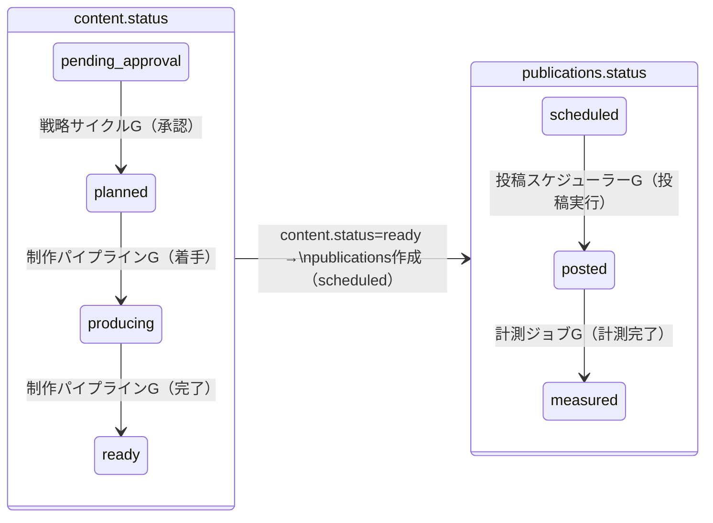
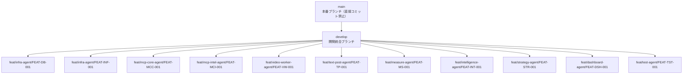

# 10. 実装ガイド: Claude Code Agent Team 並列実装

> v5.0仕様書（01-13）に基づいてClaude Code Agent Teamが並列実装を行うための指示書。
> 人間（Shungo）はコードを一切書かず、指示・レビュー・承認のみを行う。
>
> **最大同時エージェント**: リーダー1 + チームメイト10
>
> **関連ドキュメント**: [06-development-roadmap.md](06-development-roadmap.md) (ロードマップ), [04-agent-design.md](04-agent-design.md) (エージェント設計), [03-database-schema.md](03-database-schema.md) (DBスキーマ), [11-pre-implementation-checklist.md](11-pre-implementation-checklist.md) (実装前チェックリスト), [13-agent-harness.md](13-agent-harness.md) (ワークフロー・品質ゲート・リカバリー)

## 目次

- [1. 概要](#1-概要)
  - [1.1 前提条件](#11-前提条件)
- [2. チーム構成](#2-チーム構成)
  - [2.1 リーダーAgent（1名）](#21-リーダーagent1名)
  - [2.2 チームメイト（10名）](#22-チームメイト10名)
- [3. ディレクトリ構造](#3-ディレクトリ構造)
- [4. モジュール間インターフェース](#4-モジュール間インターフェース)
  - [4.1 全モジュール共通: types/ ディレクトリ](#41-全モジュール共通-types-ディレクトリ)
  - [4.2 MCP Server ↔ エージェント/ワーカー](#42-mcp-server--エージェントワーカー)
  - [4.3 ダッシュボード ↔ PostgreSQL](#43-ダッシュボード--postgresql)
  - [4.4 エージェント ↔ DB](#44-エージェント--db)
  - [4.5 エージェントノード → LLM](#45-エージェントノード--llm)
  - [4.6 ワーカー → 外部API](#46-ワーカー--外部api)
  - [4.7 設定アクセス（ソフトコーディング）](#47-設定アクセスソフトコーディング)
  - [4.8 グラフ間連携（DB経由）](#48-グラフ間連携db経由)
- [5. 実装プロトコル](#5-実装プロトコル)
  - [5.1 コーディング規約](#51-コーディング規約)
  - [5.2 ブランチ戦略](#52-ブランチ戦略)
  - [5.3 コンフリクト回避](#53-コンフリクト回避)
  - [5.4 日次プロトコル](#54-日次プロトコル)
- [6. 各エージェントの詳細タスク](#6-各エージェントの詳細タスク)
  - [6.1 infra-agent](#61-infra-agentweek-1-2-集中week-3以降はサポート)
  - [6.2 mcp-core-agent](#62-mcp-core-agentweek-1-4)
  - [6.3 mcp-intel-agent](#63-mcp-intel-agentweek-1-4)
  - [6.4 video-worker-agent](#64-video-worker-agentweek-1-4)
  - [6.5 text-post-agent](#65-text-post-agentweek-1-4)
  - [6.6 measure-agent](#66-measure-agentweek-1-4)
  - [6.7 intelligence-agent](#67-intelligence-agentweek-1-5)
  - [6.8 strategy-agent](#68-strategy-agentweek-1-5)
  - [6.9 dashboard-agent](#69-dashboard-agentweek-1-5)
  - [6.10 test-agent](#610-test-agentweek-1-7)
- [7. 人間（Shungo）の作業](#7-人間shungoの作業)

## 1. 概要

本ドキュメントは、v5.0仕様書（01-13）に基づいてClaude Code Agent Teamが並列実装を行うための指示書である。
人間（Shungo）はコードを一切書かず、指示・レビュー・承認のみを行う。

**重要**: 全エージェントは [13-agent-harness.md](13-agent-harness.md) のワークフローに従って作業すること。本ドキュメント（10）は「何をやるか」（チーム構成・タスク割り振り）を定義し、13は「どうやるか」（セッション起動チェックリスト・単一機能ワークフロー・品質ゲート・リカバリー手順）を定義する。

### 1.1 前提条件

| 項目 | 要件 |
|------|------|
| 仕様書 | 全仕様書（01-13）が最終承認済み |
| 型定義 | TypeScript型定義ファイルが生成・凍結済み |
| プロンプト | 全プロンプトファイル（prompts/*.md）が作成済み |
| VM環境 | GCE 16GB RAM, 4vCPU |
| 同時エージェント上限 | リーダー1 + チームメイト10 |

## 2. チーム構成

### 2.1 リーダーAgent（1名）

| 項目 | 内容 |
|------|------|
| 役割 | タスク割り振り、進捗管理、コードレビュー、統合テスト指揮 |
| ツール | 全ツール利用可能 |

**責務**:

1. `TeamCreate` → `TaskCreate` → `Task`（チームメイト起動）→ `TaskUpdate`
2. コンフリクト検出・解決
3. モジュール間インターフェースの整合性確認
4. 統合テストの実行・管理

### 2.2 チームメイト（10名）

| # | エージェント名 | subagent_type | 担当モジュール |
|---|-------------|--------------|-------------|
| 1 | infra-agent | general-purpose | Docker + PostgreSQL + DDL + マイグレーション |
| 2 | mcp-core-agent | general-purpose | MCP Server コアCRUDツール 45ツール（§3マッピング表参照、詳細は [04-agent-design.md §4](04-agent-design.md)） |
| 3 | mcp-intel-agent | general-purpose | MCP Server インテリジェンスツール 58ツール（§3マッピング表参照、詳細は [04-agent-design.md §4](04-agent-design.md)） |
| 4 | video-worker-agent | general-purpose | 動画制作ワーカー + fal.ai連携 |
| 5 | text-post-agent | general-purpose | テキスト制作 + 4PF投稿アダプター |
| 6 | measure-agent | general-purpose | 計測ワーカー + 4PF APIアダプター |
| 7 | intelligence-agent | general-purpose | LangGraph + Researcher/Analyst/ToolSP/DataCurator |
| 8 | strategy-agent | general-purpose | Strategy Cycle Graph + Planner |
| 9 | dashboard-agent | general-purpose | Next.js ダッシュボード全15画面 |
| 10 | test-agent | general-purpose | Jest + E2E + CI |

#### 横断的関心事のモジュール担当

**クレデンシャル管理**（詳細は [02-architecture.md §12](02-architecture.md)）: text-post-agent (YouTube/X/IG/TikTok投稿OAuth + トークンリフレッシュ), measure-agent (YouTube/TikTok/IG Analytics API), infra-agent (Google Service Account, PostgreSQL接続情報)。全プラットフォームのOAuth認証情報は `accounts.auth_credentials` (JSONB) に格納。

**エラーリカバリー**: 横断的関心事。各ワーカーエージェントが自モジュール内で [02-architecture.md §9](02-architecture.md) のパターンに従い実装。video-worker-agent, text-post-agent, measure-agentが各自のリトライ・チェックポイント処理を担当

## 3. ディレクトリ構造

```
ai-influencer/v5/
│
│ ─── エージェントハーネス（実装管理用。コード外） ───
├── CLAUDE.md                  # Agent Team起動時の自動読み込みエントリポイント（修正不可）
├── feature_list.json          # 全276機能の進捗管理（passesフィールドのみ更新可）
├── progress.txt               # 実装ログ（append-only: START/COMPLETE/FAIL/SMOKE/BLOCKED/SESSION）
├── scripts/
│   └── daily-report.sh        # 日次モニタリング（cron自動実行）
├── logs/                      # daily-report出力先（gitに含める）
│
│ ─── インフラ・設定 ───
├── docker-compose.yml          # infra-agent (dev環境: PostgreSQL 16 + pgvector, port 5433)
├── docker-compose.prod.yml     # infra-agent (Cloud SQL本番接続)
├── init.sh                    # infra-agent (環境セットアップ: Docker起動→DDL→npm install→ヘルスチェック)
├── .env.example               # infra-agent (環境変数テンプレート)
├── package.json               # リーダーが初期生成（変更はリーダーのみ）
├── tsconfig.json              # リーダーが初期生成（変更はリーダーのみ）
│
│ ─── 凍結済み型定義（リーダーがWeek 0-1で生成。変更は「申請→リーダー承認→全チーム通知」） ───
├── types/
│   ├── database.ts            # 全33テーブルのRow型
│   ├── mcp-tools.ts           # 全MCPツールの入出力型
│   ├── langgraph-state.ts     # 全4グラフのステート型
│   └── api-schemas.ts         # ダッシュボードAPI型
│
│ ─── SQL（infra-agentのみ実行・変更可） ───
├── sql/
│   ├── 001_create_tables.sql  # DDL（33テーブル）
│   ├── 002_create_indexes.sql # インデックス（156件）
│   ├── 003_create_triggers.sql # トリガー（15件）
│   ├── 004_seed_settings.sql  # system_settings初期データ（126件）
│   └── 005_seed_prompts.sql   # agent_prompt_versions初期データ（6エージェント分）
│
│ ─── 実装コード ───
├── src/
│   ├── mcp-server/            # mcp-core-agent + mcp-intel-agent（ツール分担は§6.2/6.3を参照）
│   │   ├── index.ts           # MCP Server エントリポイント（mcp-core-agentが作成）
│   │   ├── tools/             # 103 MCPツール → 8ディレクトリ（詳細マッピングは後述の表を参照）
│   │   │   ├── entity/        # accounts, characters, components (11ツール) ── mcp-core-agent
│   │   │   ├── production/    # content, publications, 外部API連携 (15ツール) ── mcp-core-agent
│   │   │   ├── intelligence/  # hypotheses, market_intel, metrics, analyses, learnings (34ツール) ── mcp-intel-agent
│   │   │   ├── operations/    # cycles, directives, task_queue (14ツール) ── mcp-core-agent
│   │   │   ├── observability/ # reflections, individual_learnings, communications (8ツール) ── mcp-intel-agent
│   │   │   ├── tool-mgmt/     # tool_catalog, tool_experiences, recipes (5ツール) ── mcp-intel-agent
│   │   │   ├── system/        # system_settings参照 (※CRUDは19 REST APIに含まれる) ── mcp-core-agent
│   │   │   └── dashboard/     # KPI集計クエリ (2ツール) ── mcp-core-agent
│   │   ├── utils/
│   │   │   └── embedding.ts   # pgvector embedding生成（04-agent-design.md §6.3準拠）── mcp-intel-agent
│   │   └── db.ts              # PostgreSQL接続管理 ── mcp-core-agent
│   │
│   ├── workers/               # video-worker-agent, text-post-agent, measure-agent
│   │   ├── video-production/  # ── video-worker-agent
│   │   │   ├── orchestrator.ts
│   │   │   ├── fal-client.ts
│   │   │   ├── fish-audio.ts
│   │   │   └── ffmpeg.ts
│   │   ├── text-production/   # ── text-post-agent
│   │   │   └── text-generator.ts
│   │   ├── posting/           # ── text-post-agent（動画・テキスト両方の投稿を担当）
│   │   │   ├── scheduler.ts
│   │   │   ├── adapters/
│   │   │   │   ├── youtube.ts
│   │   │   │   ├── tiktok.ts
│   │   │   │   ├── instagram.ts
│   │   │   │   └── x.ts
│   │   │   └── token-refresher.ts
│   │   └── measurement/       # ── measure-agent
│   │       ├── collector.ts
│   │       └── adapters/
│   │           ├── youtube-analytics.ts
│   │           ├── tiktok-analytics.ts
│   │           ├── instagram-insights.ts
│   │           └── x-analytics.ts
│   │
│   ├── agents/                # intelligence-agent, strategy-agent
│   │   ├── graphs/            # ── intelligence-agent（グラフ定義）
│   │   │   ├── strategy-cycle.ts    # 戦略サイクルグラフ
│   │   │   ├── production-pipeline.ts # 制作パイプライングラフ
│   │   │   ├── publishing-scheduler.ts # 投稿スケジューラーグラフ
│   │   │   └── measurement-jobs.ts   # 計測ジョブグラフ
│   │   ├── nodes/             # ── strategy-agent（strategist, planner） + intelligence-agent（他4ノード）
│   │   │   ├── strategist.ts        # ── strategy-agent
│   │   │   ├── researcher.ts        # ── intelligence-agent
│   │   │   ├── analyst.ts           # ── intelligence-agent
│   │   │   ├── planner.ts           # ── strategy-agent
│   │   │   ├── tool-specialist.ts   # ── intelligence-agent
│   │   │   └── data-curator.ts      # ── intelligence-agent
│   │   └── prompts/           # ── intelligence-agent + strategy-agent（各自の担当ノード分を作成）
│   │       ├── shared-principles.md  # ── intelligence-agent（全ノード共通原則）
│   │       ├── strategist.md         # ── strategy-agent
│   │       ├── researcher.md         # ── intelligence-agent
│   │       ├── analyst.md            # ── intelligence-agent
│   │       ├── planner.md            # ── strategy-agent
│   │       ├── tool-specialist.md    # ── intelligence-agent
│   │       └── data-curator.md       # ── intelligence-agent
│   │
│   └── lib/                   # 共通ライブラリ（担当・ルールは下記を参照）
│       ├── settings.ts        # system_settings読み込みユーティリティ ── infra-agent が初期実装
│       ├── retry.ts           # リトライロジック（withRetry, exponential backoff） ── infra-agent が初期実装
│       └── logger.ts          # agent_thought_logs書き込みユーティリティ ── infra-agent が初期実装
│
├── dashboard/                 # dashboard-agent（Next.js 14.2.x、独立アプリ）
│   ├── app/
│   │   ├── layout.tsx         # Solarizedテーマ、Nunitoフォント、AuthProvider
│   │   ├── login/             # ログイン画面（Google OAuth）
│   │   │   └── page.tsx
│   │   ├── page.tsx           # ホーム（1/15画面）
│   │   ├── kpi/               # KPIダッシュボード（2/15）
│   │   ├── production/        # 制作キュー（3/15）
│   │   ├── review/            # コンテンツレビュー（4/15）
│   │   ├── content/           # コンテンツ一覧（5/15）
│   │   ├── accounts/          # アカウント管理（6/15）
│   │   ├── characters/        # キャラクター管理（7/15）
│   │   ├── agents/            # エージェント（8/15）— 7サブ機能: 思考ログ/対話/進化/プロンプト/改善提案/個別成長/受信トレイ
│   │   ├── hypotheses/        # 仮説ブラウザ（9/15）
│   │   ├── learnings/         # 知見ブラウザ（10/15）
│   │   ├── tools/             # ツール管理（11/15）— キュレーションレビュー(§6.12)含む
│   │   ├── errors/            # エラーログ（12/15）
│   │   ├── costs/             # コスト管理（13/15）
│   │   ├── settings/          # 設定（14/15）— 8カテゴリタブ
│   │   ├── directives/        # 人間指示（15/15）
│   │   └── api/               # 19 REST API Routes（02-architecture.md §6.13参照）
│   │       └── auth/[...nextauth]/ # NextAuth.js route handler
│   │           └── route.ts
│   ├── components/
│   │   ├── ui/               # Shadcn/ui components
│   │   ├── charts/           # Recharts wrappers
│   │   ├── layout/           # Sidebar, Header, etc.
│   │   └── providers/
│   │       └── AuthProvider.tsx  # SessionProvider wrapper
│   ├── lib/
│   │   ├── api.ts            # API client（PostgreSQL直接接続、MCP経由ではない）
│   │   ├── auth.ts           # NextAuth.js設定（Google OAuth, JWT, RBAC）
│   │   └── theme.ts          # Solarized color tokens
│   └── tailwind.config.ts    # Solarized + Nunito
│
└── tests/                     # test-agent
    ├── unit/
    │   ├── mcp-server/        # MCPツール単体テスト
    │   ├── workers/           # ワーカー単体テスト
    │   └── agents/            # エージェントノード単体テスト
    ├── integration/
    │   ├── mcp-db.test.ts     # MCP Server ↔ DB統合テスト
    │   ├── worker-mcp.test.ts # Worker ↔ MCP Server統合テスト
    │   └── agent-mcp.test.ts  # Agent ↔ MCP Server統合テスト
    └── e2e/
        └── full-cycle.test.ts # 全サイクルE2Eテスト
```

#### `src/lib/` 共通ライブラリの実装ルール

| ファイル | 初期実装担当 | 用途 | 利用者 |
|---------|------------|------|-------|
| `settings.ts` | infra-agent (Week 1) | `system_settings` テーブルからキーを取得するユーティリティ。全モジュールが設定値読み込みに使用 | 全エージェント |
| `retry.ts` | infra-agent (Week 1) | `withRetry(fn, options)` 形式の汎用リトライラッパー。exponential backoff + jitter。[02-architecture.md §9](02-architecture.md) のリトライパターンに準拠 | video-worker, text-post, measure |
| `logger.ts` | infra-agent (Week 1) | `agent_thought_logs` テーブルへの構造化ログ書き込み。`logThought(agent_type, step, input, reasoning, output)` | 全エージェント |

> **注**: `embedding.ts` は `src/lib/` ではなく `src/mcp-server/utils/embedding.ts` に配置する（[04-agent-design.md §6.3](04-agent-design.md) 準拠）。embedding生成はMCPツールのINSERT処理内から呼び出されるため、MCP Server内部ユーティリティとして実装する。担当は mcp-intel-agent。

**変更ルール**:
- `src/lib/` の初期実装は infra-agent が Week 1 で行う（DB接続が前提のため）
- 初期実装後の変更は「変更申請 → リーダー承認 → 全チーム通知」（`types/` と同じルール）
- 各エージェントは `src/lib/` のファイルを import して使用するが、直接変更してはならない
- 機能追加が必要な場合はリーダーに申請し、infra-agent が対応する

#### MCPツールのディレクトリマッピング（103 MCPツール）

全103 MCPツール（[04-agent-design.md §4](04-agent-design.md) 定義）を8ディレクトリに分類する。分類基準は**操作するデータドメイン**（主にアクセスするDBテーブル群）。ツールを呼び出すエージェントではなく、ツールが操作するデータの種類で分類する。

> **注**: 04-agent-design.md §4ではエージェント別にツールを列挙しており、合計106 MCPツールと記載されている。これは3ツール（get_content_prediction, get_content_metrics, get_daily_micro_analyses_summary）が§4.3（アナリスト用）と§4.12（エージェント自己学習用）の両方に掲載されているため。MCP Server実装としてはユニーク103ツール。

> **注**: 19 Dashboard REST APIツール（[04-agent-design.md §4.9](04-agent-design.md) の10ツール + [§4.11](04-agent-design.md) の3ツール + [§4.13](04-agent-design.md) の6ツール）は `dashboard/app/api/` に Next.js API Routes として実装する（[02-architecture.md §6.13](02-architecture.md) 参照）。`src/mcp-server/tools/` には含めない。

| ディレクトリ | 担当 | ツール数 | ツール名（§4.x参照元） |
|-------------|------|:-------:|----------------------|
| `entity/` | mcp-core | 14 | get_assigned_accounts(§4.4), get_account_performance(§4.4), get_available_components(§4.4), get_character_info(§4.6), get_component_data(§4.6), get_component_scores(§4.3), update_component_score(§4.3), create_component(§4.10), update_component_data(§4.10), get_similar_components(§4.10), submit_for_human_review(§4.10), create_character_profile(§4.10), generate_character_image(§4.10), select_voice_profile(§4.10) |
| `production/` | mcp-core | 15 | plan_content(§4.4), schedule_content(§4.4), get_content_pool_status(§4.4), generate_script(§4.6), start_video_generation(§4.6), check_video_status(§4.6), start_tts(§4.6), start_lipsync(§4.6), upload_to_drive(§4.6), update_content_status(§4.6), run_quality_check(§4.6), publish_to_youtube(§4.7), publish_to_tiktok(§4.7), publish_to_instagram(§4.7), publish_to_x(§4.7) |
| `intelligence/` | mcp-intel | 45 | get_top_learnings(§4.1), get_active_hypotheses(§4.1), get_algorithm_performance(§4.1), save_trending_topic(§4.2), save_competitor_post(§4.2), save_competitor_account(§4.2), save_audience_signal(§4.2), save_platform_update(§4.2), get_recent_intel(§4.2), search_similar_intel(§4.2), get_niche_trends(§4.2), get_competitor_analysis(§4.2), get_platform_changes(§4.2), mark_intel_expired(§4.2), get_intel_gaps(§4.2), get_metrics_for_analysis(§4.3), get_hypothesis_results(§4.3), verify_hypothesis(§4.3), create_analysis(§4.3), extract_learning(§4.3), update_learning_confidence(§4.3), search_similar_learnings(§4.3), detect_anomalies(§4.3), calculate_algorithm_performance(§4.3), get_niche_performance_trends(§4.3), compare_hypothesis_predictions(§4.3), generate_improvement_suggestions(§4.3), get_content_prediction(§4.3), get_content_metrics(§4.3), get_daily_micro_analyses_summary(§4.3), run_weight_recalculation(§4.3), run_baseline_update(§4.3), run_adjustment_cache_update(§4.3), run_kpi_snapshot(§4.3), run_cumulative_analysis(§4.3), search_content_learnings(§4.12), create_micro_analysis(§4.12), save_micro_reflection(§4.12), create_hypothesis(§4.4), get_niche_learnings(§4.4), collect_youtube_metrics(§4.8), collect_tiktok_metrics(§4.8), collect_instagram_metrics(§4.8), collect_x_metrics(§4.8), collect_account_metrics(§4.8) |
| `operations/` | mcp-core | 14 | get_pending_directives(§4.1), create_cycle(§4.1), set_cycle_plan(§4.1), allocate_resources(§4.1), send_planner_directive(§4.1), request_production(§4.4), get_production_task(§4.6), report_production_complete(§4.6), get_publish_task(§4.7), report_publish_result(§4.7), get_measurement_tasks(§4.8), report_measurement_complete(§4.8), get_curation_queue(§4.10), mark_curation_complete(§4.10) |
| `observability/` | mcp-intel | 8 | save_reflection(§4.12), get_recent_reflections(§4.12), save_individual_learning(§4.12), get_individual_learnings(§4.12), peek_other_agent_learnings(§4.12), submit_agent_message(§4.12), get_human_responses(§4.12), mark_learning_applied(§4.12) |
| `tool-mgmt/` | mcp-intel | 5 | get_tool_knowledge(§4.5), save_tool_experience(§4.5), search_similar_tool_usage(§4.5), get_tool_recommendations(§4.5), update_tool_knowledge_from_external(§4.5) |
| `system/` | mcp-core | 0 | ―（system_settings CRUDは19 REST APIに含まれる。エージェントの設定読み込みは `src/lib/settings.ts` を使用） |
| `dashboard/` | mcp-core | 2 | get_portfolio_kpi_summary(§4.1), get_cluster_performance(§4.1) |
| **合計** | | **103** | |

> **分類の判断基準**: ツールが主にCRUD操作するテーブルで分類する。例: `collect_youtube_metrics`は外部APIを呼び出すが、書き込み先が`metrics`テーブルなので`intelligence/`に配置。`get_production_task`は`task_queue`を読むが、制作ワークフローの一部なので`operations/`に配置（task_queue操作は全て`operations/`）。

#### ダッシュボード画面とサブ機能のマッピング

各ルートフォルダに含まれるサブ機能の一覧。機能仕様の詳細は [02-architecture.md §6](02-architecture.md) を参照。

| # | ルート | 画面名 | サブ機能（02-architecture.md 参照セクション） |
|---|--------|--------|----------------------------------------------|
| 1 | `page.tsx` | ホーム | KPI概要, 本日の制作状況, 直近のアラート (§6.1) |
| 2 | `kpi/` | KPI | アカウント別/期間別KPI進捗, 目標vs実績グラフ (§6.1) |
| 3 | `production/` | 制作キュー | task_queue一覧, ステータス別フィルター, 優先度変更 |
| 4 | `review/` | コンテンツレビュー | pending_review一覧, プレビュー+承認/差戻し |
| 5 | `content/` | コンテンツ一覧 | 全content検索, ステータス別フィルター, 投稿別パフォーマンス (§6.1) |
| 6 | `accounts/` | アカウント管理 | accounts CRUD, OAuth設定, 認証情報入力 |
| 7 | `characters/` | キャラクター管理 | characters CRUD, アセットアップロード |
| 8 | `agents/` | エージェント | **7サブ機能**: 思考ログビューア(§6.3), 人間↔エージェント対話(§6.4), エージェント進化(§6.5), プロンプト管理(§6.6), 改善提案パネル(§6.7), 個別成長トラッキング(§6.8), 受信トレイ(§6.9) |
| 9 | `hypotheses/` | 仮説ブラウザ | hypotheses一覧, 的中率推移, カテゴリ別分析 |
| 10 | `learnings/` | 知見ブラウザ | learnings一覧, 信頼度別フィルター, 類似知見検索 |
| 11 | `tools/` | ツール管理 | tool_catalog, レシピ管理, ツール経験一覧, **キュレーションレビュー(§6.12)** |
| 12 | `errors/` | エラーログ | failed/retryingタスク一覧, リトライ/破棄操作 (§9.4) |
| 13 | `costs/` | コスト管理 | 日次/月次API支出, 予算消化率, アラート |
| 14 | `settings/` | 設定 | system_settings全項目の**8カテゴリタブ**表示+編集 (§11.3) |
| 15 | `directives/` | 人間指示 | human_directives作成, 履歴閲覧 |

> **注**: 画面#8「エージェント」は最もサブ機能が多い画面。実装者は [02-architecture.md §6.3〜§6.9](02-architecture.md) の各セクションを参照して、タブまたはサブページとして実装すること。

## 4. モジュール間インターフェース

### 4.1 全モジュール共通: types/ ディレクトリ

Week 0-1でリーダーが生成し凍結。全エージェントはこの型定義に従って実装する。

| ファイル | 内容 | 利用者 |
|---------|------|-------|
| `types/database.ts` | 全33テーブルのRow型 | 全エージェント |
| `types/mcp-tools.ts` | 全MCPツールの入出力型 | mcp-core-agent, mcp-intel-agent |
| `types/langgraph-state.ts` | 全4グラフのステート型 | intelligence-agent, strategy-agent |
| `types/api-schemas.ts` | ダッシュボードAPI型 | dashboard-agent |

### 4.2 MCP Server ↔ エージェント/ワーカー

| 項目 | 内容 |
|------|------|
| 通信方式 | langchain-mcp-adapters経由 |
| 契約 | `types/mcp-tools.ts` の入出力型 |

### 4.3 ダッシュボード ↔ PostgreSQL

| 項目 | 内容 |
|------|------|
| 通信方式 | Next.js API Routes → PostgreSQL直接（ダッシュボードはMCP経由ではなくDB直結。[02-architecture.md §6.1](02-architecture.md) 参照） |
| 契約 | `types/api-schemas.ts`（13エンドポイント詳細は§6.9参照） |
| エンドポイント数 | 13（GET x8, POST x3, PUT x2） |

### 4.4 エージェント ↔ DB

| 項目 | 内容 |
|------|------|
| 通信方式 | MCP Serverツール経由（エージェントはDBに直接アクセスしない） |
| 契約 | `types/database.ts` + `types/mcp-tools.ts` |

> **例外**: `system_settings` の読み取りは `src/lib/settings.ts` 経由でDB直接アクセスする（§4.7参照）。これはMCPツール経由にすると全ノードの起動時コストが増大するため、パフォーマンス上の理由で直接アクセスを許容する。

### 4.5 エージェントノード → LLM

LangGraphの各ノード（Strategist, Researcher, Analyst, Planner, Tool Specialist, Data Curator）はLLM呼び出しを行う。テキスト制作ワーカーも同様にLLMを使用する。

| 項目 | 内容 |
|------|------|
| 通信方式 | LangGraph node内で LangChain の `ChatAnthropic.invoke()` を直接呼び出し |
| LLMモデル | Strategist: Claude Opus 4.6, 他全ノード: Claude Sonnet 4.5（[04-agent-design.md §1](04-agent-design.md) 参照） |
| System Prompt | `agent_prompt_versions` テーブルから `is_active=true` のバージョンを取得。ファイルは `src/agents/prompts/*.md` |
| 入力 | LangGraphのステート（`types/langgraph-state.ts`）から必要なフィールドを抽出してメッセージ構築 |
| 出力 | LLM応答をパースしてステートに書き戻す。`agent_thought_logs` に推論ログを記録（`src/lib/logger.ts` 経由） |
| エラーハンドリング | `src/lib/retry.ts` の `withRetry()` で3回リトライ。失敗時は `agent_thought_logs` にエラー記録 |
| 認証 | `system_settings` `CRED_ANTHROPIC_API_KEY`（[02-architecture.md §12.2](02-architecture.md) 参照） |

### 4.6 ワーカー → 外部API

動画制作ワーカー・投稿ワーカー・計測ワーカーは外部APIを直接呼び出す。これらはMCPツール経由ではなく、Node.jsコードが直接API呼び出しを実行する（[02-architecture.md §5.6](02-architecture.md) 参照: 動画制作は「判断」ではなく「変換」のタスクのためLLM不要）。

| 項目 | 内容 |
|------|------|
| 通信方式 | Node.js コードから各サービスのREST APIを直接呼び出し |
| 動画制作API | fal.ai（Kling v2.6, Sync Lipsync）, Fish Audio（TTS）, ffmpeg（concat）, Google Drive API |
| 投稿API | YouTube Data API v3, TikTok Content Posting API, Instagram Graph API, X API v2 |
| 計測API | YouTube Analytics API v2, TikTok Analytics API, Instagram Insights API, X Analytics API |
| ツール選択 | `production_recipes.steps[]` の `tool_name` フィールドでレシピ駆動（[02-architecture.md §5.4](02-architecture.md) 参照） |
| 認証（ツールAPI） | `system_settings` `category='credentials'` から取得: `CRED_FAL_AI_API_KEY`, `CRED_FISH_AUDIO_API_KEY` 等（[02-architecture.md §12.2](02-architecture.md)） |
| 認証（プラットフォーム） | `accounts.auth_credentials` (JSONB) からアカウント別OAuth情報を取得（[02-architecture.md §12.1](02-architecture.md)） |
| エラーハンドリング | `src/lib/retry.ts` の `withRetry()` でリトライ。失敗は `tool_experiences` テーブルに記録（ツールスペシャリストが代替レシピを推奨） |

### 4.7 設定アクセス（ソフトコーディング）

全モジュールが設定値を取得する際は `src/lib/settings.ts` を使用する。§4.4のMCPルールの例外として、DB直接アクセスを許容する。

| 項目 | 内容 |
|------|------|
| 通信方式 | `src/lib/settings.ts` → PostgreSQL直接クエリ（MCP非経由） |
| 呼び出し元 | 全エージェント、全ワーカー、ダッシュボード |
| テーブル | `system_settings`（126件、8カテゴリ: agent(79), production(14), posting(8), measurement(6), credentials(5), cost_control(4), review(5), dashboard(5)） |
| 契約 | `getSetting(key: string): Promise<string>` — 初期実装は infra-agent（[02-architecture.md §10](02-architecture.md) 参照） |
| ルール | 全設定値はこのユーティリティ経由で取得する。ハードコーディング禁止 |

### 4.8 グラフ間連携（DB経由）

4つのLangGraphグラフは互いに直接通信せず、PostgreSQLのステータス遷移のみで連携する（[02-architecture.md §3.7](02-architecture.md) 参照）。

**グラフのトリガー方式**:

| グラフ | トリガー | 関連設定キー |
|--------|---------|-------------|
| 戦略サイクル | 日次cron | `HYPOTHESIS_CYCLE_INTERVAL_HOURS`（デフォルト24h） |
| 制作パイプライン | 連続実行（task_queueポーリング） | `PRODUCTION_POLL_INTERVAL_SEC`（デフォルト30s） |
| 投稿スケジューラー | 連続実行（task_queueポーリング） | `POSTING_POLL_INTERVAL_SEC`（デフォルト120s） |
| 計測ジョブ | 連続実行（task_queueポーリング） | `MEASUREMENT_POLL_INTERVAL_SEC`（デフォルト300s） |

**ステータス遷移によるグラフ間連携**:



- 各グラフは自分が関心を持つステータスのレコードのみをポーリングで検出して処理する
- グラフ間の直接関数呼び出しやメッセージングは**一切行わない**

## 5. 実装プロトコル

> **詳細ワークフロー**: 本セクションは実装ルールの概要を定義する。具体的な作業フロー・品質ゲート・Git操作手順は [13-agent-harness.md](13-agent-harness.md) を参照。テスト定義は [12-test-specifications.md](12-test-specifications.md) を参照。

### 5.1 コーディング規約

| 項目 | 設定 |
|------|------|
| 言語 | TypeScript (strict mode) |
| ランタイム | Node.js 20+ |
| パッケージマネージャ | npm |
| フォーマッタ | Prettier (default config) |
| リンター | ESLint (recommended config) |
| テスト | Jest |
| コミットメッセージ | `{type}({module}): {description} ({feature-id}, tests: {test-ids})`（詳細は [13-agent-harness.md §7.3](13-agent-harness.md) 参照） |

### 5.2 ブランチ戦略



**ブランチ命名規則**: `feat/{agent-name}/{feature-id}` — 1機能=1ブランチ（詳細は [13-agent-harness.md §7](13-agent-harness.md) を参照）

**マージフロー**: 各エージェントが `feat/{agent}/{feature}` ブランチで作業 → テスト全通過 → リーダーがdevelopにマージ → 全機能完了後mainにマージ（人間承認）

**禁止事項**（詳細は [13-agent-harness.md §7.5](13-agent-harness.md) 参照）: `git push --force`, push後の `--amend`, 共有ブランチでの `rebase -i`, mainへの直接コミット, 1コミットに複数機能

### 5.3 コンフリクト回避

| ルール | 内容 |
|--------|------|
| ディレクトリ分離 | 各エージェントは担当ディレクトリ以外のファイルを変更しない |
| 共有ファイル管理 | 共通ファイル（`package.json`, `docker-compose.yml`, `types/`）はリーダーのみが変更 |
| 型定義変更 | `types/` の変更は「変更申請→リーダー承認→全チーム通知」 |

**品質ゲート**: 全機能は6つの自動品質ゲート（G1-G6）を通過する必要がある。詳細は [13-agent-harness.md §8](13-agent-harness.md) を参照。

### 5.3.1 テストDB分離戦略

並列開発時のDB競合を防ぐための戦略:

| 項目 | 方針 |
|------|------|
| DDLマイグレーション | infra-agentのみ実行。他エージェントはDDL操作禁止 |
| 共有開発DB | `dev_ai_influencer` (port 5433) を全エージェントで共有 |
| テスト分離 | 各エージェントのJestテストはトランザクション内で実行し、ROLLBACK |
| テストパターン | `beforeEach(() => db.query('BEGIN'))`, `afterEach(() => db.query('ROLLBACK'))` |
| CI用テストDB | `test_ai_influencer` を init.sh が別途作成 |
| マイグレーションロック | `/tmp/v5-migration.lock` ファイルロックで排他制御。`npm run db:migrate` 実行時に取得 |
| シード投入 | infra-agentが `004_seed_settings.sql`, `005_seed_prompts.sql` を実行。他エージェントは読み取り専用 |

### 5.4 日次プロトコル

1. **朝**: リーダーがタスク割り振り確認
2. **日中**: 各エージェントが担当タスク実行 → テスト実行 → コミット
3. **夕方**: リーダーがプルリクエストレビュー → developマージ
4. **夜**: 人間がダッシュボードで進捗確認 → 翌日の方針指示

## 6. 各エージェントの詳細タスク

### 6.1 infra-agent（Week 1-2 集中、Week 3以降はサポート）

**参照仕様**: [03-database-schema.md](03-database-schema.md)（33テーブル定義）, `v5/sql/`（DDL・シード・トリガー）, `v5/docker-compose.yml`

**Week 1:**
- Docker Compose作成 (PostgreSQL 16 + pgvector, Node.js app)
- Cloud SQL接続設定
- DDL適用スクリプト（`001_create_tables.sql` 〜 `003_create_triggers.sql`）
- system_settings初期データ投入 (`004_seed_settings.sql`)

**Week 2:**
- agent_prompt_versions初期データ投入 (`005_seed_prompts.sql`)
- v4.0 → v5.0 マイグレーションスクリプト
- バックアップ/リストアスクリプト
- 環境変数テンプレート (`.env.example`)

**Week 3+:**
- 他エージェントのDB関連サポート
- パフォーマンスチューニング

### 6.2 mcp-core-agent（Week 1-4）

**担当**: 45 MCPツール（entity/production/operations/system/dashboard ディレクトリ。§3マッピング表参照）

- Entity系 (14ツール): accounts, characters, components CRUD + キャラクター自動生成（[04-agent-design.md §4.3](04-agent-design.md), §4.4, §4.6, §4.10）
- Production系 (15ツール): content, publications CRUD + 外部API連携（§4.4, §4.6, §4.7）
- Operations系 (14ツール): cycles, human_directives, task_queue CRUD（§4.1, §4.4, §4.6, §4.7, §4.8, §4.10）
- System系 (0 MCPツール): system_settings CRUDは19 REST APIに含まれる。エージェントは `src/lib/settings.ts` で読み取り
- Dashboard系 (2ツール): KPI集計クエリ（§4.1 get_portfolio_kpi_summary, get_cluster_performance）

各ツールの入出力型は [04-agent-design.md §4](04-agent-design.md) および `types/mcp-tools.ts` を参照。

**各ツールの実装パターン**:

```typescript
// types/mcp-tools.ts の型定義に従う
export const getAccountsTool = {
  name: 'get_accounts',
  description: 'アカウント一覧取得',
  input_schema: GetAccountsInput,
  handler: async (input: GetAccountsInput): Promise<GetAccountsOutput> => {
    // PostgreSQL クエリ実行
  }
};
```

### 6.3 mcp-intel-agent（Week 1-4）

**担当**: 58 MCPツール（intelligence/observability/tool-mgmt ディレクトリ。§3マッピング表参照）

- Intelligence系 (45ツール): hypotheses, market_intel, metrics, analyses, learnings, content_learnings, algorithm_performance, prediction_weights, account_baselines, adjustment_factor_cache, kpi_snapshots CRUD + ベクトル検索 + メトリクス収集 + マイクロサイクル分析 + バッチジョブ（[04-agent-design.md §4.1](04-agent-design.md) 一部, §4.2 リサーチャー用, §4.3 アナリスト用22ツール, §4.4 一部, §4.8 計測ワーカー用, §4.12 マイクロサイクル用3ツール）
- Observability系 (8ツール): reflections, individual_learnings, agent_communications（§4.12 自己学習・コミュニケーション用）
- Tool Management系 (5ツール): tool_catalog, tool_experiences, tool_external_sources（§4.5 ツールスペシャリスト用）

**pgvector関連ツール**（コサイン類似度検索）:
- `search_similar_intel` (§4.2) — market_intel類似検索
- `search_similar_learnings` (§4.3) — learnings類似検索
- `search_content_learnings` (§4.12) — content_learnings類似検索（マイクロサイクル蓄積知見）
- `get_similar_components` (§4.10) — components類似検索（※実装ファイルはentity/に配置するが、embedding生成ロジックはmcp-intel-agentが実装）
- `search_similar_tool_usage` (§4.5) — tool_experiences類似検索

各ツールの入出力型は [04-agent-design.md §4](04-agent-design.md) および `types/mcp-tools.ts` を参照。

### 6.4 video-worker-agent（Week 1-4）

**参照仕様**: [04-agent-design.md §4.6](04-agent-design.md)（制作ワーカー用 12ツール）+ README.md のv4.0パイプライン

**実装内容**:
- fal.ai Kling v2.6 連携 (motion-control, image-to-video)
- Fish Audio TTS 連携 (REST API直接)
- Sync Lipsync v2/pro 連携 (fal.ai経由)
- ffmpeg concat (filter_complex, CRF18)
- fal.storage アップロード
- Google Drive 保存
- エラーリカバリー（3段階: リトライ→代替パラメータ→failed_permanent）
- `production_recipes.steps` の実行エンジン（ツールスペシャリスト設計のレシピに従う）

> **境界**: 動画の「制作」のみ担当。「投稿」は text-post-agent が担当する（§6.5参照）。

### 6.5 text-post-agent（Week 1-4）

**参照仕様**: [04-agent-design.md §4.7](04-agent-design.md)（投稿ワーカー用 6ツール）

> **注**: 本エージェントは [04-agent-design.md](04-agent-design.md) で定義される「テキスト制作ワーカー」（テキスト生成）と「投稿ワーカー」（全プラットフォームへの投稿実行）の2つの責務を統合する。動画投稿（YouTube Shorts等）もこのエージェントが担当する（動画の**制作**は video-worker-agent、**投稿**は text-post-agent）。

**実装内容**:
- テキスト生成（Claude Sonnet, キャラクターpersonality反映）
- 4プラットフォーム投稿アダプター (YouTube, TikTok, Instagram, X) — 動画・テキスト両方の投稿
- OAuth トークンリフレッシュ（認証情報の定義は [02-architecture.md §12](02-architecture.md) を参照）
- 投稿スケジューラー (`POSTING_POLL_INTERVAL_SEC`, `POSTING_TIME_JITTER_MIN`)
- Rate Limit対応 (`DAILY_POST_LIMIT`, `PLATFORM_COOLDOWN_HOURS`)
- publicationsレコード作成 + `measure_after` 自動設定

### 6.6 measure-agent（Week 1-4）

**参照仕様**: [04-agent-design.md §4.8](04-agent-design.md)（計測ワーカー用 7ツール）

**実装内容**:
- 5つの計測API連携:
  - YouTube Analytics API v2
  - TikTok Analytics API
  - Instagram Insights API
  - X Analytics API
  - アカウント全体メトリクス (`collect_account_metrics` — follower_count, follower_delta)
- メトリクス収集スケジューラー (`METRICS_COLLECTION_DELAY_HOURS`)
- フォローアップ計測スケジュール（24h / 72h / 168h の複数時点計測）
- リトライ（指数バックオフ + 最大試行回数）
- コンポーネント抽出（高パフォーマンスコンテンツからの再利用可能部品作成 + 重複検出）

> **注**: 異常検知（`detect_anomalies`）は Analyst サブエージェントの責務であり、戦略サイクルグラフ内で実行される（§6.7, §6.8参照）。

### 6.7 intelligence-agent（Week 1-5）

**参照仕様**: [04-agent-design.md §5](04-agent-design.md)（LangGraphグラフ設計）, §1（エージェント階層）

**最も複雑なモジュール**。3つのグラフ定義 + 4つのLLMサブエージェント + 横断機能を担当する。

**グラフ定義**（3グラフ — 戦略サイクルグラフは strategy-agent が定義。§6.8参照）:
- 制作パイプライングラフ（§5.2）— content_formatによるワーカー振り分け + recipe_id参照
- 投稿スケジューラーグラフ（§5.3）— 投稿タスク生成 + スケジューリング
- 計測ジョブグラフ（§5.4）— measure_after到達検出 + 計測ディスパッチ
- グラフ間通信はPostgreSQLステータス変更のみ（§4.8参照）
- チェックポイント設定（PostgreSQL保存）

**LLMサブエージェント実装**（4体）:
- Researcher (Sonnet) — 市場データ収集・整理（§1.2, §4.2）
- Analyst (Sonnet) — 仮説検証・知見抽出・品質スコア計算（§1.3, §4.3）
- Tool Specialist (Sonnet) — 制作レシピ最適化・ツール組み合わせ提案（§1.4, §4.5）
- Data Curator (Sonnet) — コンポーネント抽出・キャラクター自動生成・知見重複検出・グローバル知見昇格（§1.5, §4.10）

**横断機能**:
- LangGraph.js セットアップ (@langchain/langgraph 0.2.19) + langchain-mcp-adapters
- プロンプト読み込み（`prompts/*.md`, [04-agent-design.md §8](04-agent-design.md)）
- エージェント個別学習メカニズム — confidence更新・自動無効化・自動昇格（§10-11）
- 仮説検証ロジック（`HYPOTHESIS_CONFIRM_THRESHOLD`, `HYPOTHESIS_INCONCLUSIVE_THRESHOLD`）
- 異常検知（`ANOMALY_DETECTION_SIGMA`）+ 探索率制御（`EXPLORATION_RATE`）
- エージェント間コミュニケーション（`agent_communications` テーブル経由）
- 戦略サイクルへのデータキュレーター統合

### 6.8 strategy-agent（Week 1-5）

**参照仕様**: [04-agent-design.md §5.1](04-agent-design.md)（戦略サイクルグラフ）, §1.1（戦略エージェント）, §1.6（プランナー）

**実装内容**:
- 戦略サイクルグラフの定義と全ノード実装（§5.1 — 日次cron実行、ノード順: analyze→plan→approve→execute→reflect）
- 社長ノード (Opus) — サイクル方針決定 + リソース配分
- Planner ノード (Sonnet x N) — 水平スケーリング対応（`MAX_PLANNER_INSTANCES`）
- 人間承認ゲート（`STRATEGY_APPROVAL_REQUIRED`）+ 差戻しルーティング（rejection_category→適切ノード）
- 最大リビジョンループ（`MAX_STRATEGY_REVISIONS`）
- `human_directives` 処理
- KPI監視 + エスカレーション
- `agent_thought_logs` 記録 + エージェントリフレクション（self_score 1-10）

### 6.9 dashboard-agent（Week 1-5）

**参照仕様**: [04-agent-design.md §4.9](04-agent-design.md)（ダッシュボード用 10ツール）, §4.11（キュレーション用 3ツール）, [02-architecture.md §6](02-architecture.md)（ダッシュボード設計）

**実装内容**:
- Next.js 14.2.x App Router スキャフォールド
- Solarized Dark/Light テーマ（Tailwind CSS）
- Nunito フォント（Google Fonts）
- レスポンシブデザイン（Mobile-first）
- 19 REST APIエンドポイント（`dashboard/app/api/` — §4.9の10 + §4.11の3 + §4.13の6）

**19 REST APIエンドポイント一覧**（基本13 + アルゴリズム6）（型定義: `types/api-schemas.ts`）:

| # | Method | Path | Request型 | Response型 | 説明 |
|---|--------|------|-----------|------------|------|
| 1 | GET | `/api/accounts` | `ListAccountsRequest` | `ListAccountsResponse` | アカウント一覧。platform/status/page/limitでフィルター |
| 2 | GET | `/api/accounts/:id` | `GetAccountRequest` | `GetAccountResponse` | アカウント詳細。関連character・recent_publications含む |
| 3 | POST | `/api/accounts` | `CreateAccountRequest` | `CreateAccountResponse` | アカウント新規作成。platform/handle/character_id必須 |
| 4 | PUT | `/api/accounts/:id` | `UpdateAccountRequest` | `UpdateAccountResponse` | アカウント更新。handle/status/niche/cluster/character_id変更可 |
| 5 | GET | `/api/content` | `ListContentRequest` | `ListContentResponse` | コンテンツ一覧。status/content_format/character_idでフィルター |
| 6 | POST | `/api/content/:id/approve` | `ApproveContentRequest` | `ApproveContentResponse` | コンテンツ承認（pending_approval → approved） |
| 7 | POST | `/api/content/:id/reject` | `RejectContentRequest` | `RejectContentResponse` | コンテンツ差し戻し。rejection_category必須（plan_revision/data_insufficient/hypothesis_weak） |
| 8 | GET | `/api/kpi/summary` | `GetKpiSummaryRequest` | `GetKpiSummaryResponse` | KPIサマリー。period（7d/30d/90d）指定可。accounts/followers/engagement/content/monetization |
| 9 | GET | `/api/hypotheses` | `ListHypothesesRequest` | `ListHypothesesResponse` | 仮説一覧。verdict/categoryでフィルター |
| 10 | GET | `/api/learnings` | `ListLearningsRequest` | `ListLearningsResponse` | 知見一覧。min_confidence/categoryでフィルター |
| 11 | GET | `/api/settings` | `ListSettingsRequest` | `ListSettingsResponse` | system_settings一覧。categoryでフィルター |
| 12 | PUT | `/api/settings/:key` | `UpdateSettingRequest` | `UpdateSettingResponse` | system_setting値の更新。key（パスパラメータ）+ value |
| 13 | GET | `/api/errors` | `ListErrorsRequest` | `ListErrorsResponse` | エラーログ一覧。period（24h/7d/30d）/task_type（production/publishing/measurement/curation）でフィルター |

**アルゴリズム・KPI関連 REST API（追加6エンドポイント）**:

| # | Method | Path | 説明 |
|---|--------|------|------|
| 14 | GET | `/api/predictions/:content_id` | コンテンツ別予測vs実績データ |
| 15 | GET | `/api/algorithm/performance` | アルゴリズム性能サマリー（予測精度、weight分布） |
| 16 | GET | `/api/baselines/:account_id` | アカウント別ベースライン詳細 |
| 17 | GET | `/api/weights/audit` | weight再計算の監査ログ |
| 18 | POST | `/api/kpi/snapshots` | KPIスナップショット手動トリガー |
| 19 | GET | `/api/kpi/snapshots` | KPIスナップショット一覧（platform, year_monthフィルター） |

> REST API合計: 19エンドポイント（13 既存 + 6 アルゴリズム追加）

> **実装パス**: 各エンドポイントは `dashboard/app/api/{resource}/route.ts` に Next.js Route Handler として実装する。DB接続は Prisma/Drizzle ORM → PostgreSQL 直接（MCP Server経由ではない。§4.3参照）。型は `types/api-schemas.ts` の `ApiRouteMap` で一括マッピングされており、`ApiRequest<T>` / `ApiResponse<T>` ユーティリティ型でルート別の型を取得可能。

**15画面の実装（優先度順、画面×サブ機能マッピングは§3参照）**:

| Week | 画面 |
|------|------|
| Week 1 | ホーム, KPI, 設定 |
| Week 2 | 制作キュー, アカウント管理, エラーログ |
| Week 3 | コンテンツレビュー, コンテンツ一覧, エージェント |
| Week 4 | 仮説ブラウザ, 知見ブラウザ, ツール管理 |
| Week 5 | コスト管理, 人間指示, キャラクター管理 |

### 6.10 test-agent（Week 1-7）

**参照仕様**: [12-test-specifications.md](12-test-specifications.md)（全テスト定義）, [13-agent-harness.md §8](13-agent-harness.md)（品質ゲート G1-G6）

**実装内容**:
- Jest設定（TypeScript対応、ts-jest）
- ユニットテスト（各モジュール — feature_list.json の `test_ids` が参照する TEST-xxx を実装）
- 統合テスト（MCP Server ↔ DB, Worker ↔ MCP）
- E2Eテスト（全サイクルフロー）
- スモークテスト（`npm run test:smoke` — 各機能実装後に必ず実行）
- GitHub Actions CI設定
- テストカバレッジ目標: 80%+

## 7. 人間（Shungo）の作業

開発期間中の人間の作業。詳細チェックリストは [11-pre-implementation-checklist.md](11-pre-implementation-checklist.md) を参照。

### 前提条件（実装開始前に必須）

以下は実装開始のブロッカーとなるため、最優先で完了すること（11-pre-implementation-checklist.md §2.1-2.2）:

- GCE VM プロビジョニング + Cloud SQL PostgreSQL 16 インスタンス作成
- VPCネットワーク + ファイアウォール設定
- Docker + Docker Compose インストール
- AIサービスAPIキー取得（Anthropic, fal.ai, Fish Audio, OpenAI Embedding）

### 日次（〜30分）

- Daily Report確認（`v5/logs/daily-report-YYYY-MM-DD.txt` — GitHubアプリでスマホから閲覧可能）
- Agent Teamの進捗確認（TaskList, メッセージ確認）
- ブロッカーの解消（判断が必要な質問への回答）
- コードレビュー承認（リーダーが準備したPR）
- `human_directives` でエージェントへ方針指示（必要に応じて）

### 週次（〜2時間）

- 主要マイルストーンの確認
- 方針変更の判断（必要に応じて）
- 人間作業の実施（アカウント作成、OAuth設定等）

### 並行作業（開発と同時進行）

⚠️ プラットフォームAPI審査は2-4週間かかるため、実装開始と同時に申請すること（11-pre-implementation-checklist.md §2.3）

- プラットフォームAPI審査申請（YouTube, TikTok, Instagram, X）
- プラットフォームアカウント作成（初期50アカウント）
- OAuth認証フロー完了
- キャラクターアセットレビュー（Data Curatorが自動生成、人間はダッシュボードでレビュー・修正。初期フェーズでは手動作成も可能）
