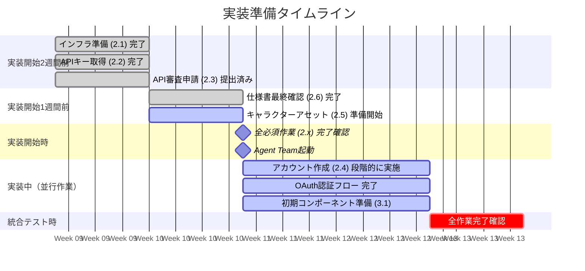

# 11. 実装前チェックリスト: 人間が実施する準備作業

> Agent Teamが並列実装を開始する前に、人間（Shungo）が完了しておくべき作業の一覧。
> 各項目のステータスを管理し、全て完了してから実装フェーズを開始する。
>
> **関連ドキュメント**: [10-implementation-guide.md](10-implementation-guide.md) (実装ガイド), [06-development-roadmap.md](06-development-roadmap.md) (ロードマップ), [05-cost-analysis.md](05-cost-analysis.md) (コスト分析)

## 目次

- [1. 概要](#1-概要)
- [2. 必須作業（実装開始前に必ず完了）](#2-必須作業実装開始前に必ず完了)
  - [2.1 インフラストラクチャ](#21-インフラストラクチャ)
  - [2.2 AIサービス API キー](#22-aiサービス-api-キー)
  - [2.3 プラットフォーム API 審査](#23-プラットフォーム-api-審査)
  - [2.4 アカウント作成（初期50アカウント）](#24-アカウント作成初期50アカウント)
  - [2.5 キャラクターアセット](#25-キャラクターアセット)
  - [2.6 仕様書最終確認](#26-仕様書最終確認)
- [3. 推奨作業（実装開始後でも可）](#3-推奨作業実装開始後でも可)
  - [3.1 初期コンポーネント準備](#31-初期コンポーネント準備)
  - [3.2 運用準備](#32-運用準備)
- [4. タイムライン](#4-タイムライン)
- [5. コスト概算（準備作業）](#5-コスト概算準備作業)
- [6. v4.0 → v5.0 データ移行](#6-v40--v50-データ移行)

## 1. 概要

Agent Teamが並列実装を開始する前に、人間（Shungo）が完了しておくべき作業の一覧。
各項目のステータスを管理し、全て完了してから実装フェーズを開始する。

## 2. 必須作業（実装開始前に必ず完了）

### 2.1 インフラストラクチャ

| # | 作業 | 詳細 | ステータス |
|---|------|------|----------|
| 1 | GCPプロジェクト新規作成 | GCPコンソールで新規プロジェクト作成。名称は作成時に決定 | ☑ (ai-influencer-ceed, 2026-02-23) |
| 2 | GCE VM プロビジョニング | e2-standard-4: 4vCPU, 16GB RAM, 100GB SSD | ☑ (ai-influencer-vm, asia-northeast1-b, 2026-02-23) |
| 3 | Cloud SQL PostgreSQL 16 インスタンス作成 | PostgreSQL 16 + pgvector 拡張有効化。初期: db-f1-micro → 本番時 db-custom-2-7680 | ☑ (ai-influencer-db, asia-northeast1-c, pgvectorはSQL接続後に有効化, 2026-02-23) |
| 4 | VPCネットワーク + ファイアウォール設定 | SSH, HTTP 3000 (Dashboard), API 3001 (MCP Server) | ☑ (allow-ssh, allow-dashboard, allow-mcp-api, 2026-02-23) |
| 5 | Docker + Docker Compose インストール | `docker --version`, `docker compose --version` 正常動作確認 | ☑ (Docker 29.2.1, Compose v5.0.2, 2026-02-23) |
| 6 | Cloud SQL 接続設定 | Private IP or Cloud SQL Proxy 設定。GCE VMからの接続確認 | ☑ (Public IP + authorized-networks, pgvector v0.8.1有効化済み, 2026-02-23) |
| 7 | Git リポジトリ準備 | v5用ブランチ（`develop`）作成、`.gitignore` 更新 | ☑ (developブランチ作成済み, .gitignore更新済み, 2026-02-23) |
| 8 | 監視・アラート基盤の準備 | Cloud Monitoring + Error Reporting の有効化 | ☑ (両API有効化済み, 2026-02-23) |

### 2.2 AIサービス API キー

| # | サービス | 取得方法 | 月額費用 | ステータス |
|---|---------|---------|---------|----------|
| 1 | Anthropic (Claude API) | console.anthropic.com → API Keys | 従量課金 | ☑ (取得済み, $5クレジット購入, 2026-02-23) |
| 2 | fal.ai | fal.ai/dashboard → API Keys | 従量課金（$1,000+で40並列） | ☑ (取得済み, 2026-02-23) |
| 3 | Fish Audio | fish.audio → API Keys (Plus plan必須) | $11/月 | ☑ (v4.0既存キー流用, 残高$3.21確認済み, 2026-02-23) |
| 4 | OpenAI (Embedding) | platform.openai.com → API Keys | 従量課金（微小） | ☑ (v4.0既存キー流用, 有効性確認済み, 2026-02-23) |
| 5 | Anthropic APIキー有効性確認 | APIキーの有効性確認 + クレジット残高チェック ($50以上推奨) | - | ☑ (取得済み, $5クレジット購入済み, 2026-02-23) |

**注意**: 各サービスのアカウント登録 + クレジットカード登録が必要

### 2.3 プラットフォーム API 審査

| # | プラットフォーム | 審査内容 | 予想期間 | ステータス |
|---|---------------|---------|---------|----------|
| 1 | YouTube Data API v3 | GCPプロジェクトで有効化 + OAuth同意画面設定 | 即時〜1週間 | ☐ |
| 2 | TikTok Content API | TikTok Developers → アプリ作成 → 審査申請 | 2-4週間 | ☐ |
| 3 | Instagram Graph API | Meta Developers → アプリ作成 → 審査申請 | 2-4週間 | ☐ |
| 4 | X API v2 | developer.x.com → Premium申請 | 1-2週間 | ☐ |

⚠️ **審査は最も時間がかかるため、実装開始と同時または先行して申請すること**

### 2.4 アカウント作成（初期50アカウント）

| # | プラットフォーム | アカウント数 | 必要情報 | ステータス |
|---|---------------|-----------|---------|----------|
| 1 | YouTube | 12 | Googleアカウント + チャンネル作成 | ☐ |
| 2 | TikTok | 12 | メールアドレス + プロフィール設定 | ☐ |
| 3 | Instagram | 12 | Facebook連携 + ビジネスアカウント化 | ☐ |
| 4 | X | 14 | メールアドレス + Premium契約（$8/月 × 14） | ☐ |

**各アカウントにつき実施する作業**:

1. メールアドレス作成
2. パスワード設定（パスワードマネージャー管理）
3. 2段階認証設定
4. プロフィール設定（キャラクター情報に基づく）
5. OAuthコンセントフロー完了 → 認証情報をダッシュボードに入力

### 2.5 キャラクターアセット

| # | 作業 | 詳細 | ステータス |
|---|------|------|----------|
| 1 | キャラクター画像準備 | 各キャラクター × 3850x3850以下のPNG/JPG。Google Drive `characters/` にアップロード | ☐ |
| 2 | 音声サンプル準備 | Fish Audio `voice_id` の確認。各キャラクターの voice_id を accounts inventory に記録 | ☐ |
| 3 | キャラクター設定 | Drive `キャラクター情報/01_キャラクター設定/` の .md ファイル更新 | ☐ |

> **Phase 2以降**: `CHARACTER_AUTO_GENERATION_ENABLED=true` に設定することで、Data Curatorがキャラクタープロフィール・画像・音声を自動生成。人間はダッシュボードでレビュー・修正のみ。初期フェーズでは人間が上記作業を手動で実施する。

### 2.6 仕様書最終確認

| # | ファイル | 確認事項 | ステータス |
|---|--------|---------|----------|
| 1 | 01-tech-stack.md | 技術選定に問題なし | ☑ (承認, 2026-02-23) |
| 2 | 02-architecture.md | アーキテクチャ承認 | ☑ (承認, 2026-02-23) |
| 3 | 03-database-schema.md | 全33テーブルのスキーマ承認 | ☑ (承認, 2026-02-23) |
| 4 | 04-agent-design.md | エージェント設計承認 | ☑ (承認, 2026-02-23) |
| 5 | 05-cost-analysis.md | コスト試算確認 | ☑ (承認, 2026-02-23) |
| 6 | 06-development-roadmap.md | ロードマップ承認 | ☑ (承認, 2026-02-23) |
| 7 | 07-kpi-analysis.md | KPI目標確認 | ☑ (承認, 2026-02-23) |
| 8 | 08-algorithm-analysis.md | アルゴリズム設計承認 | ☑ (承認, 2026-02-23) |
| 9 | 09-risks-and-bottlenecks.md | リスク対策確認 | ☑ (承認, 2026-02-23) |
| 10 | 10-implementation-guide.md | 実装ガイド承認 | ☑ (承認, 2026-02-23) |

### 2.7 アルゴリズム・KPI基盤

| # | 作業 | 詳細 | ステータス |
|---|------|------|----------|
| 1 | 6アルゴリズムテーブル作成確認 | prediction_weights, weight_audit_log, prediction_snapshots, kpi_snapshots, account_baselines, adjustment_factor_cache | ☐ |
| 2 | 31 system_settings シード投入 | アルゴリズム関連設定値のデフォルト値投入確認 | ☐ |
| 3 | ベースライン計算バッチジョブテスト | own_history, cohortフォールバック, デフォルト(500) の3パスを確認 | ☐ |
| 4 | weight再計算バッチジョブテスト | tier判定, EMA平滑化, ±20%クリップ, WEIGHT_FLOOR, 正規化 | ☐ |
| 5 | Per-content マイクロ分析パイプラインテスト | 48h計測→単発分析→content_learnings書き込み | ☐ |
| 6 | 累積分析（pgvector）テスト | 7d計測→5テーブル検索→構造化集計→AI解釈→cumulative_context書き込み | ☐ |

## 3. 推奨作業（実装開始後でも可）

### 3.1 初期コンポーネント準備

| # | 作業 | 詳細 | ステータス |
|---|------|------|----------|
| 1 | シナリオインベントリ確認 | 既存scenarios inventoryのデータ確認・更新 | ☐ |
| 2 | モーションインベントリ確認 | 既存motions inventoryのデータ確認・更新 | ☐ |
| 3 | v4.0マスタースプレッドシートバックアップ | 移行前のデータバックアップ | ☐ |

### 3.2 運用準備

| # | 作業 | 詳細 | ステータス |
|---|------|------|----------|
| 1 | system_settings初期値レビュー | デフォルト値の妥当性確認 | ☐ |
| 2 | 予算設定 | `DAILY_BUDGET_LIMIT_USD`, `MONTHLY_BUDGET_LIMIT_USD` の決定 | ☐ |
| 3 | レビュー方針決定 | `HUMAN_REVIEW_ENABLED` の初期設定確認 | ☐ |

## 4. タイムライン

## 5. コスト概算（準備作業）

| 項目 | 費用 |
|------|------|
| Cloud SQL (準備+開発期間2ヶ月) | ~$140 |
| GCE VM (既存、追加費用なし) | $0 |
| Fish Audio Plus | $11/月 |
| X Premium × 14アカウント | $112/月 |
| fal.ai 初期チャージ | $100-500 |
| **合計（初月）** | **~$363-763** |

## 6. v4.0 → v5.0 データ移行

### 移行タイミング
v5.0が機能的に完成した後、v4.0を停止する前に実施。2週間の並行運用期間を設ける。

### データマッピング

| v4.0 (Sheets) | v5.0 (PostgreSQL) | 備考 |
|---------------|-------------------|------|
| production tab (33列) | content + content_sections + publications | 1行 → 3テーブルに正規化 |
| Accounts Inventory | accounts | platform, status, auth_credentials をマッピング |
| Characters Inventory | characters | appearance, personality を JSONB に変換 |
| Scenarios Inventory | components (type='scenario') | script_en, script_jp を component_data JSONB に格納 |
| Motions Inventory | components (type='motion') | file_link → drive_file_id に変換 |

### 型変換ルール

| v4.0 | v5.0 | 変換 |
|------|------|------|
| Sheets timestamp | PostgreSQL TIMESTAMPTZ | `new Date((sheetsDate - 25569) * 86400000).toISOString()` |
| カンマ区切り文字列 | JSONB 配列 | `value.split(',').map(s => s.trim())` → `JSON.stringify(result)` |
| key:value ペア | JSONB オブジェクト | カスタムパーサーで変換 |
| Drive URL | drive_file_id | `extractDriveFileId(url)` (既存ヘルパー) |

### 移行対象外
- `scenario.json`: 廃止済み (v4.0で既にInventoryに移行済み)
- Drive上のファイル: 移行不要 (同じフォルダ構造、新DBからdrive_file_idで参照)

### 移行スクリプト
`v5/scripts/migrate-v4-data.ts` — Week 5 で作成予定

### ロールバック計画
v4.0のSpreadsheetは移行期間中 **読み取り専用** で保持。問題発生時はv4.0に切り戻し可能。
